# Storage Devices

- Storage devices are available in (2) categories:
  - Traditional (a.k.a. "Magnetic Storage", "HDD", "Hard Disk Drive")
  - Solid State (a.k.a. "Flash Storage", "SSD", "Solid State Drive")

## Traditional Storage Devices

- A stack of rotating magnetic platters
- Susceptible to physical damage due to movable components
- Data is magnetically stored at a sector level on each platter, using magnetic heads (mounted on a movable arm)
- Higher power requirements than a solid state storage device, therefore more heat is generated (which is bad)
- Slower to read and write data than a solid state storage device (which becomes very frustrating)
- Overall cost is cheaper than a solid state storage device
- The sector size is determined by the manufacturer of the storage device and is typically (4,096 bytes), also referred to as "4K sectors" or "Advanced Format"
- Older storage devices had a sector size of (512 bytes)
- At an operating system level, sectors are grouped together for efficiency, and are called logical units (a.k.a. allocation units)

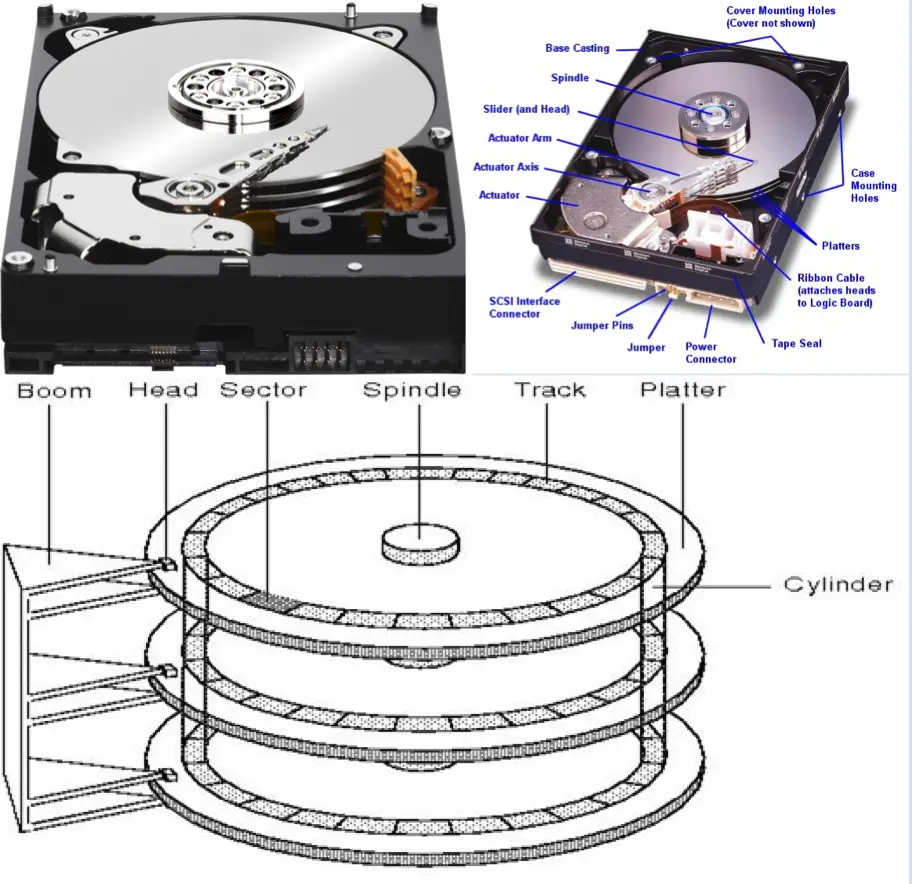

## Solid State Storage Devices

- A series of computer chips used to store data
- No moving parts, therefore less susceptible to physical damage
- Data is electrically stored at a page level within each computer chip
- Lower power requirements than a traditional storage device, therefore less heat is generated (which is good)
- Faster to read and write data than a traditional storage device (which you will be very thankful for)
- Overall cost is greater than a traditional storage device
- Pages are presented to the operating system as series of sectors (pseudo sectors).
  - The operating system is then able to treat the solid state storage device as if it were a traditional storage device
- At an operating system level, these pseudo sectors are grouped together for efficiency, and are called logical units (a.k.a. allocation units)

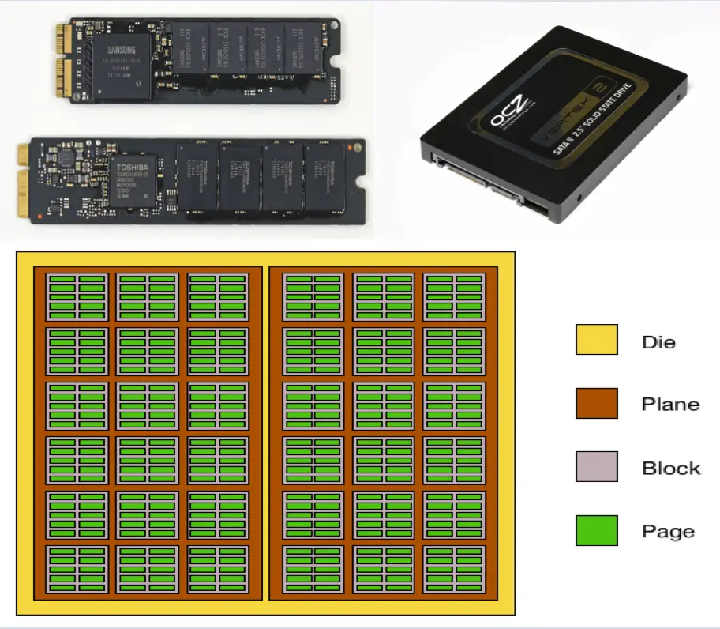

## Storage Devices

- Storage devices are used by an operating system to store data (the operating system itself including supporting files, installed applications, user data, etc.).
- The data written to storage devices is persistent. When a computer, smartphone, tablet, etc., is powered down, the data remains on the storage device.
  - On the contrary, data stored in the memory of a computer, smartphone, tablet, etc., is lost forever when it is powered down.
- Storage devices must be partitioned and formatted before any data can be written to them.
  - One or more partitions may exist for any single storage device.
- The format process lays down a file system which is used to keep track of the data on the storage device.
- A partition formatted with a file system is called a volume.

## File Systems

- Common modern-day file systems include:
- Microsoft Windows
  - ReFS: Resilient File System (newest)
  - NTFS: New Technology File System (most common)
  - exFAT: Extended File Allocation Table (greatest compatibility)
- Apple macOS
  - APFS: Apple File System (newest)
  - HFS+: Hierarchal File System Plus (most common)
  - exFAT: Extended File Allocation Table (greatest compatibility)
- Linux
  - xfs: (acronym not expandable) (newest)
  - ext4: Fourth Extended File System (most common)
  - exFAT: Extended File Allocation Table (greatest compatibility)

## Partitioning and Formatting

- When you purchased your portable USB-powered storage device, it was most likely already partitioned and formatted for you.
- Unfortunately, it was probably formatted with an inappropriate file system type (e.g. FAT32 or NTFS) for most uses.
- In order to be the most compatible between (Microsoft Windows, Apple macOS, and Linux) operating systems, your portable USB-powered storage device should be configured as follows:
- Uses the Globally Unique Identifier (GUID) Partition Table (GPT) partitioning scheme.
- Created with only (1) partition.
- A single volume formatted with the exFAT file system.

## Example

- Type in -> `list disk` to see which storage devices the host computer system is aware of.
- Identify the disk (#) associated with your portable USB-powered storage device.
- Your disk (#) might not be the same as the one identified in the image.

```console
DISKPART> list disk

    Disk ###    Status              Size        Free        Dyn     Gpt
    --------    ----------------    ---------   ---------     -----     ------
    Disk 0      Online              476GB             0 B              *
    Disk 1      Online              465GB         1024 KB         *
```

## Storage Device Identification

- If you are having difficulty identifying the disk (#) associated with your portable USB-powered storage device, follow these steps:

1. Type in (exit), and hit `<Enter>`, to exit the (`diskpart.exe`) application.
2. Detach your portable USB-powered storage device from the host computer system.
3. Re-run the (`diskpart.exe`) application, and execute the (list disk) command.
   - This will give you a list of all existing storage devices for the host computer system (not including your portable USB-powered storage device).
   - Take a screenshot (or write down) the complete list of devices.
4. Exit from the (diskpart.exe) application using the (exit) command.
5. Attach your portable USB-powered storage device to the host computer system.
6. Re-run the (diskpart.exe) application, and execute the (list disk) command.
   - This will give you a list of all existing storage devices for the host computer system, including your portable USB-powered storage device.
7. Compare this list of devices with the list you documented in (Step #3).
   - The additional device that appears in this new list of devices is your portable USB-powered storage device.
   - Document the disk (#) associated with that storage device.
8. Continue on with the next slide.

## Example

- Type in -> `select disk <#>` to change the context for all future (diskpart.exe) related commands you will type.
- Future commands will then be executed directly against your portable USB-powered storage device.

```console
DISKPART> select disk 1

Disk 1 is now the selected disk.
```

- Type in -> `clean` to remove all existing partitions on your portable USB-powered storage device.

```console
DISKPART> clean

DiskPart succeeded in cleaning the disk.
```

- Type in -> `list disk` to identify the "Free" space now available on your portable USB-powered storage device.
- The "Free" value should now be equal to the "Size" (total capacity) value for your portable USB-powered storage device.
- If so, then all partitions were successfully removed.

```console
DISKPART> list disk

    Disk ###    Status              Size        Free        Dyn     Gpt
    --------    ----------------    ---------   ---------   -----   ------
    Disk 0      Online              476GB             0 B           *

- Disk 1 Online 465GB 465 GB *
```

- Type in -> `exit` to gracefully close the (diskpart.exe) application.

```console
DISKPART> exit
```

- Click on the "Disk Management" node.
- This is where you will manage your storage devices at a GUI-level.
- A very important box will pop up.
- The applet has identified that there is a new unpartitioned storage device connected to the host computer system and needs you to identify a partitioning scheme that will be used to manage new partitions created on it.

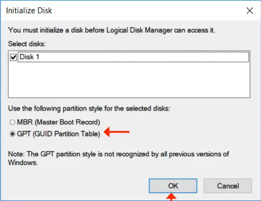

- Make sure you select the "GPT (GUID Partition Table)" option.

## Partitioning Schemes

- There are (2) main partitioning schemes available for storage devices:
- MBR (Master Boot Record)
  - An older method of managing partitions on a storage device
  - Used if storage devices need to be accessed by older host computer systems
  - Has a (2 TB) limitation. For a (3 TB) storage device, (1 TB) of the potential storage can never be utilized.
- GPT (Globally Unique Identifier Partitioning Table)
  - The newer method of managing partitions on a storage device
  - Used if the storage devices are moved between newer, more modern, host computer systems which are GPT-aware.
- Note: Because your portable USB-powered storage device will be plugged in and out of various modern host computer systems, it is best to use the GPT partitioning scheme.
- Right-click on the unallocated area of your portable USB-powered storage device.
- From the shortcut menu, select "New Simple Volume...". This option will permit you to create a new single exFAT formatted volume on your portable USB-powered storage device.

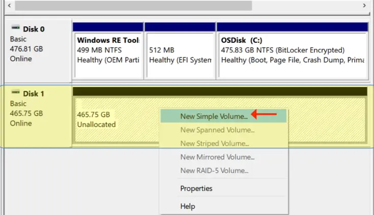

- When the wizard starts, click on the "Next" button.

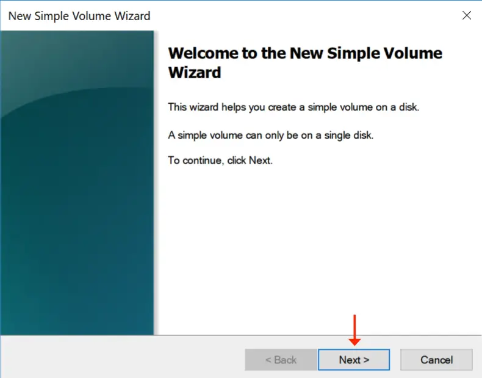

- Click on the "Next" button.
- Do not change the size of the partition, as you want all of the free space on your portable USB-powered storage device to be used for a single exFAT-formatted volume.

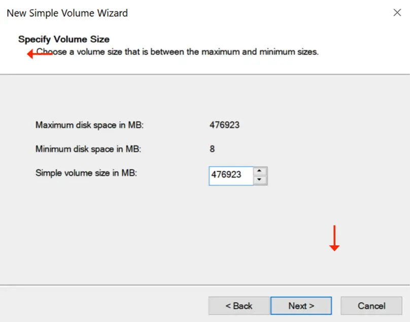

- On a Microsoft Windows-based host, almost all volumes are associated with a unique alphabetical letter.
- Leave it at whatever value is selected by default.
- The letter value will change dynamically when you attach your portable USB-powered storage device to different host computer systems.

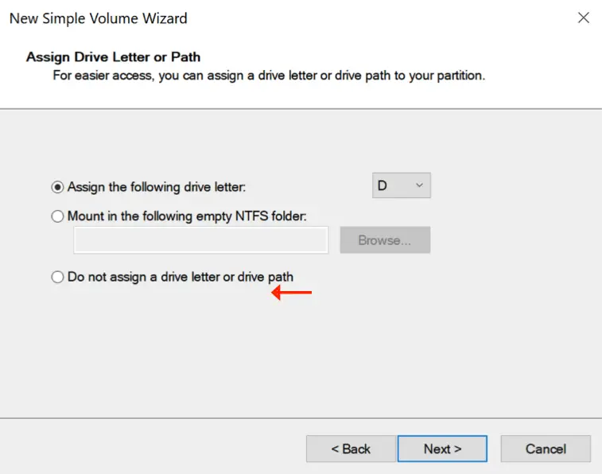

- Change the file system type to "exFAT”.
- Leave the allocation unit size as "Default”.
- Give the new volume a meaningful label name.
- Do not use spaces or weird characters in the name.
- Keep it simple.
- Ensure the quick format option is selected, or the format process will possibly take many hours to complete.

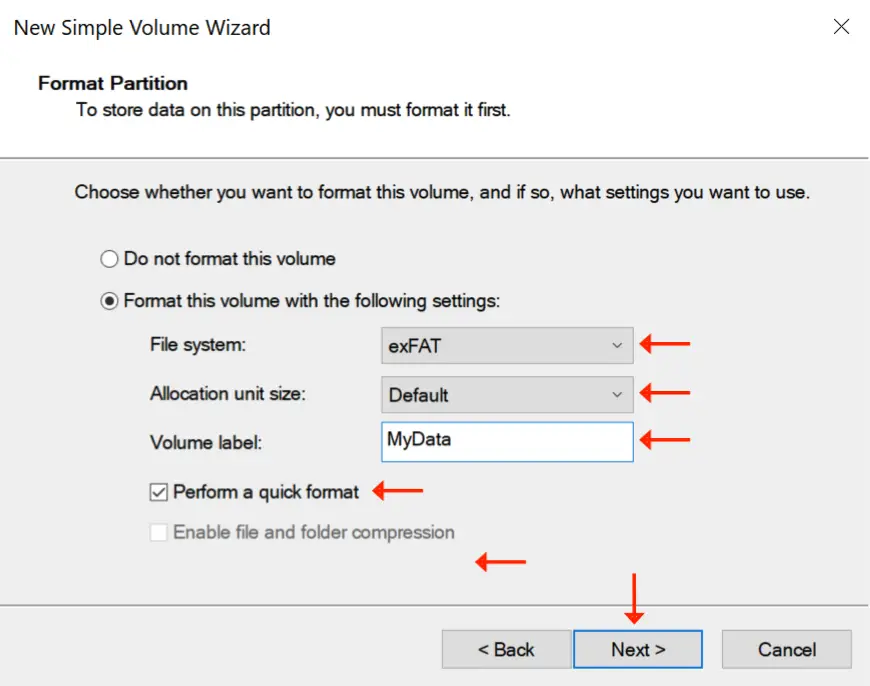

- Do not change the allocation unit size.
- This screenshot is just to illustrate that the grouped sectors on the storage device can be altered.
- You really need to know what the data you will be storing on this volume is before changing from the "Default" setting value.
- The size and quantity of the data being stored on a volume determine which allocation unit size is manually selected.
- On servers, this value is manually adjusted to gain better performance from the host.

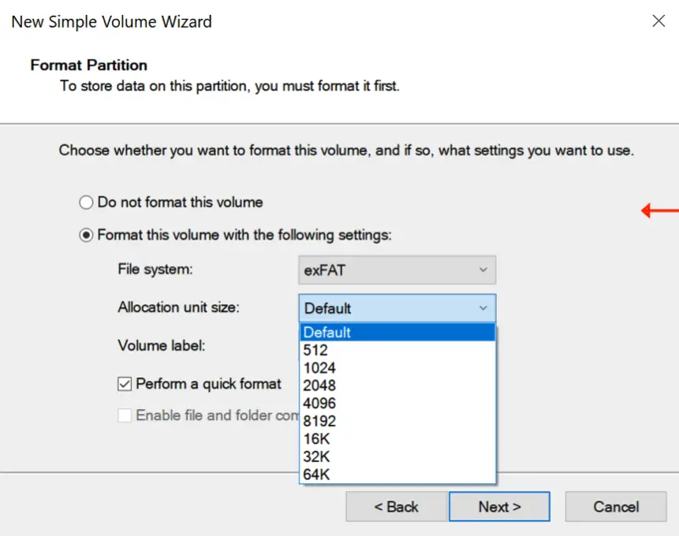

- On the summary screen, verify that both the "exFAT" file system and "Default" allocation unit size are chosen.
- Click on the "Finish" button to complete the partitioning and formatting process.
- The end result will be a single exFAT volume on your portable USB-powered storage device.

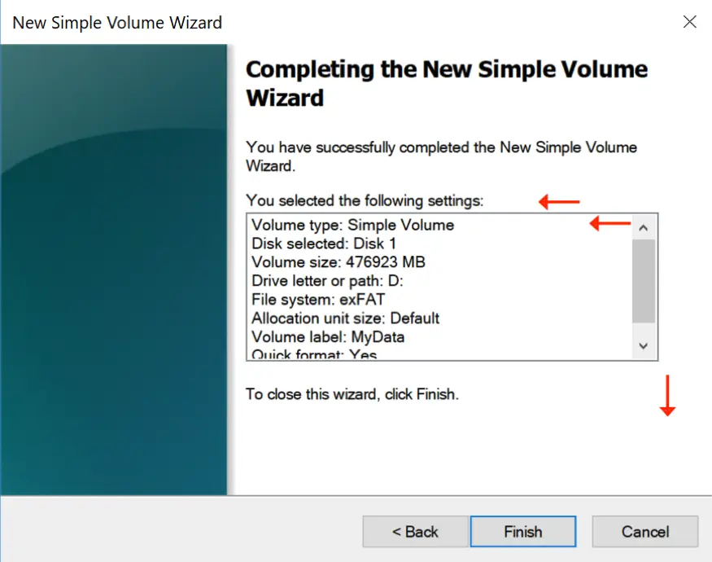

- Monitor the formatting process.
- It will be displayed as an incrementing (%) value.
- Once the formatting process is complete, it will show as "Healthy" in the new volume.
- Once it has, close the "Computer Management" applet.


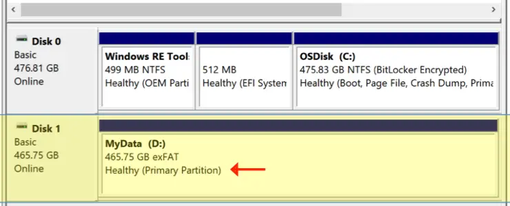

- Using the (`diskpart.exe`) application, you can identify the partitioning scheme for the storage device.

```console
DISKPART> list disk

    Disk ###    Status              Size        Free        Dyn     Gpt
    --------    ----------------    ---------   ---------   -----   ------
    Disk 0      Online              476GB             0 B           *
    Disk 1      Online              465GB          465 GB           *
```

## Proper Removal of a Storage Device

- When you want to detach your portable USB-powered storage device from the host computer system, DO NOT, just rip the cable from the computer.
- File systems are very complicated and very unforgiving if not respected.
- The operating system needs to write data in memory to the files located on a file system. When you click on (File -> Save) within an application, the file system write process may not occur immediately. Instead, the information is cached (buffered) in memory.
- If you were to just physically rip the cable on your portable USB-powered storage device from the computer, the operating system will not have had a chance to write uncommitted data to the file system.
- The result? Lost data, corrupted files, corrupted file systems, etc.

## Proper Removal of a Storage Device

- There are (2) graceful methods to properly removing your portable USB-powered storage device from a host computer system.

1. Eject the portable storage device, then physically detach it.
2. Gracefully powering down the host computer system, then physically detach it.

- Observations: On a Microsoft Windows operating system, Method #1 (above) fails most of the time.
- Therefore, Method #2 (above) is your best choice to use and works every time.
