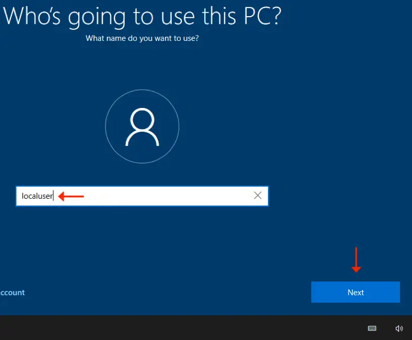
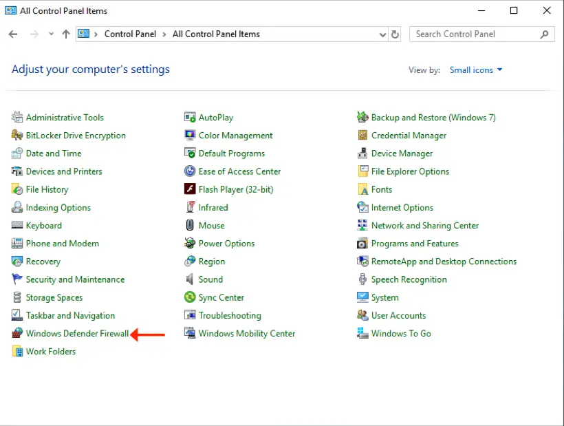
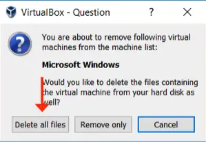

# Guest OS Installation (Microsoft Windows 10)

## Installation Highlights

- Create a virtual machine configuration profile.
- Boot from installation media and install the Guest OS operating system.
- Disable the firewall software service, set the correct time zone, etc.
- Change the Guest OS hostname.
- Update the operating system to the most available stable build.
- Bug fixes, additional features, security patches, etc.
- Install the VirtualBox Guest Additions.
- Install a 3rd party rich-featured text editor.
- Activate the operating system with Microsoft Corporation's license servers.
- Shutdown the Guest OS and back up the virtual disk image (`*.vdi`) file.

1. Click on the "New" button to begin the creation of a new virtual machine configuration profile.

2. Assign a meaningful name for the new virtual machine configuration profile.

- Identify the correct type, version, and build (or as close as possible) for the Guest OS (operating system) being installed.

3. Assign an appropriate amount of the Host OS' physical memory for the Guest OS to use.

- Type in a value of (2048).
- A gigabyte of memory is equal to 1024 megabytes.
- Therefore, this Guest OS will be able to consume up to (2 GB) of the Host OS' physical memory.
- Assigning more memory to the Guest OS is better, but be careful not to leave the Host OS with too little, or it will perform poorly.

4. A new virtual disk image (`*.vdi`) file will need to be created.

- The (`*.vdi`) file is where the operating system and applications are installed.
- Think of a (`*.vdi`) file as a separate hard disk, which is attached to a virtual machine (instead of a physical computer).

5. Use the native virtual disk format for the Oracle VM VirtualBox platform.

- The remaining formats listed are for other virtualization platform products (e.g. VMware ESXi, Microsoft Hyper-V, etc.).

6. Allow the virtual disk image to start off small in size and grow as needed.

- Although this option can negatively affect the performance of the Guest OS, it is typically suggested so you don't accidentally consume all of the available space on your portable USB-powered storage device.

7. Allow the virtual disk image file to grow to a maximum of (300 GB).

- Don't worry, it won't get close to that in size, but you want to make sure you never run out of room (typical if using the given default size).
- Click on the folder icon and identify a folder on your portable USB-powered storage device where you want this new (`*.vdi`) file to be created.

8. The wizard does a good job of creating the virtual machine configuration profile, but there are additional settings which need to be made.

- With the new virtual machine configuration profile selected (highlighted by the colour blue), click on the "Settings" button.

9. Configure the virtual machine for bidirectional clipboard capability.

- Once the Guest Additions are installed onto the Guest OS, you will be able to (cut+copy+paste) data between the Host OS and the Guest OS.

10. The days of floppy disks are long gone.

- There is no need to configure a virtual machine to support older and unused hardware, so deselect it.
- Also, change the boot order for a typical configuration.

11. Aside from memory, one of the best settings to increase is the amount of virtual CPUs associated with the virtual machine.

- A value above (1 CPU) will increase the performance of the Guest OS significantly.
- The maximum number of (8 CPUs) above is the sum of all CPU cores and hyper-threading features of the CPUs on this physical host computer system.

12. Many of the Guest OSes you create or use throughout your program will make use of a graphical desktop.

- So that all applications function properly (within the Guest OS), make certain you assign the maximum amount of video memory for each virtual machine configuration profile you create.

13. At a minimum, this is what you want all of your virtual machine configuration profiles to look like ...from a storage perspective.

- At least one virtual disk image (`*.vdi`) file and a virtual optical CD/DVD-ROM storage device, connected to the newer and faster SATA storage controller.

14. Next, associate the operating system installation media with the virtual optical CD/DVD-ROM storage device.

- Click on the CD/DVD icon, and select the "Choose Virtual Optical Disk File..." option.

15. Locate and click on the DVD ISO image file you downloaded earlier.

- This is what the virtual machine will initially boot from, in order to install the Guest OS' operating system into the virtual disk image (`*.vdi`) file.

16. Ensure the installation media is associated with the virtual optical CD/DVD-ROM storage device, or you won't be able to boot your virtual machine successfully.

17. The installation of the Guest OS will need Internet connectivity, and without having to use a dedicated IPv4 address.

- The NAT adapter will satisfy this requirement.

18. With the virtual machine configuration properly configured, click on the "Start" button to boot the virtual machine, and begin the operating system installation process.

## Installing the Operating System

19. Boot the virtual machine with the Microsoft Windows 10 DVD ISO associated with the virtualized CD/DVD-ROM storage device.

- Click on the "Next" button to continue.

20. Click on the "Install now" button to continue.

21. Enter your personal software product key, then click on the "Next" button.

22. Accept the license agreement

- Click on the "Next" button to continue

23. Select the appropriate installation type

- You have no existing operating system to "Upgrade" ...so select the "Custom" installation type instead

24. This screen identifies the options available for installing the operating system onto a hard disk

- Your virtual machine configuration profile includes only (1) virtual disk image (`*.vdi`) file
- As such, only (1) hard disk is listed above
- Click on the "Next" button to continue

25. DO NOT sign in using personal username and password credentials

- Click on the option "Domain join instead"
- This option will keep the Guest OS in a state

26. Create a generic local user account on the new host

- Keep the username simple (e.g. localuser), and set its password to (P&ssw0rd)
- This local user account will have full administrative authority on the Guest OS

27. Enter a password of (P&ssw0rd) for the new (localuser) account

28. Confirm the password

- Enter a password of (P&ssw0rd) for the new (localuser) account

29. Complete the security questions using information which you will easily remember if you ever forget this user account's password value

## Customizing the Guest OS

30. Most Microsoft Windows hosts are configured initially with Pacific Standard Time (PST) time zone.

- This means that the host's internal clock will be off by (3) hours, and will affect folder and file timestamps, log file event entries, etc.
- To correct this, it must be configured for an Eastern Standard Time (EST) time zone.
- Click on the "Date and Time" Control Panel applet.

31. Click on the "Change time zone..." button (A), then select Eastern Time from the drop-down selection list (B).

- Click on each of the "OK" buttons to save the setting change.

32. When testing network connectivity, the most annoying feature of any operating system is the internal firewall.

- The firewall feature blocks certain communications by default (which at this point, we do not want).
- Click on the "Windows Defender Firewall" Control Panel applet.

33. Click on the "Turn Windows Defender Firewall on or off" option.

34. Disable the firewall feature for both the Private and Public network interfaces of the Guest OS.

- Click on the "OK" button when finished.

35. Click on the "All Control Panel Items" option in the navigation field to return to the main Control Panel app selection screen.

36. Click on the "Power Options" Control Panel applet.

37. Click on the option to "Choose when to turn off the display."

- By default, the display of a Microsoft Windows host will turn off after a short period of time.
- It will turn the Guest OS' screen black.
- So you don't have to hit a key on the keyboard, shake the mouse, etc., after every few minutes of inactivity, it is best to configure the screen to never turn off.

38. From the drop-down list(s), select the "Never" option(s).

39. Click on the "Save changes" button to activate and save this setting change.

40. Click on the "All Control Panel Items" option in the navigation field to return to the main Control Panel app selection screen.

41. When the Microsoft Windows operating system was initially installed, the unique hostname associated with the Guest OS was randomly created.

- A random value makes it difficult to remember and is meaningless.
- You will change this value to include your personal 9-digit number.
- Click on the "System" Control Panel applet.

42. Identify the (current) randomized hostname value for the Guest OS.

- Click on the "Change settings" option.

43. Click on the "Change" button and type in a new hostname value using the format (w000123456a).

- Replace the fictitious 9-digit value with your personal 9-digit number.
- This will ensure all hosts on the network, at any given time, are unique and will not be in direct conflict with any other host.

44. Once the hostname value has been changed, click on the "OK" button to save the setting change.

- As indicated, the Guest OS will need to be restarted in order for the new hostname value to become active.

45. Click on the "Close" button.

46. Restart the Guest OS when prompted.

47. At the "Sign-on Screen", authenticate with the Localuser's security credentials (Username = localuser) and (Password = P&ssw0rd).

- Hit the `<Enter>` key on the keyboard, or click on the arrow icon, to complete the authentication process.

## Updating the Operating System

48. Click on the "Check for updates" button to see if there are even more software updates available for this host.

- If there are, go through the update process again like before.
- Repeat this process over and over again until a message appears near the top of this window, indicating that the host is completely up to date (see next step).

49. Manually restart the Guest OS to make sure all the software updates have been completely installed.

- From the "Start Menu", select the option to restart the host.

## Installing the Guest Additions

- From the menu bar, located at the top of the Guest OS console window, select the following menu options:
  - Devices -> Insert Guest Additions CD Image

50. Click on "This PC”.

- Your file system context will be changed to show all file systems this Guest OS currently has access to.
- Next, double-click on the "VirtualBox Guest Additions" CD, which is associated with the virtual CD/DVD-ROM drive.

51. If the auto-run feature does not automatically launch, you may need to double-click on the explicit executable to begin the installation of the Oracle VM VirtualBox Guest Additions.

52. Install the Oracle VM VirtualBox Guest Additions software product using the default settings.

- Click on the "Next" button to continue.

53. Ensure the checkbox is enabled to always trust software officially developed and distributed by Oracle Corporation.

- Click on the "Install" button to continue.

54. Click on the "Finish" button to restart the Guest OS.

55. Resize the Guest OS console window.

- The Guest OS' desktop will resize accordingly if the Guest Additions were installed successfully.

## Notepad++ Text Editor

- The default text editor application which comes with a Microsoft Windows operating system is called Notepad.
- Notepad is a very basic text editor and does not include features a Network Administrator or Software Developer desperately needs (editing multiple documents concurrently, block editing, line numbering, exposing whitespace characters, etc.).
- As such, it is wise for you to seek out a text editing application which is more powerful.
- Some will cost you money, while others may be free.
- The text editor that has been standardized on is Notepad++ and is free to use.
- Notepad++ is a rich-featured text editor.

## Activating the Operating System

- Most software products you will work with require activation using a legally acquired license, user account credentials, or a product activation key.
- Without proper activation, many software products from Microsoft Corporation will disable critical features after a period of time has lapsed, crippling the functionality of the software product and making it basically useless.
- The product activation process is identical for both the Microsoft Windows and Microsoft Windows Server operating systems.
- If you experience difficulties activating your operating system product, skip to the last section in this PowerPoint slide-set entitled (Phoned-Based Product Activation).
- This alternative process for activating the operating system product works if:
  - ...you receive error messages during the normal activation process.
  - ...you are attempting to activate the operating system product without Internet connectivity.
  - ...you are trying to activate the operating system using the same product activation key more than once.

56. From the "Activation" window, note that this operating system is currently activated.

- If your operating system is not activated, click on the "Change product key" option.
- When prompted, enter your personal product activation code and activate your operating system.
- If you receive an error message or are unable to activate your operating system, skip to the last section in this PowerPoint slide-set and go through the Phone-based Product Activation process.

## Backing up the (`*.vdi`) File

- Final Operating System Update
  - The Guest OS installation, customization, and activation is now complete.
  - You should check one last time to ensure the Guest OS' operating system is completely up to date.
  - Complete that process now before continuing.
- You have just spent a few hours creating a Guest OS.
- The last thing you want is to lose all of the work you just put into creating the Guest OS.
- The entire Guest OS is contained within a single file located on your Host OS, called a virtual disk image (`*.vdi`) file.
- Making a copy of the (`*.vdi`) file ensures you have something to revert back to in the event of a catastrophe with your original (`*.vdi`) file.
- The next section will guide you through the process of disassociating virtual disk image (`*.vdi`) files and CD/DVD ISO image (`*.iso`) files with an Oracle VM VirtualBox virtual machine profile, and then backing up the (`*.vdi`) file.

57. Gracefully shut down the Guest OS.

- From the "Start Menu", select the option to "shut down" the host.
- Let the Guest OS complete its graceful shut down before continuing.
- This Guest OS console window will completely disappear once the process has finished.

## The Virtual Media Manager Repository

- From the Oracle VM VirtualBox application menu bar, select the following menu options:
  - File -> Virtual Media Manager,
- The Virtual Media Manager is an interface to the repository of all virtual disk image (`*.vdi`) files and CD/DVD image (`*.iso`) files.
- From within the Virtual Media Manager, you can release, remove, and modify each image file.
- Release: Disassociates the image file with any virtual machine configuration profile.
  - The image file remains in the Virtual Media Manager.
- Remove: Removes the image file from the Virtual Media Manager.
  - Must be released prior to a remove attempt.
  - Be careful to NOT delete the image file.
- Properties: Changes the mode of an image file and how it behaves (Normal = read+write), (Immutable = write protected), etc.
  - Must be released first.

58. For the virtual disk image (`*.vdi`) file, note that it cannot be removed at this point.

- It must first be released from the associated virtual machine configuration profile.

59. Also make note of the location of the (`*.vdi`) file (it should be located on your portable USB-powered storage device).

60. Click on the (Release) icon, and release the virtual disk image (`*.vdi`) file from the (Microsoft Windows) virtual machine configuration profile.

61. Once the image file has been released from a virtual machine configuration profile, you are then able to remove it from the Virtual Media Manager repository.

62. Click on the (Remove) icon, and remove the virtual disk image (`*.vdi`) file from the Virtual Media Manager repository.

- WARNING, DO NOT delete the file when prompted (see next step).

63. There are very few times where you will delete the image file from within the Oracle VM VirtualBox application environment.

- Select the option to (Keep) the image file.

64. The Virtual Media Manager now includes zero virtual disk image (`*.vdi`) files (a.k.a. hard disk image files).

65. There are (2) CD/DVD installation media currently in the Virtual Media Manager.

- Using similar steps as before (with the virtual hard disk (`*.vdi`) image) ...remove these (2) CD/DVD installation media from the Virtual Media Manager.

66. Now, the Virtual Media Manager repository includes zero CD/DVD image files and zero hard disk image files.

- Close the Virtual Media Manager interface.

67. With no attached virtual hard disk (`*.vdi`) file to the (Microsoft Windows) virtual machine configuration profile, you can now complete the removal process.

- Right-click on the (Microsoft Windows) virtual machine configuration profile and select "Remove..." from the shortcut menu options.

68. Select the option to delete all remaining files associated with the (Microsoft Windows) virtual machine profile, then close the Oracle VM VirtualBox application.

69. On the Host OS, make a copy of the virtual disk image (`*.vdi`) file that includes your Microsoft Windows 10 Guest OS installation.

- In the image above, (A) is the original file, and (B) is a backup copy of (A) ...where each file is located below a meaningful folder name.

