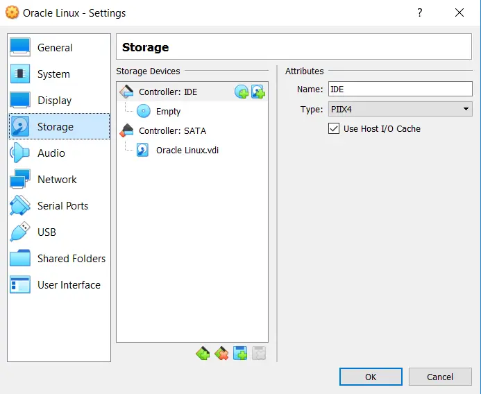
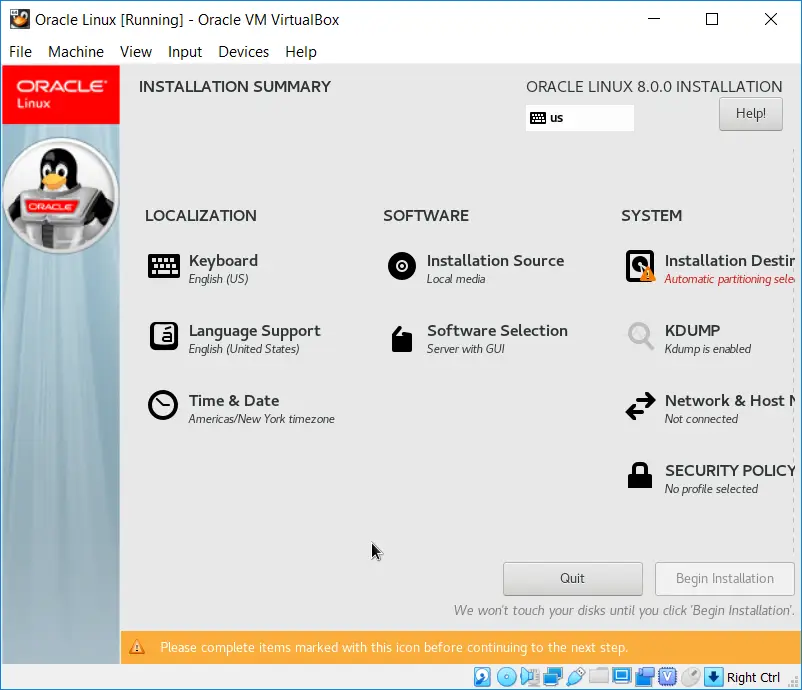
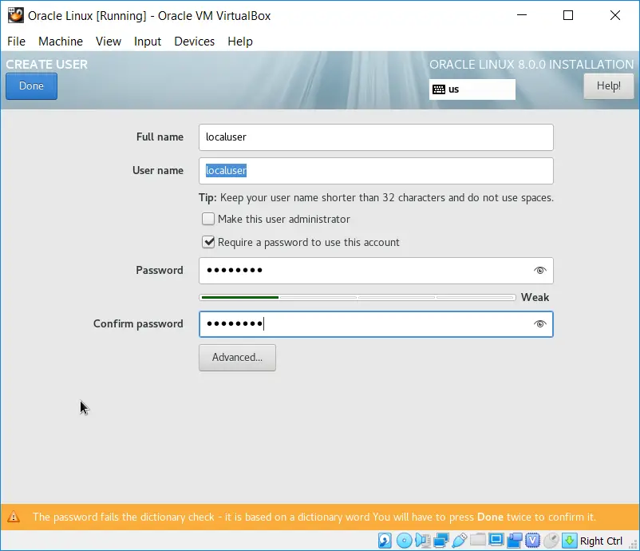
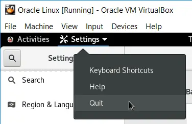
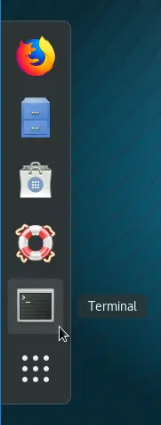
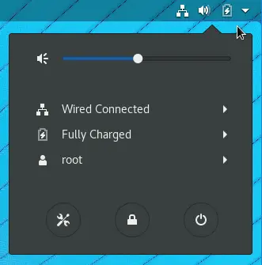
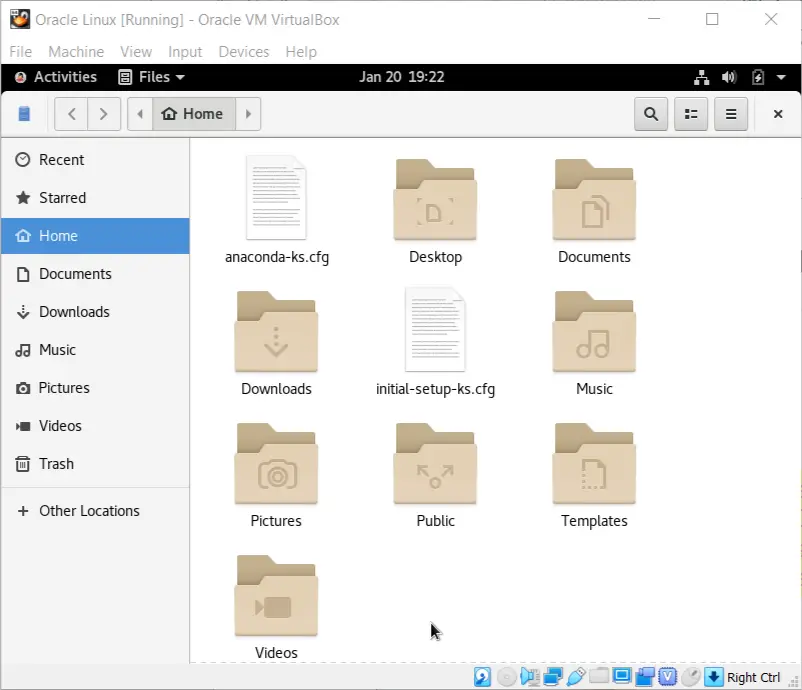
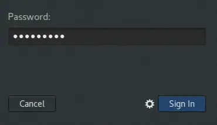
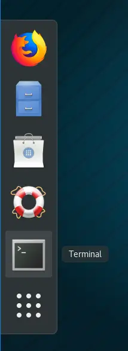

# Guest OS Installation (Oracle Linux 8)

## Installation Highlights

- Create a virtual machine configuration profile.
- Boot from installation media and install the Guest OS operating system.
- Change the Guest OS hostname.
- Update the operating system to the most available stable build.
- Bug fixes, additional features, security patches, etc.
- Install the VirtualBox Guest Additions.
- Disable the firewall software service.
- Shutdown the Guest OS and back up the virtual disk image (`*.vdi`) file.

1. Click on the "New" button to begin the creation of a new virtual machine configuration profile.


2. Assign a meaningful name for the new virtual machine configuration profile.

- Identify the correct type, version, and build (or as close as possible) for the Guest OS (operating system) being installed.


3. Assign an appropriate amount of the Host OS' physical memory for the Guest OS to use.

- Type in a value of (2048).
- A gigabyte of memory is equal to 1024 megabytes.
- Therefore, this Guest OS will be able to consume up to (2 GB) of the Host OS' physical memory.
- Assigning more memory to the Guest OS is better, but be careful not to leave the Host OS with too little, or it will perform poorly.


4. A new virtual disk image (`*.vdi`) file will need to be created.

- The (`*.vdi`) file is where the operating system and applications are installed into.
- Think of a (`*.vdi`) file as a separate hard disk, which is attached to a virtual machine (instead of a physical computer).


5. Use the native virtual disk format for the Oracle VM VirtualBox platform.

- The remaining formats listed are for other virtualization platform products (e.g. VMware ESXi, Microsoft Hyper-V, etc.).


6. Allow the virtual disk image to start off small in size and grow as needed.

- Although this option can negatively affect the performance of the Guest OS, it is typically suggested so you don't accidentally consume all of the available space on your portable USB-powered storage device.


7. Allow the virtual disk image file to grow to a maximum of (300 GB).

- Don't worry, it won't get close to that in size, but you want to make sure you never run out of room (typical if using the given default size).
- Click on the folder icon and identify a folder on your portable USB-powered storage device where you want this new (`*.vdi`) file to be created.


8. The wizard does a good job of creating the virtual machine configuration profile, but there are additional settings which need to be made.

- With the new virtual machine configuration profile selected (highlighted by the colour blue), click on the "Settings" button.


9. Configure the virtual machine for bidirectional clipboard capability.

- Once the Guest Additions are installed onto the Guest OS, you will be able to (cut+copy+paste) data between the Host OS and the Guest OS.


10. The days of floppy disks are long gone.

- There is no need to configure a virtual machine to support older and unused hardware, so deselect it.
- Also, change the boot order for a typical configuration.


11. Aside from memory, one of the best settings to increase is the amount of virtual CPUs associated with the virtual machine.

- A value above (1 CPU) will increase the performance of the Guest OS significantly.
- The maximum number of (8 CPUs) above is the sum of all CPU cores and hyper-threading features of the CPUs on this physical host computer system.


12. Many of the Guest OSes you create or use throughout your program will make use of a graphical desktop.

- So that all applications function properly (within the Guest OS), make certain you assign the maximum amount of video memory for each virtual machine configuration profile you create.


13. The (IDE) storage controller is old, outdated, and slow when compared to the newer (SATA) storage controller, so get rid of it.

- The steps to do so are documented over the next few slides.



14. Select the existing virtual optical CD/DVD-ROM storage device connected to the IDE storage controller.

- Click on the remove device icon.


15. Confirm that you wish to remove the storage device.


16. Select the existing IDE storage controller.

- Click on the remove storage adapter icon.


17. Add a virtual optical CD/DVD-ROM storage device to the SATA storage controller.

- Select the SATA controller, and click on the add optical device icon.


18. Leave the virtual CD/DVD-ROM storage device empty for now.


19. At a minimum, this is what you want all of your virtual machine configuration profiles to look like, from a storage perspective.

- At least one virtual disk image (`*.vdi`) file and a virtual optical CD/DVD-ROM storage device, connected to the newer and faster SATA storage controller.


20. Next, associate the operating system installation media with the virtual optical CD/DVD-ROM storage device.

- Click on the CD/DVD icon, and select the "Choose Virtual Optical Disk File" option.


21. Locate and click on the DVD ISO image file you downloaded earlier.

- This is what the virtual machine will initially boot from, in order to install the Guest OS' operating system into the virtual disk image (`*.vdi`) file.


22. Ensure the installation media is associated with the virtual optical CD/DVD-ROM storage device, or you won't be able to boot your virtual machine successfully.


23. The installation of the Guest OS will need Internet connectivity, and without having to use a dedicated IPv4 address.

- The NAT adapter will satisfy this requirement.


24. With the virtual machine configuration properly configured, click on the "Start" button to boot the virtual machine and begin the operating system installation process.


## Installing the Operating System

25. Boot the virtual machine with the Oracle Linux 8 DVD ISO associated with the virtualized CD/DVD-ROM storage device.

- Using the arrow keys on your keyboard, select the option to "Install Oracle Linux 8.0.0."


26. Let the operating system boot from the installation media.


27. Click on the "Continue" button.


28. Unlike with the Microsoft Windows and Microsoft Windows Server Guest OS installations, your mouse and keyboard will need to be explicitly "captured" in the virtual machine's console window.

- To "release" it, so you can use your mouse and keyboard back on your Host OS, press the right control key on your keyboard if necessary.
- Once the Guest Additions are installed, this explicit capture/release process will no longer be required.


29. This is the main installation menu.

- You will come back to this menu a few times during this installation process.
- Click on the "Software Selection" option to select which software components will be initially installed on this new Oracle Linux host.



30. Select the "Server with GUI" base environment option.

- This will install the Oracle Linux host with a graphical desktop (similar to a Microsoft Windows host).
- Do not select any of the additional add-ons located in the right-side pane of this screen.
- Click on the "Done" button when finished.


31. From the main installation menu, select the "KDUMP" option.

- In the event of a kernel crash, you will not be analyzing any kernel crash dumps, so disable this feature.
- Click on the "Done" button when finished.


32. From the main installation menu, select the "Network & Host Name" option.

- In the bottom-left corner, provide a host name in the format shown (ol000123456a), but use your personal 9-digit number instead.
- Click on the "Apply" button, then click on the "Configure" button to configure the network adapter.
- Format:
  - (2) lower case letters "o" + "l"
  - 9-digit personal number
  - the lower case letter "a"


33. Configure the network adapter to be automatically enabled when the Guest OS boots, then click on the "Save" button.


34. Return to the main installation menu by clicking on the "Done" button.


35. From the main installation menu, select the "Installation Destination" option.

- Here is where you would partition the `<empty>` virtual hard disk for the Guest OS.
- Leave the "Automatically Storage Configuration" option selected.
- Click on the "Done" button.


36. From the main installation menu, select the "Begin Installation" button.


37. From the installation progress screen, select the "Root Password" option to configure the main administrative user account (root) with a password.


38. Enter a password for the (root) administrative user account.

- Type in (Adm1np&ss).
- Click on the "Done" button to return to the previous screen.


39. From the installation progress screen, select the "User Creation" option to create a new non-administrative user account.


40. Enter the details for a new non-administrative user account.

- Type in (localuser) for the full name and user name fields.
- Type in (P&ssw0rd) for the password fields.
- Click on the "Done" button twice to return to the previous screen.



41. Wait for the installation to complete.

- The installation progress will be updated periodically to inform you how far along the process is.


42. Installation is now complete.

- Click on the "Reboot" button.


## First Boot

43. Let the Oracle Linux Guest OS boot from the virtual disk image (`*.vdi`) file.

- Do not alter the default Oracle Linux kernel at any point.
- The default Oracle Linux kernel is whichever kernel choice is highlighted during the startup process.
- It will automatically change over time as needed.


44. From the initial setup screen, click on the "License Information" option.


45. Accept the License Agreement, then return to the initial setup screen by clicking on the "Done" button.


46. Click on the "Finish Configuration" button to continue.


47. Sign in to the new Oracle Linux Guest OS as the (root) user.

- Click on the "Not Listed?" option.


48. Explicitly type in the (root) user name.

- Click on the "Next" button.


49. Type in the password for the (root) user.

- The password is (Adm1np&ss).
- Click on the "Sign In" button.


50. Click on the "Next" button.


51. Click on the "Next" button.


52. Disable "Location Services", then click on the "Next" button.


53. Click on the "Skip" button.


54. Click on the "Start Using Oracle Linux Server" button.


55. Close the foreground application to reveal the desktop.


56. Your initial look at the Oracle Linux desktop environment


## Customizing the User Environment

57. Go to the "Settings" panel

- This is similar to the Control Panel for Microsoft Windows


58. Click on the "Power" settings category


59. Adjust the power settings (for this user), such that the desktop screen never goes blank


60. Close the settings panel when finished



## Updating the Operating System

61. Gracefully restart the Oracle Linux Guest OS

- This will ensure there are no processes running, which may interfere with the operating system updating steps documented over the next few slides


62. Restart the Oracle Linux Guest OS


63. Let the Oracle Linux Guest OS restart

- Again, do not alter from the default Oracle Linux kernel at any point


64. Sign in to the new Oracle Linux Guest OS as the (root) user

- Click on the "Not Listed?" option


65. Explicitly type in the (root) user name

- Click on the "Next" button


66. Type in the password for the (root) user

- The password is (Adm1np&ss)
- Click on the "Sign In" button


67. Locate and click on the (Terminal) application in order to launch a (bash) shell from within the desktop environment



68. This is the (bash) shell.

- It is similar to the Command Interpreter (cmd.exe) and Windows PowerShell (powershell.exe) command-line interface environments for a Microsoft Windows host.


69. To update the Oracle Linux host, type in (yum update), followed by the (`<Enter>`) key.

- If there is any software installed on this host (which is out of date), it will be updated from sources located on the Internet.
- This is similar to the update process for a Microsoft Windows host.

```console
[root@o1000123456a ~]# yum update
```

70. Once a list of software (which needs to be updated) has been identified, type in (y), followed by the (`<Enter>`) key.

```console
...

Transaction Summary
===========================
Install     5 Packages
Upgrade   154 Packages

Total download size: 259 M
Is this ok [y/N]: Y
```

71. Some software packages are secured using a digital certificate.

```console
...

Total                         2.4 MB/S | 259 MB           01:48
...

  Fingerprint: 76FD 3DB1 3AB6 7410 B89D B10E 8256 2A9 AD98 6DA3
  From:        /etc/pki/rpm-gpg/RPM-GPG-KEY -oracle
Is this ok [y/N]: y
```

- For now, type in (y), followed by the (`<Enter>`) key.

72. As the software is downloaded and installed, you will be able to see the installation progress for each package.

```console
Key imported successfully
Running transaction check
Transaction check succeeded.
Running transaction test
Transaction test succeeded.
Running transaction
...
```

73. After the software updates have been downloaded and installed, you will be returned to the shell prompt.

```console
...

Installed:
kernel-4.18.0-80.4.2.el8 0.X86 64
kernel-core-4.18.0-80.4.2.el8 0.X86 64
kernel-modules-4.18.0-80.4.2.el8 0.x86 64
xorg-x11-drv-fbdev-0.5.0-2.el8.×86 64
xorg-x11-drv-vesa-2.4.0-3.el8.X86 64

Complete!
[root@ol000123456a ~# exit
```

- To gracefully close the (Terminal) application, type in (exit), followed by the (`<Enter>`) key on the keyboard.

74. As it is for any operating system, when a large update has been performed, it is best to immediately restart the host.

- This ensures all of the software is completely installed.
- It also lets you see if there are problems with the new software.
- Locate and click on the shut down options button.



75. Select the option to restart the host (Guest OS).


76. Let the Oracle Linux Guest OS restart.

- Again, do not alter from the default Oracle Linux kernel at any point.


77. Sign in to the new Oracle Linux Guest OS as the (root) user.

- Click on the "Not Listed?" option.


78. Explicitly type in the (root) user name.

- Click on the "Next" button.


79. Type in the password for the (root) user.

- The password is (Adm1np&ss).
- Click on the "Sign In" button.


## Installing the Guest Additions

- Guest Additions (Oracle Linux)
  - When installing the Oracle VM VirtualBox Guest Additions onto an Oracle Linux Guest OS, the process is not as straightforward as it is for a Microsoft Windows Guest OS.
  - During the Guest Additions installation (on an Oracle Linux Guest OS), software source code needs to first be compiled, and then binaries of that compiled code need to be made.
  - As such, source code and development tools will need to be installed beforehand (called prerequisites) ...or the Guest Additions installation will fail.
  - This convoluted process is similar for most UNIX or Linux types of Guest OSes (not just for the Oracle Linux operating system platform).
  - If the Guest Additions installation fails, you will see messages indicating that it failed.
  - Mo re importantly, if the Guest Additions installation fails, you will not be able to perform tasks that you might expect (resizing the Guest OS desktop, mouse integration between the Host OS and the Guest OS, copying data using the common clipboard, copying files between the Host OS and the Guest OS, attaching USB devices directly to the Guest OS, etc.).
- Guest Additions (6.0.14)
  - For the (Winter 2020) academic term, you will need to install version (6.0.14) of the Oracle VM VirtualBox Guest Additions in only your Oracle Linux Guest OS.
  - You will continue to use version (6.0.12) of the Oracle VM VirtualBox Guest Additions in both your Microsoft Windows and Microsoft Windows Server Guest OSes.
  - Oracle Corporation has provided an update to their latest available version of Oracle Linux, and that, coupled with programmatic problems in version 6.0.12 of the Oracle VM VirtualBox Guest Additions, will result in an unsuccessful installation of the Guest Additions within your Oracle Linux Guest OS.
  - As such, [download version (6.0.14)](http://download.virtualbox.org/virtualbox/6.0.14/VBoxGuestAdditions_6.0.14.iso) of the Oracle VM VirtualBox Guest Additions to your Host OS right now.
- Guest Additions (History)
  - Oracle VM VirtualBox is one of the most unstable and unpredictable software products ever.
  - The software developers who maintain this software product have a history of breaking the software, then fixing the software, and then breaking the software again, repeatedly.
  - When a version that seems stable enough to use in your program is identified, we use it, and that is why it is typically not the latest available version.
- Here is a small sample of the recent history of programmatic-related technical issues with just the Oracle VM VirtualBox Guest Additions component.
- Guest Additions (6.0.10):
  - Shared Folders feature does not work for Microsoft Windows Guest OSes.
- Guest Additions (6.0.12):
  - Works for Microsoft Windows Guest OSes, and Oracle Linux 8.0 Guest OSes, but won't install correctly on Oracle Linux 8.1 Guest OSes.
- Guest Additions (6.0.14):
  - Shared Folders feature does not work for Microsoft Windows Guest OSes.
  - However, it will install properly on Oracle Linux 8.1 Guest OSes.

80. Locate and click on the (Terminal) application in order to launch a (bash) shell from within the desktop environment.


81. Download and install the source code compiler.

- Type in the following command EXACTLY, followed by the (`<Enter>`) key:

```console
[root@ol000123456a ~]# yum install gcc
```

82. Complete the installation of the gcc compiler package plus any identified software dependencies.

- Type in (y), followed by the (`<Enter>`) key.

```console
...

Transaction Summary
=========================
Install 5 Packages

Total download size: 36 M
Installed size: 92 M
Is this ok [y/N]: Y
```

83. Once the gcc compiler package has been installed, clear the (Terminal) application screen.

- Type in (clear), followed by the (`<Enter>`) key.

```console
...

Installed:
  gcc-8.3.1-4.5.0.4.el8.x86 64
  libxcrypt-devel-4.1.1-4.ei8.x86 64
  cpp-8.3.1-4.5.0.4.el8.x86 64

Complete!
[root@ol000123456a ~]# clear
```

84. Download and install the utility used to create executable binaries and libraries.

- Type in the following command EXACTLY, followed by the (`<Enter>`) key:

```console
[root@ol000123456a ~]# yum install make
```

85. Complete the installation of the make utility package plus any identified software dependencies.

- Type in (y), followed by the (`<Enter>`) key.

```console
...

Transaction Summary
==========================
Install 1 Package

Total download size: 498 k
Installed size: 1.4 M
Is this ok [y/N]: y
```

86. Once the make utility package has been installed, clear the (Terminal) application screen.

- Type in (clear), followed by the (`<Enter>`) key.

```console
...

Running transaction check
Transaction check succeeded.
Running transaction test
Transaction test succeeded.
Running transaction

...

Complete!
[root@ol000123456a -]# clear
```

87. Download and install the Oracle Linux kernel development package specific to the current Oracle Linux kernel the host was started with.

- Type in the following command EXACTLY, followed by the (`<Enter>`) key:

```console
[root@ol000123456a ~]# yum install kernel-devel-$(uname -r)
```

88. Complete the installation of the Oracle Linux kernel development package plus any identified software dependencies.

- Type in (y), followed by the (`<Enter>`) key.

```console
...

Transaction Summary
=========================
Install 1 Package

Total download size: 13 M
Installed size: 46 M
Is this ok [y/N]: y
```

89. Once the Oracle Linux kernel development package has been installed, clear the (Terminal) application screen.

- Type in (clear), followed by the (`<Enter>`) key.

```console
...

Running transaction check
Transaction check succeeded.
Running transaction test
Transaction test succeeded.
Running transaction

...

Complete!
[root@ol000123456a ~]# clear
```

90. Download and install the ELF library files.

- Type in the following command EXACTLY, followed by the (`<Enter>`) key:

```console
[root@ol000123456a ~]# yum install elfutils-libelf-devel
```

91. Complete the installation of the ELF libraries package plus any identified software dependencies.

- Type in (y), followed by the (`<Enter>`) key.

```console
...

Transaction Summary
==========================
Install 2 Packages

Total download size: 110 k
Installed size: 170 k
Is this ok [y/N]: y
```

92. Once the ELF libraries package has been installed, gracefully exit the (Terminal) application.

- Type in (clear), followed by the (`<Enter>`) key.

```console
...

Running transaction check
Transaction check succeeded.
Running transaction test
Transaction test succeeded.
Running transaction

...

Complete!
[root@ol000123456a ~]# clear
```

93. Download and install the Binaries Annotation package.

- Type in the following command EXACTLY, followed by the (`<Enter>`) key:

```console
[root@ol000123456a ~]# yum install annobin
```

94. Complete the installation of the Binaries Annotation package plus any identified software dependencies.

- Type in (y), followed by the (`<Enter>`) key.

```console
...

Transaction Summary
==========================
Install 1 Package

Total download size: 197 k
Installed size: 457 k
Is this ok [y/N]: Y
```

95. Once the Binaries Annotation package has been installed, gracefully exit the (Terminal) application.

- Type in (exit), followed by the (`<Enter>`) key.

```console
...

Running transaction check
Transaction check succeeded.
Running transaction test
Transaction test succeeded.
Running transaction

...

Complete!
[root@ol000123456a ~]# exit
```

96. Restart the Guest OS.


97. Click “Restart."


98. Let the Oracle Linux Guest OS restart.

- Again, do not alter the default Oracle Linux kernel at any point.


99. Sign in to the new Oracle Linux Guest OS as the (root) user.

- Click on the "Not Listed?" option.


100. Explicitly type in the (root) user name.

- Click on the "Next" button.


101. Type in the password for the (root) user.

- The password is (Adm1np&ss).
- Click on the "Sign In" button.


102. Now that the prerequisites for the Guest Additions have been installed, the final step is to install the Guest Additions itself.

- For that to happen, we need to ensure the CD/DVD drive is empty, so we can insert the Guest Additions CD ISO image in it.
- Open the file management interface for the Oracle Linux operating system.


103. If you see that the Oracle Linux installation media is still inserted into the virtualized CD/DVD-ROM drive, click on the button to eject (unmount) it.


104. Here, there is no media associated with the CD/DVD-ROM drive, as it should be at this point.

- Close the file management interface.



105. From the (Devices) menu on the Oracle Linux Guest OS, choose which ISO image file you want to be associated with the virtualized CD/DVD-ROM optical drive for the virtual machine.


106. Select the recently downloaded version (6.0.14) of the Oracle VM VirtualBox Guest Additions ISO image file.


107. Select "Cancel" for the option to run.

- You really should run the installer from a command-line environment, or else you will never see what (if any) error messages appear.


108. Locate and click on the (Terminal) application in order to launch a (bash) shell from within the desktop environment.


109. If you are using Oracle VM VirtualBox (6.0.14), then the (cd) command below will be:

```console
[root@ol000123456a ~]# cd /run/media/root/VBox_GAs_6.0.14
```

- Change your file system context to where the installer file is located.
- An Oracle Linux operating system is case-sensitive, so make sure you type upper and lower case characters EXACTLY as indicated above.

```console
[root@ol000123456a VBoX GAs 6.0.14]# clear
```

110. Execute the Guest Additions installer file.

- This will begin the installation process for the Oracle VM VirtualBox Guest Additions.

```console
[root@ol000123456a BoX GAs 6.0.14]# ./VBoxLinuxAdditions.run
```

111. Make sure you do not see any failures during the installation process.

- Once the Oracle VM VirtualBox Guest Additions have been installed successfully, gracefully exit the (Terminal) application.

```console
[root@ol000123456a Box GAs 6.0.14]# exit
```

112. Restart the Guest OS.


113. Click the "Restart" button.


114. Let the Oracle Linux Guest OS restart.

- Again, do not alter the default Oracle Linux kernel at any point.


115. Sign in to the new Oracle Linux Guest OS as the (root) user.

- Click on the "Not Listed?" option.


116. Explicitly type in the (root) user name.

- Click on the "Next" button.


117. Type in the password for the (root) user.

- The password is (Adm1np&ss).
- Click on the "Sign In" button.



118. Resize the Guest OS console window.

- The Guest OS' desktop will resize accordingly if the Guest Additions were installed successfully.


119. Here is an example of a properly installed and working Guest Additions installation, as the desktop resized successfully.

- You should also have noticed that it is no longer necessary to explicitly capture/release the mouse with the virtual machine.
- This is called seamless mouse integration.


120. Using the file management interface, eject (unmount) the Guest Additions CD ISO image file from the CD/DVD-ROM drive.


121. Locate the Guest Additions CD ISO image file, then click on the associated icon to eject (unmount) it from your Oracle Linux Guest OS.


## Disabling the Firewall Service

- When testing network connectivity, the most annoying feature of any operating system is the internal firewall.
- The firewall feature blocks certain communications by default (which at this point, we do not want).
- The (root) administrative user account is used to stop and/or disable the firewall services provided on an Oracle Linux host.
- Stopping the firewall services is only temporary until the host is restarted.
- At that point, the firewall services will be restarted again.
- Disabling the firewall services will ensure that the firewall services are in a persistently stopped state, each time the host is started or restarted (this is what you want for now).

122. Locate and click on the (Terminal) application in order to launch a (bash) shell from within the desktop environment.



123. The firewall is now in both a stopped and disabled state.

```console
[root@ol000123456a ~]# systemctl stop firewalld
[root@ol000123456a ~]# systemctl disable firewalld
```

- Once completed, gracefully exit the (Terminal) application.

```console
[root@ol000123456a ~]# exit
```

## Updating the Operating System

- The Guest OS installation and customization are now complete.
- You should check one last time to ensure the Guest OS' operating system is completely up to date.
- Complete that process now before continuing.

124. Locate and click on the (Terminal) application in order to launch a (bash) shell from within the desktop environment.


125. Run the (yum update) command.

- If any new updates are available, install them.
- Once completed, close the (Terminal) application gracefully.

```console
[root@ol000123456a ~]# yum update

...

Complete!
[root@o1000123456a ~]# exit
```

## Backing up the (`*.vdi`) File

- You have just spent a few hours creating a Guest OS.
- The last thing you want is to lose all of the work you just put into creating the Guest OS.
- The entire Guest OS is contained within a single file located on your Host OS, called a virtual disk image (`*.vdi`) file.
- Making a copy of the (`*.vdi`) file ensures you have something to revert back to in the event of a catastrophe with your original (`*.vdi`) file.
- The next section will guide you through the process of disassociating virtual disk image (`*.vdi`) files and CD/DVD ISO image (`*.iso`) files with an Oracle VM VirtualBox virtual machine profile, and then backing up the (`*.vdi`) file.

126. Shutdown the Guest OS.


127. Click the "Restart" button.


128. Verify the Guest OS has been shut down.


## The Virtual Media Manager Repository

- From the Oracle VM VirtualBox application menu bar, select the following menu options:
  - File -> Virtual Media Manager,
- The Virtual Media Manager is an interface to the repository of all virtual disk image (`*.vdi`) files and CD/DVD image (`*.iso`) files.
- From within the Virtual Media Manager, you can release, remove, and modify each image file.
- Release: Disassociates the image file with any virtual machine configuration profile.
  - The image file remains in the Virtual Media Manager.
- Remove: Removes the image file from the Virtual Media Manager.
  - Must be released prior to a remove attempt.
  - Be careful to NOT delete the image file.
- Modify: Changes the mode of an image file and how it behaves (Normal = read+write), (Immutable = write protected), etc.
  - Must be released first.

129. For the virtual disk image (`*.vdi`) file, note that it cannot be removed at this point.

- It must first be released from the associated virtual machine configuration profile.


130. Also make note of the location of the (`*.vdi`) file (it should be located on your portable USB-powered storage device).


131. Click on the (Release) icon, and release the virtual disk image (`*.vdi`) file from the (Oracle Linux) virtual machine configuration profile.


132. Once the image file has been released from a virtual machine configuration profile, you are then able to remove it from the Virtual Media Manager repository.


133. Click on the (Remove) icon, and remove the virtual disk image (`*.vdi`) file from the Virtual Media Manager repository.

- WARNING, DO NOT delete the file when prompted (see next slide).


134. There are very few times where you will delete the image file from within the Oracle VM VirtualBox application environment.

- Select the option to (Keep) the image file.


135. The Virtual Media Manager now includes zero virtual disk image (`*.vdi`) files (a.k.a

- hard disk image files).


136. There are (2) CD/DVD installation media currently in the Virtual Media Manager.

- Using similar steps as before (with the virtual hard disk (`*.vdi`) image) ...remove these (2) CD/DVD installation media from the Virtual Media Manager.


137. Now, the Virtual Media Manager repository includes zero CD/DVD image files and zero hard disk image files.

- Close the Virtual Media Manager interface.


138. With no attached virtual hard disk (`*.vdi`) file to the (Oracle Linux) virtual machine configuration profile, you can now complete the removal process.

- Right-click on the (Oracle Linux) virtual machine configuration profile and select "Remove..." from the shortcut menu options.


139. Select the option to delete all remaining files associated with the (Oracle Linux) virtual machine profile, then close the Oracle VM VirtualBox application.


140. On the Host OS, make a copy of the virtual disk image (`*.vdi`) file that includes your Oracle Linux 8 Guest OS installation.

- In the image above, (A) is the original file, and (B) is a backup copy of (A) ...where each file is located below a meaningful folder name.


