# Creating a Virtual Machine Profile

## Using an Existing Virtual Disk Image (`*.vdi`) File

- When you are installing a Guest OS, you need to create a brand new virtual disk image (`*.vdi`) file, but after the installation is complete, you no longer need to create any new virtual disk image (`*.vdi`) file(s).
- The following slides provide detailed steps on creating new virtual machine configuration profiles, whereby you associate an existing virtual disk image (`*.vdi`) file with it.

1. Click on the "New" button to begin the creation of a new virtual machine configuration profile.

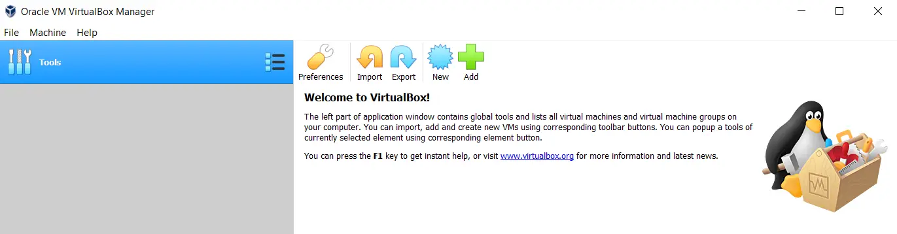

2. Assign a meaningful name for the new virtual machine configuration profile.

- Identify the correct type, version, and build (or as close as possible) for the Guest OS (operating system) which has already been installed.

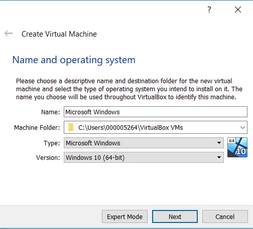

3. Assign an appropriate amount of the Host OS' physical memory for the Guest OS to use.

- Type in a value of (2048).
- A gigabyte of memory is equal to 1024 megabytes.
- Therefore, this Guest OS will be able to consume up to (2 GB) of the Host OS' physical memory.
- Assigning more memory to the Guest OS is better, but be careful not to leave the Host OS with too little, or it will perform poorly.

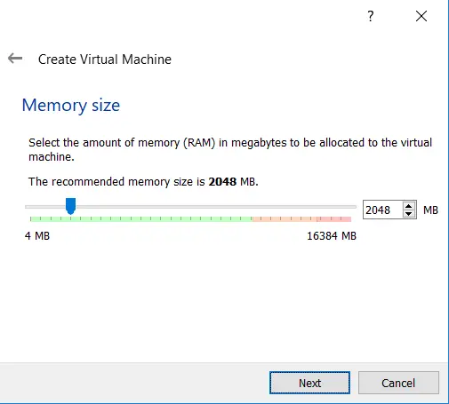

4. Select the option to use an existing virtual disk image (`*.vdi`) file.

- Click on the folder icon to select your existing virtual disk image (`*.vdi`) file.

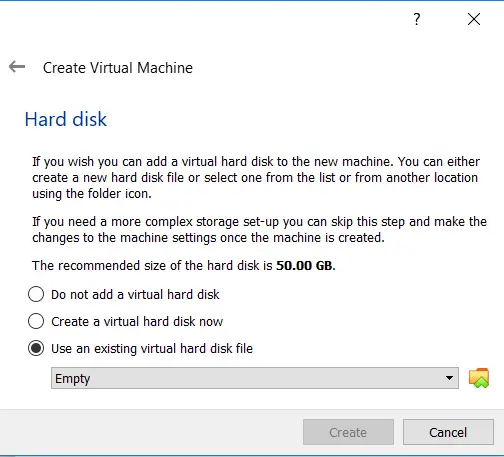

5. If the virtual disk image (`*.vdi`) file is not already listed, click on the "Add" button to add it to the Oracle VM VirtualBox environment.

- If it is already listed, click on it, then click on the "Choose" button.

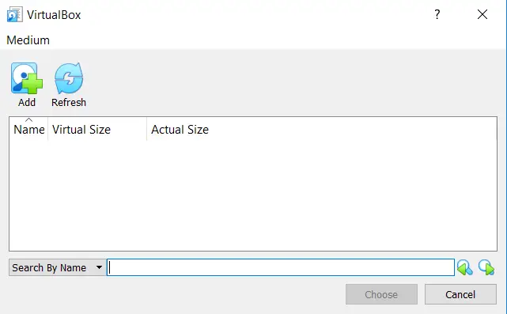

6. Select the existing virtual disk image (`*.vdi`) file you wish to add to the Oracle VM VirtualBox environment, then click on the "Open" button.

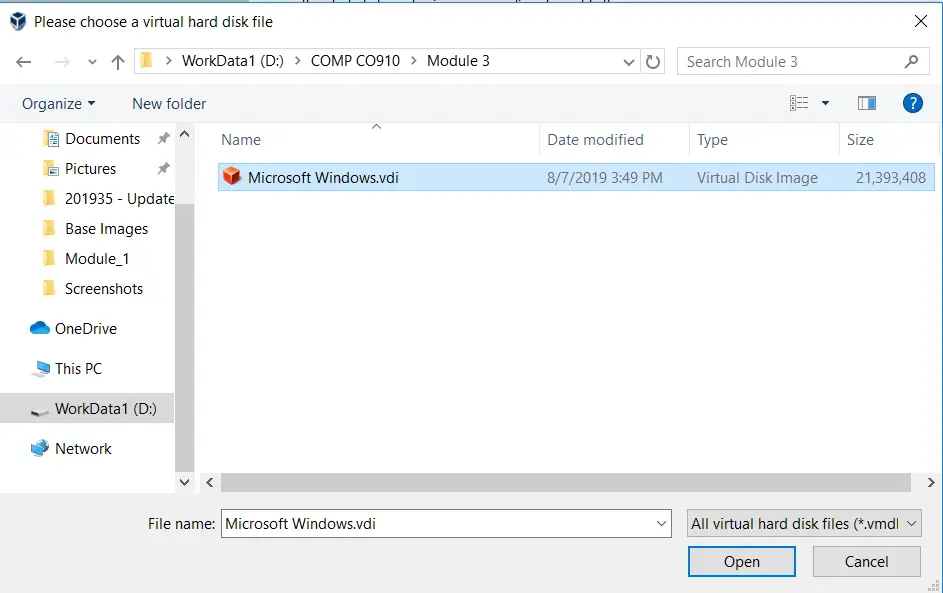

7. Select the existing virtual disk image (`*.vdi`) file you wish to associate with this new virtual machine configuration profile, then click on the "Choose" button.

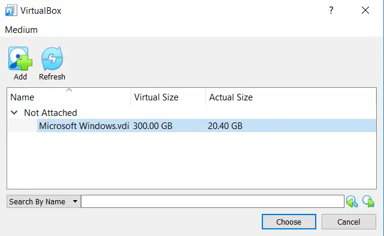

8. Confirm the virtual disk image (`*.vdi`) file you have selected for this new virtual machine configuration profile.

- If it is not correct, change it now.
- If it is correct, click on the "Create" button.

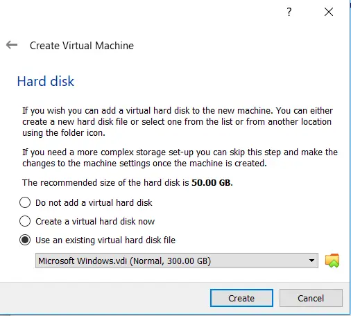

9. The wizard does a good job of creating the virtual machine configuration profile, but there are additional settings which need to be made.

- With the new virtual machine configuration profile selected (highlighted by the colour blue), click on the "Settings" button.

10. Configure the virtual machine for bidirectional clipboard capability.

- With the Guest Additions already installed onto the Guest OS, you will be able to (cut+copy+paste) data between the Host OS and the Guest OS.

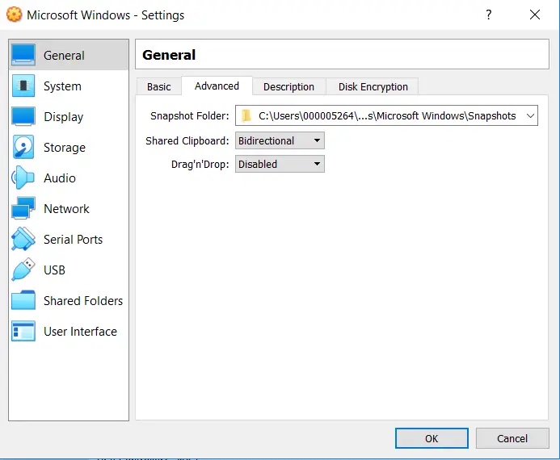

11. The days of floppy disks are long gone.

- There is no need to configure a virtual machine to support older and unused hardware, so deselect it.
- Also, change the boot order for a typical configuration.

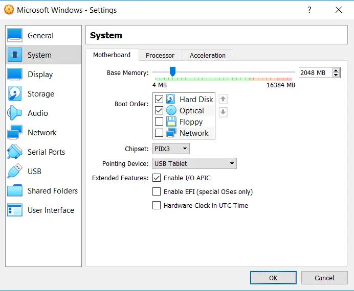

12. Aside from memory, one of the best settings to increase is the amount of virtual CPUs associated with the virtual machine.

- A value above (1 CPU) will increase the performance of the Guest OS significantly.
- The maximum number of (8 CPUs) above is the sum of all CPU cores and hyper-threading features of the CPUs on this physical host computer system.

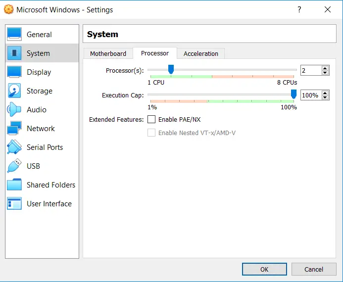

13. Many of the Guest OSes you create or use throughout your program will make use of a graphical desktop.

- So that all applications function properly (within the Guest OS), make certain you assign the maximum amount of video memory for each virtual machine configuration profile you create.

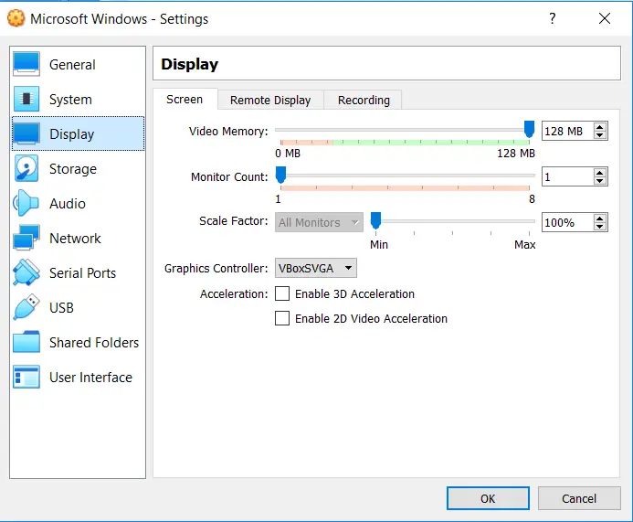

14. At a minimum, this is what you want all of your virtual machine configuration profiles to look like, from a storage perspective.

- At least one virtual disk image (`*.vdi`) file and a virtual optical CD/DVD-ROM storage device, connected to the newer and faster SATA storage controller.

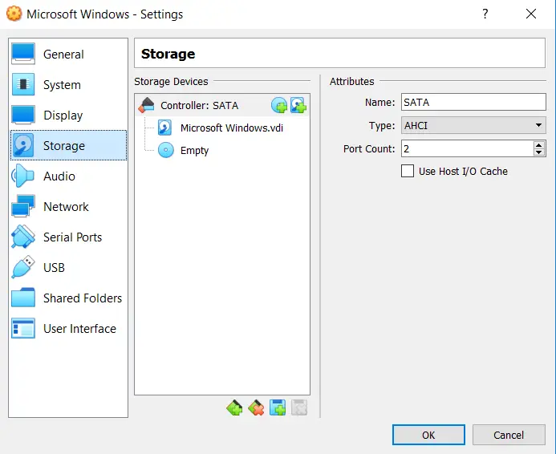

15. Select the appropriate network adapter type.

- We will make use of the "Internal Network" adapter for all (but one) of your virtual machine configuration profiles, once the initial Guest OS installations have been completed.

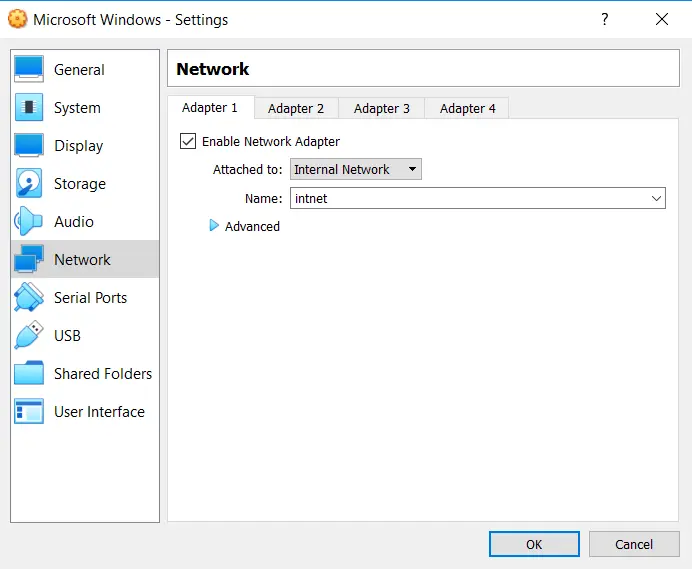

16. With the virtual machine configuration properly configured, click on the "Start" button to boot the virtual machine.

- The existing operating system installed in the virtual disk image (`*.vdi`) file will start up.

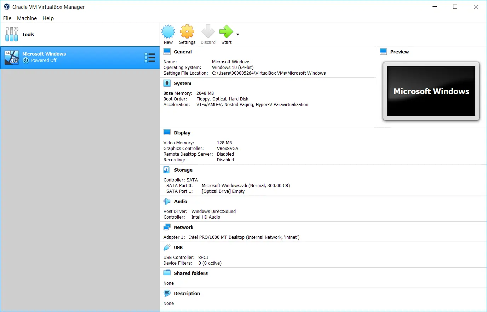
