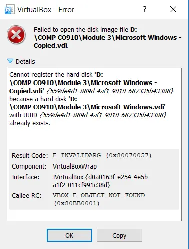
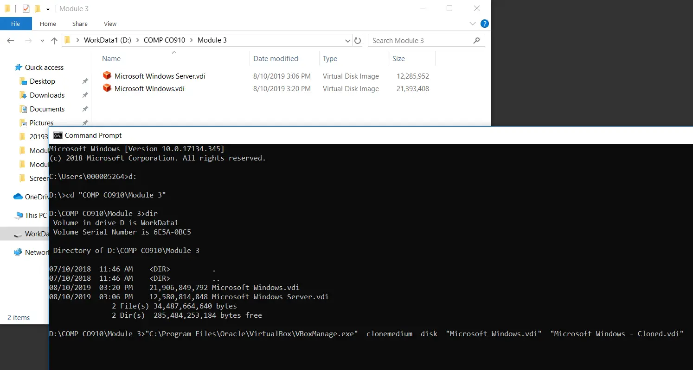
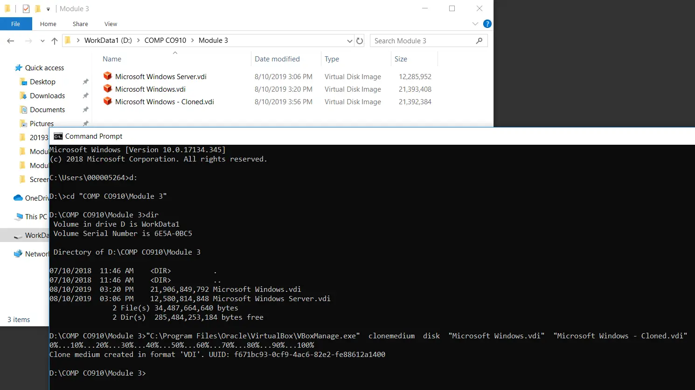
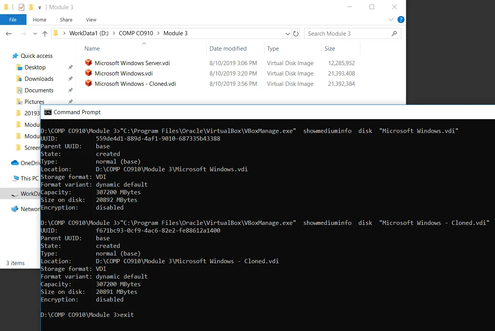
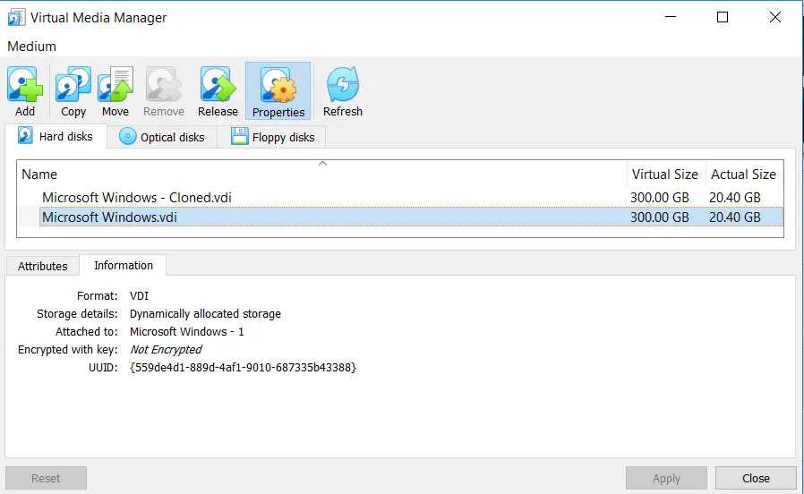
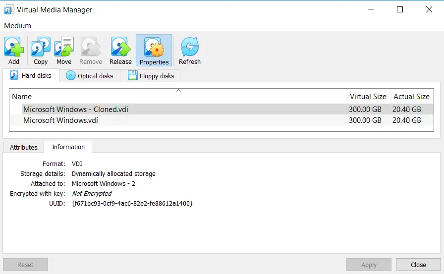

# Cloning a Virtual Disk Image

- At times, it is more efficient to make a copy of an existing virtual disk image (`*.vdi`) file to work with, instead of having to go through the Guest OS installation process over and over again.
- Using multiple copies of a virtual disk image (`*.vdi`) file is not permitted, as the Oracle VM VirtualBox Virtual Media Manager repository keeps track of each virtual disk image (`*.vdi`) file using their associated UUID (Universally Unique Identifier) value.
- If you wish to use multiple "copies" of a single virtual disk image (`*.vdi`) within the Oracle VM VirtualBox virtualization environment, then clones of the virtual disk image (`*.vdi`) file must be used.
- Cloned virtual disk image (`*.vdi`) files are essentially copies, with a new randomly generated UUID associated with them (making them unique to the Oracle VM VirtualBox environment).
- Attempting to add multiple copies of a virtual disk image (`*.vdi`) file into the Oracle VM VirtualBox Virtual Media Manager repository is not possible, and will result in an error message.

1. Cloned images are permitted, as they will have different UUID values associated with each of them.



2. At the Command Interpreter (cmd.exe) prompt, type in commands that will clone your virtual disk image (`*.vdi`) file.

- The command is not case-sensitive, but must include quotation marks to preserve any `<space>` characters located in folder or file names.



## Clone Command

- The following is a single command, even though it is wrapped on multiple lines.
- Modify the following sample command to fit your environment.

```console
"C:\Program Files\Oracle\VirtualBox\VBoxManage.exe" clonemedium disk ".\Microsoft Windows.vdi" ".\Microsoft Windows - Cloned.vdi"
```

### Command Breakdown

- The absolute reference for the (VBoxManage.exe) executable utility.

```console
"C:\Program Files\Oracle\VirtualBox\VBoxManage.exe"
```

- A (VBoxManage.exe) parameter combination identifying that you wish to clone an existing virtual disk image (`*.vdi`) file.

```console
clonemedium disk
```

- A (VBoxManage.exe) parameter identifying the existing virtual disk image (`*.vdi`) file that you wish to clone.

```console
".\Microsoft Windows.vdi"
```

- A (VBoxManage.exe) parameter identifying the location and name of the new virtual disk image (`*.vdi`) file that will be created (cloned).

```console
".\Microsoft Windows - Cloned.vdi"
```

3. Once the cloning process has completed, you can see the new UUID value that is associated with the cloned virtual disk image (`*.vdi`) file that was created.



4. Using the (showmediuminfo) parameter for the (VBoxManage.exe) utility, will display details related to a virtual disk image (`*.vdi`) file, including its UUID value.

- Type the (exit) command to gracefully exit the Command Interpreter (cmd.exe) interface.



## Virtual Disk Details Command

- The following is a single command, even though it is wrapped on multiple lines.
- Modify the following sample command to fit your environment.

```console
"C:\Program Files\Oracle\VirtualBox\VBoxManage.exe" showmediuminfo disk ".\Microsoft Windows.vdi"
```

### Command Breakdown

- The absolute reference for the (VBoxManage.exe) executable utility.

```console
"C:\Program Files\Oracle\VirtualBox\VBoxManage.exe"
```

- A (VBoxManage.exe) parameter combination identifying that you wish to view information related to an existing virtual disk image (`*.vdi`) file.

```console
showmediuminfo disk
```

- A (VBoxManage.exe) parameter identifying the existing virtual disk image (`*.vdi`) file that you wish to display information about.

```console
".\Microsoft Windows.vdi"
```

5. From the Oracle VM VirtualBox Virtual Media Manager repository, you can also view the UUID values for each virtual disk image (`*.vdi`) file.




