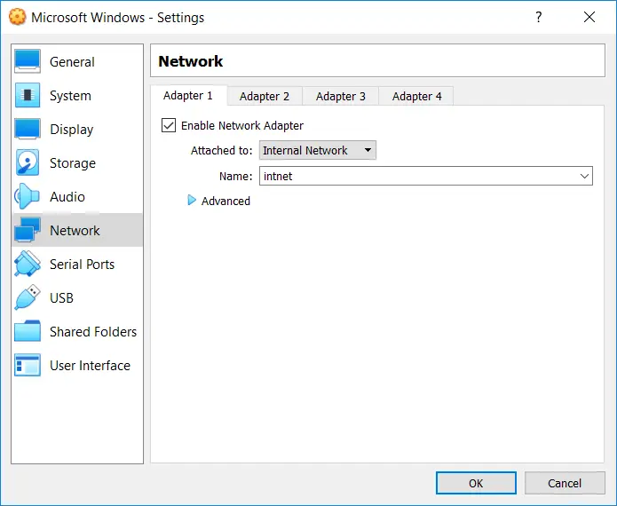

# Cloning - Practice

- All (3) virtual machines will not need access to the Internet.
- As such, you will configure each virtual machine configuration profile with the below virtual network settings.

## Virtual Machine # 1 (Specifications)

- Virtual Machine Name: Microsoft Windows - 1
- Operating System: Microsoft Windows 10 (64-bit)
- Memory: 2048 MB
- Storage Controllers:
  - Quantity: 1
  - Type: SATA Controller
    - SATA Port 0: {a copy of a Microsoft Windows image}
    - SATA Port 1: {an optical CD/DVD-ROM storage device}
- Network Adapters:
  - Quantity: 1
  - Attached to: Internal Network (Network Name: intnet)
- Floppy Disk: {Removed}
- Shared Clipboard: Bidirectional
- Processors: 2
- Video Memory: 128 MB

## Virtual Machine # 2 (Specifications)

- Virtual Machine Name: Microsoft Windows - 2
- Operating System: Microsoft Windows 10 (64-bit)
- Memory: 2048 MB
- Storage Controllers:
  - Quantity: 1
  - Type: SATA Controller
    - SATA Port 0: {a clone of a Microsoft Windows image}
    - SATA Port 1: {an optical CD/DVD-ROM storage device}
- Network Adapters:
  - Quantity: 1
  - Attached to: Internal Network (Network Name: intnet)
- Floppy Disk: {Removed}
- Shared Clipboard: Bidirectional
- Processors: 2
- Video Memory: 128 MB

## Virtual Machine #3 (Specifications)

- Virtual Machine Name: Microsoft Windows Server
- Operating System: Microsoft Windows Server 2019
- Memory: 2048 MB
- Storage Controllers:
  - Quantity: 1
  - Type: SATA Controller
    - SATA Port 0: {a copy of a Microsoft Windows Server image}
    - SATA Port 1: {an optical CD/DVD-ROM storage device}
- Network Adapters:
  - Quantity: 1
  - Attached to: Internal Network (Network Name: intnet)
- Floppy Disk: {Removed}
- Shared Clipboard: Bidirectional
- Processors: 2
- Video Memory: 128 MB

## Tasks

1. Start the (Microsoft Windows - 2) virtual machine, and sign on to the Guest OS using the localuser account's security credentials.

- On the (Microsoft Windows - 2) Guest OS, change the hostname value from (`w000123456a`) to (`w000123456b`).
- Use your personal 9-digit number in place of this fictitious one.
- Remember, all nodes on a network must have unique hostname values.
- Restart the Guest OS when prompted.
- Sign on using the localuser account's security credentials.

2. On the (Microsoft Windows - 2) Guest OS, change the IP address settings from a dynamic configuration to a static configuration.

- Use the IP address of (`192.168.100.30`) and a subnet mask of (`255.255.255.0`).
- Startup the (Microsoft Windows - 1) virtual machine, and sign on to the Guest OS using the localuser account's security credentials.

3. On the (Microsoft Windows - 1) Guest OS, change the IP address settings from a dynamic configuration to a static configuration.

- Use the IP address of (`192.168.100.87`) and a subnet mask of (`255.255.255.0`).
- Verify network connectivity between the (2) Guest OSes.

4. On the (Microsoft Windows - 2) Guest OS, create the following new local SAM-based user account:
   - Username: `john.smith`
   - Password: `P&ssw0rd`
   - User must change password at next logon.

5. On the (Microsoft Windows - 1) Guest OS, create the following new local SAM-based user account:
   - Username: `john.smith`
   - Password: `P&ssw0rd`
   - User must change password at next logon.

6. On the (Microsoft Windows - 1) Guest OS, sign on using the new local SAM-based user account's security credentials.

- When prompted, change the (`john.smith`) user account's password in the (Microsoft Windows - 1) Guest OS' SAM database to (`jsP&ssw0rd`).

7. On the (Microsoft Windows - 2) Guest OS, sign on using the new local SAM-based user account's security credentials.

- When prompted, change the (`john.smith`) user account's password in the (Microsoft Windows - 2) Guest OS' SAM database to (`jsP&ssw0rd`).

8. On the (Microsoft Windows - 2) Guest OS, sign on to the Guest OS using the localuser account's security credentials.

9. On the (Microsoft Windows - 2) Guest OS, create a new folder structure on the (C:) volume called (`\Data\Sales Department`).

- The absolute path will be (`C:\Data\Sales Department`).

10. On the (Microsoft Windows - 2) Guest OS, share the (`C:\Data\Sales Department`) folder with a share name of (`Sales`).

- Ensure user (`john.smith`) will have Full Control access to the (`Sales`) shared folder.

11. On the (Microsoft Windows - 1) Guest OS, map a network drive to the new shared folder hosted on the (Microsoft Windows - 2) Guest OS.

- The UNC pathname will be similar to (`\\w000123456b\Sales`).
- Modify to fit your virtualized environment.

12. On the (Microsoft Windows - 1) Guest OS, copy the local (`C:\Windows\System32\drivers\etc\hosts`) text-based file across the network and into the (`Sales`) shared folder.

13. On the (Microsoft Windows - 2) Guest OS, verify the (hosts) file now exists in the (`C:\Data\Sales Department`) folder.

14. On the (Microsoft Windows - 1) Guest OS, verify user (`john.smith`) has Full Control permissions to the contents of the (`Sales`) shared folder.

- The user should be able to rename the file, modify the contents within the file, delete the file, etc.

15. On the (Microsoft Windows - 1) Guest OS, remove the network drive mapping for the (`Sales`) shared folder.

16. On the (Microsoft Windows - 2) Guest OS, disable the sharing of the (`C:\Data\Sales Department`) folder.

- Do not delete the folder itself.

17. Start the (Microsoft Windows Server) virtual machine, and sign on to the Guest OS using the administrator account's security credentials.

18. On the (Microsoft Windows Server) Guest OS, change the IP address settings from a dynamic configuration to a static configuration.

- Use the IP address of (`192.168.100.224`) and a subnet mask of (`255.255.255.0`).
- Verify network connectivity between the (3) Guest OSes.

19. On the (Microsoft Windows Server) Guest OS, create the following new local SAM-based user account.
    - Username: `john.smith`
    - Password: `jsP&ssw0rd`
    - Password never expires.

20. On the (Microsoft Windows Server) Guest OS, create a new folder structure on the (C:) volume called (`\Data\Human Resources`).

- The absolute path will be (`C:\Data\Human Resources`).

21. On the (Microsoft Windows Server) Guest OS, share the (`C:\Data\Human Resources`) folder with a share name of (`HRDept`).

22. On the (Microsoft Windows - 1) Guest OS, map a network drive to the new shared folder hosted on the (Microsoft Windows Server) Guest OS.

- The UNC pathname will be similar to (`\\ws000123456a\HRDept`).
- Modify to fit your virtualized environment.

23. On the (Microsoft Windows - 1) Guest OS, copy the local (`C:\Windows\System32\drivers\etc\hosts`) text-based file across the network and into the (`HRDept`) shared folder.

24. On the (Microsoft Windows Server) Guest OS, verify the (hosts) file now exists in the (`C:\Data\Human Resources`) folder.

25. On the (Microsoft Windows - 1) Guest OS, verify user (`john.smith`) has Full Control permissions to the contents of the (`HRDept`) shared folder.

- The user should be able to rename the file, modify the contents within the file, delete the file, etc.

26. On the (Microsoft Windows - 1) Guest OS, remove the network drive mapping for the (`HRDept`) shared folder.

27. On the (Microsoft Windows Server) Guest OS, disable the (`john.smith`) SAM-based user account.

28. On the (Microsoft Windows - 1) Guest OS, attempt to map a network drive to the (`HRDept`) shared folder hosted on the (Microsoft Windows Server) Guest OS.

- Verify user (`john.smith`) is no longer able to successfully map a drive to this folder, as his SAM-based account on the (Microsoft Windows Server) Guest OS has since been disabled.

29. On the (Microsoft Windows Server) Guest OS, disable the sharing of the (`C:\Data\Human Resources`) folder.

- Do not delete the folder itself.

30. On the (Microsoft Windows Server) Guest OS, delete the (`john.smith`) SAM-based user account.

31. On the (Microsoft Windows - 2) Guest OS, delete the (`john.smith`) SAM-based user account.

32. On the (Microsoft Windows Server) Guest OS, delete the entire (`C:\Data\Human Resources`) folder structure.

33. On the (Microsoft Windows - 2) Guest OS, delete the entire (`C:\Data\Sales Department`) folder structure.

- Copy any small file from the Host OS into each of the (3) Guest OSs using the Oracle VirtualBox Shared Folders feature.
- Copy any (different) small file from each of the (3) Guest OSs out to the Host OS using the Oracle VirtualBox Shared Folders feature.
- For all (3) Guest OSs, remove the drive mappings to the Oracle VirtualBox shared folders.
- For all (3) Guest OSs, remove each of the Oracle VirtualBox shared folders being advertised to each Guest OS.
- Gracefully shut down the (Microsoft Windows - 2) Guest OS.
- Gracefully shut down the (Microsoft Windows - 1) Guest OS.
- Gracefully shut down the (Microsoft Windows Server) Guest OS.
- For all (3) virtual machines, remove each virtual disk image (`*.vdi`) file from the Oracle VirtualBox Virtual Media Manager repository.
- Do not delete any of the (3) virtual disk image (`*.vdi`) files.
- Remove all (3) virtual machine profiles.
- Delete all virtual machine configuration files.
