# Microsoft Windows Network Settings

## Checking a node's existing IP settings

- Here, an APIPA address (`169.254.h.h`) is being used.
- This means that this node is configured to acquire its IP address settings from a dynamic source (e.g. a DHCP server), but was unsuccessful in doing so.
- Therefore, the node randomly chooses valid APIPA values (IP address and subnet mask) and auto-configures the node to use it.
- With APIPA settings in place, this node will be unable to communicate on a corporate network properly or gain access to Internet resources.

1. Seeing an APIPA value (`169.254.h.h`) is really just an indicator to you that something has gone wrong (e.g. faulty node network adapter, faulty network switch, faulty router, faulty network cable, DHCP server is unavailable, etc.).

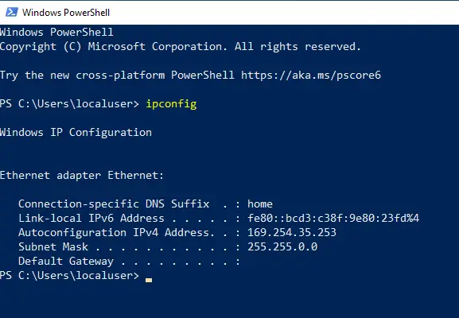

2. IP settings are changed at the network adapter level for the node.

- Click on the (Network and Sharing Center) Control Panel applet.

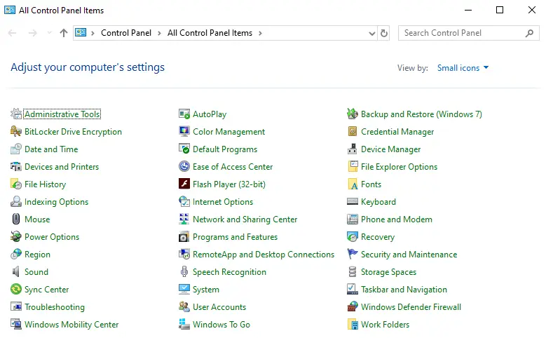

3. Click on the (Change adapter settings) hyperlink.

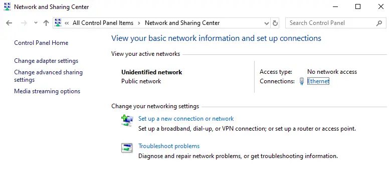

4. This node has only (1) network adapter associated with it.

- If it were configured with additional network adapters, then more than the (1) icon would be displayed here.
- Select the network adapter you wish to change the settings of, right-click on it, and from the shortcut menu select (Properties).

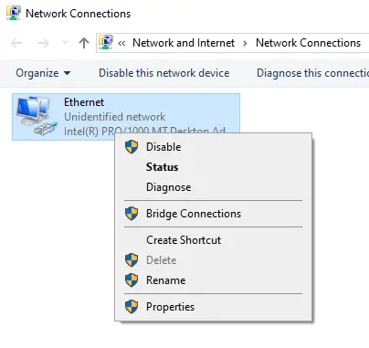

5. Locate the IPv4 protocol stack that is associated with the network adapter, and click on the (Properties) button.

- Here, you can see that this network adapter is currently configured to acquire its IPv4 settings from a dynamic source on the network (e.g. a DHCP server).

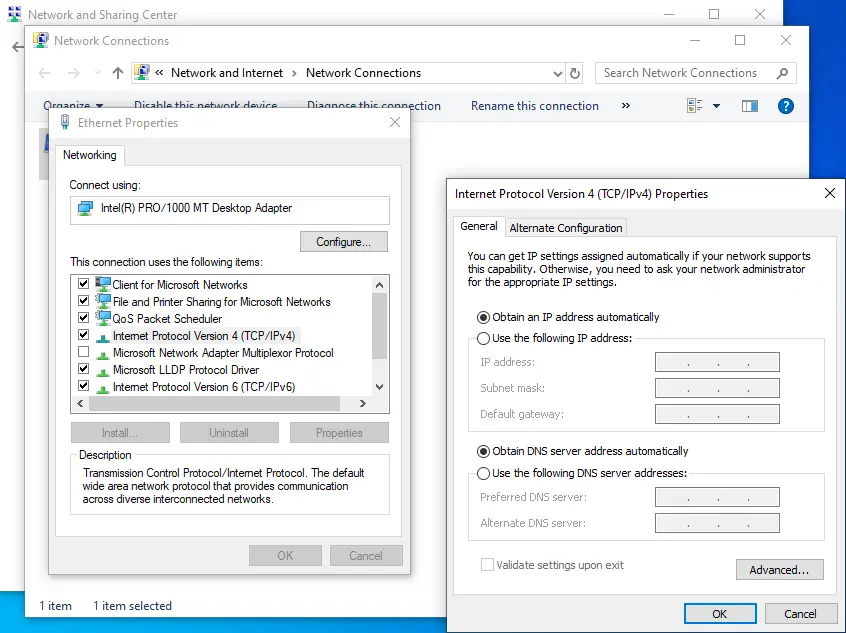

- To configure the network adapter with static IPv4 settings, toggle the radio buttons and enter the appropriate values.
- Here, only an IP address and corresponding subnet mask are entered.
- There is no default gateway in our mini virtualized network environments, nor any DNS server to provide name resolution.
- Therefore, we do not need to enter any values for these optional settings.

6. Click on the (OK/Close) buttons to save the setting changes.

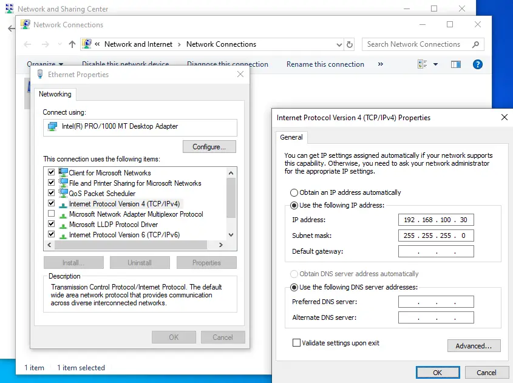

7. Verify that the IP settings have been applied to the node's network adapter.

- If they are not the values you expect to see, go back and check/change the network adapter's IP settings.

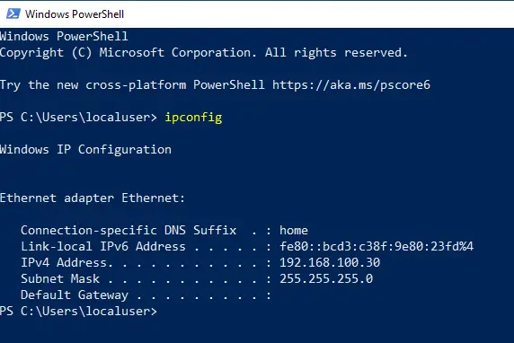

## Verifying Network Connectivity

- Once IP settings have been applied to the node's network adapter(s), verify that you can successfully communicate on the network (at an IP level).
- The proper (ping) order for checking network connectivity is:

1. Ping the internal local loopback adapter (127.0.0.1). This will verify that the IPv4 protocol stack is functioning correctly on the node.

- If this step fails, and you do not see successful responses from the internal local loopback adapter, there is a serious problem with the node, and it would be pointless to continue with the remaining network connectivity verification steps.

2. Next, ping the node's own network adapter.

- There is no point in attempting to communicate on the network with other nodes or the Internet if your own node's network adapter card does not respond successfully.

3. Next, ping a node that is on the same local network as your own node.

- There is no point in attempting to communicate with other nodes in other networks if you are unable to successfully communicate with nodes on your own network.

4. Next, ping a node that is located on a different network to that of the one your own node is located on.

- This step verifies if your default gateway value for your node is correct (and that the router is routing network traffic properly).

5. Next, ping other remote nodes (e.g. Internet-based nodes).

6. Next, ping using hostnames and FQDN values.

- This will verify if forward lookup name resolution is functioning correctly.
- If it isn't, check the DNS server value settings for your node's network adapter.
- If they seem correct, then maybe there is a problem with the DNS server you are using.

7. Finally, begin to use your node as normal.

- Test using applications that communicate on the network to verify everything functions as expected.
- Not all network connectivity tests will result in successful responses (replies).
- Diagnostic utilities like ping and traceroute make use of a unique protocol included with the Internet Protocol (IP) called ICMP (Internet Control Message Protocol).
- The Internet Protocol (IP) is actually a group of many protocols (e.g. ICMP, HTTP, FTP, SMTP, POP, IMAP, etc.), which are referred to collectively as the Internet Protocol Suite.
- For security purposes, it is common nowadays for network administrators to configure nodes (they are responsible for) to purposely not respond to incoming ICMP traffic (or to block ICMP traffic altogether on their networks).
- Network administrators are making it more and more difficult these days for the casual user to "look" for nodes and software services on their networks (a form of network snooping). This is a good thing and only makes networks more secure in the long run.

## Verifying network connectivity

8. Above shows all positive (successful) results from the ping tests.
   - (A) pinging the internal local loopback adapter
   - (B) pinging the local node's network adapter

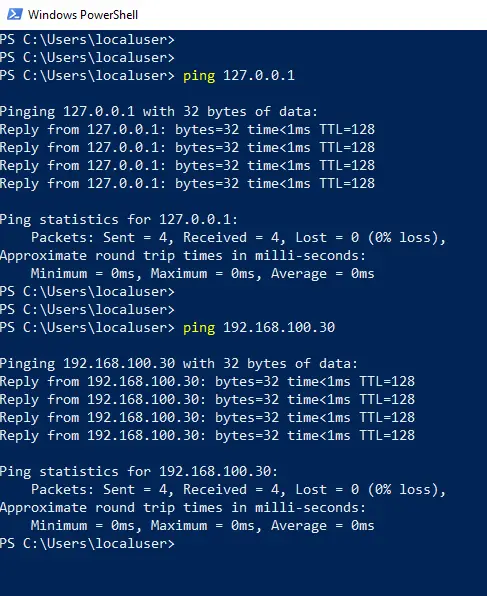

9. Above shows all positive (successful) results from the ping test.
   - (C) ping a nearby node on the same local network as this node
   - (D) ping another nearby node on the same local network as this node

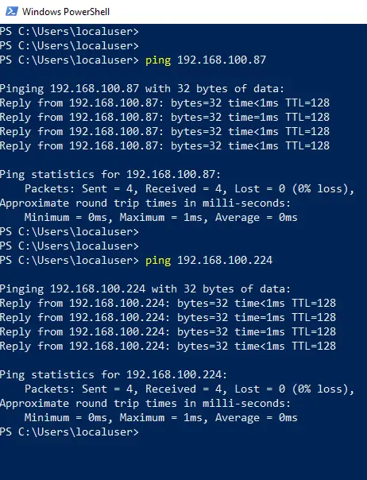

## Typical Configuration Mistakes

- When network connectivity verification steps fail, it is typically due to a mistyped IP setting value.
- All nodes communicating on a network must have a unique IP address.
- Having (2) or more nodes configured with the exact same IP address will result in failed communications.
- Networks without routers must have all nodes participating in the same logical IP network.
- If (1) or more nodes are participating outside of the same network, this will also result in failed communications.
- Typically, users will accidentally type in the wrong IP address, subnet mask, default gateway, DNS server, or DNS suffix values for their nodes.

10. Here, an accidentally typed IPv4 address (`n.n.200.h`) was entered.

- This address is not in the same network as the other nodes we wish to communicate with (`n.n.100.h`).
- As such, expect network connectivity problems.

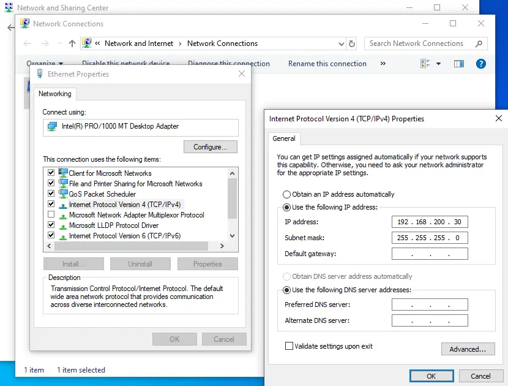

11. An attempt to ping a node located on the same physical local network as our own node fails.

- The remote node is not participating in the same IPv4 network as our own node.
- Without a router device, communications will never occur between a node located in the (`n.n.200.h`) network and the (`n.n.100.h`) network.

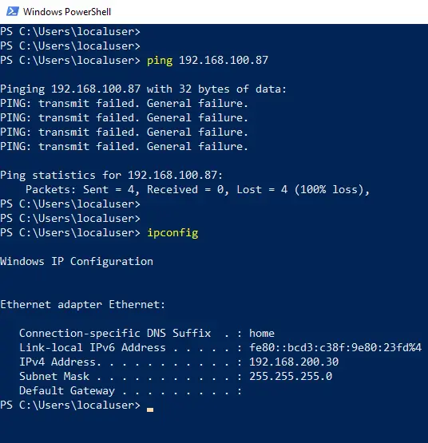

12. By default, most modern-day nodes are IPv6 capable and are typically IPv6 enabled too.

- Do not disable IPv6 on a modern-day Microsoft Windows node, as it will typically "break" software on the node which relies on it to be enabled.

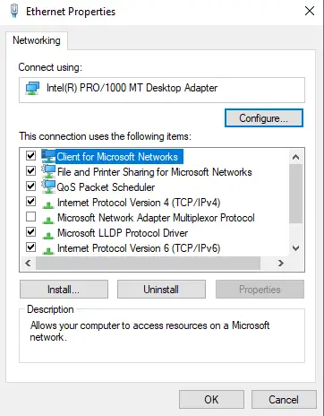

13. If you would like to experiment and get comfortable with IPv6, then you can adjust the IPv6 settings for a node similar to how you will adjust the IPv4 settings for nodes.

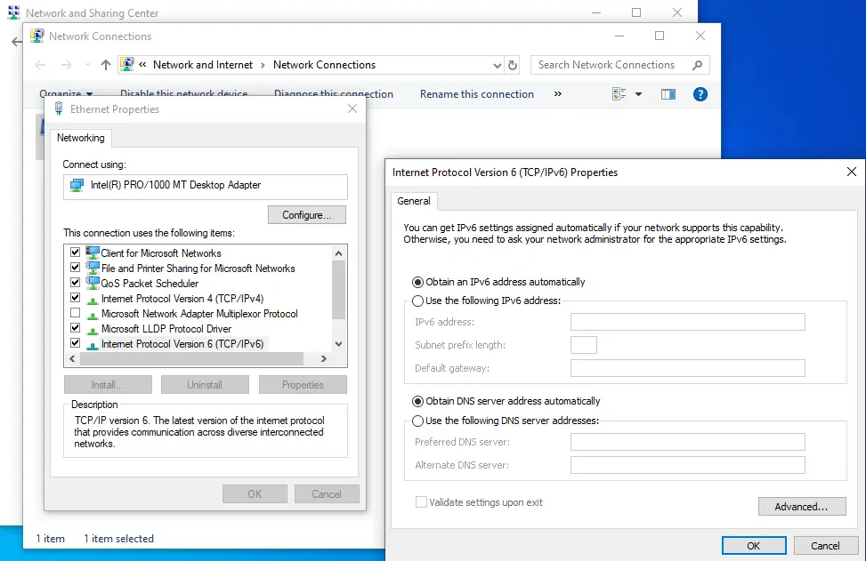
