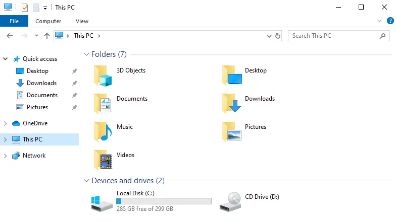
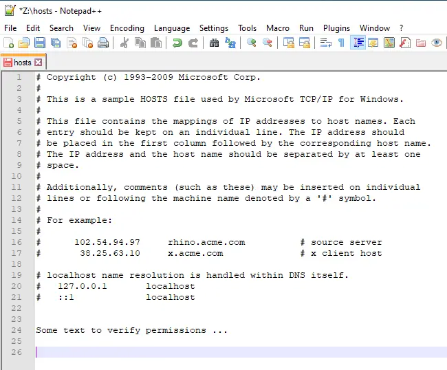

# Microsoft Windows Shared Folders

- A good part of an administrator's role is to make data available to users in a workplace.
- Data should always be centralized so all users have access to it.
- Data residing only on a single employee's node is useless, as no other employee would typically have access to it.
- Folder structures are created to house the data, which are then advertised on the network for remote node users to access.
- Shared folders are used as the mechanism to advertise out the data.
- Shared folders are created, and appropriate permissions are applied to them.
- Remote users then map a network drive (across the network) to the remote shared folders.
- Through the mapped network drive, users are able to access the data.
- Shared folder permissions are a combination of (2) unique types of permissions:
  - Share permissions
  - NTFS file system permissions
- The combination of both share and NTFS permissions creates effective permissions for each user.
- Effective permissions are what let users do things to folders and files, or prevent them.
- Share permissions are simple.
- They should always be set to allow (Everyone) full control to the folders and files accessed through a shared folder.
- Set it once, and forget about it.
- Once a user has full control access through the shared folder (via share permissions), then NTFS permissions take over.
- NTFS permissions are a form of file system security that allows users to read, write, modify, rename, etc., folders and files on an NTFS file system.
- NTFS permissions are specific to NTFS file systems.
- Similar permissions are not found on older outdated file systems like:
  - FAT32
  - ExFAT
- When you are working with Microsoft Windows nodes and Microsoft Windows Servers nodes, you should never use these older file system types to house important data.
- NTFS should be used all of the time.
- The only reason why your portable USB-powered hard disk is currently formatted with an (ExFAT) file system is for portability and compatibility reasons
- Not for security reasons.

## Creating a Shared Folder

1. Never save files at the root of a storage volume.

- Instead, store them within folders.
- It is wise to keep the number of folders located at the root of a storage volume to a minimum.
- Here, we'll create a single folder off the root of the (C:) volume, called (`Data`), to contain all of your data.

2. Below the (`Data`) folder, we can start to create subfolders to organize our data.

- Change your file system context to (`C:\Data`) by double-clicking on the (`Data`) folder.

3. Assume we would like to keep all of our "Sales Department" related data in a folder structure, such that all users who work in our "Sales Department" can access the data over the network.

- Folder names and file names should be meaningful.
- Here, we'll create a new folder called (`Sales Department`).
- Assume there will be many more folders and data files below this new folder, which are all related to the "Sales Department" of the company.

4. Currently, the contents of the (`Sales Department`) folder are only available to users who sign on to this node directly.

- To permit other networked node users access to the data from across the network, we will need to ‘share' the folder.
- Right-click on the (`Sales Department`) folder, and select the (Properties) option.

5. From the (Sharing) tab, click on the (Advanced Sharing, ) button.

6. Enable the (Share this folder) checkbox to begin sharing the (`Sales Department`) folder over the network.

- The share name defaults to the folder name that is being shared.
- Having `<space>` characters in a share name can be problematic, so let's shorten it a bit to just (`Sales`).

7. The shortened share name now does not include any `<space>` characters and is a bit easier to remember.

8. Click on the (Permissions) button.

- As a rule of thumb, you will only ever have (1) share permissions entry called (Everyone), and you will give the (Everyone) group (Full Control) permissions at a share level.
- More granular permissions can then be controlled at an NTFS file system level if needed.

9. The (Everyone) security group now has (Full Control) share level permissions.

- Click on all the (Apply) and (OK) buttons to save the folder sharing settings.
- Return to the (Properties - Sharing) tab for the (`Sales Department`) folder.

10. Verify the UNC (Universal Naming Convention) value for your newly shared folder.

- The UNC value is what remote node users will use to access the (`Sales Department`) folder from across the network.
- The UNC value format is: `\\nodename\sharename`.
- Click on the (Close) button.

## Microsoft Windows - Default NTFS Permissions

- All newly created user accounts, within a Microsoft Windows node's SAM database, will automatically have some level of permissions to folders and files on the node's NTFS file systems.
- The permissions are inherited from the default security groups the user account is a member of.
- Typically, most users will need to perform the following file system tasks:
  - Traverse folder structures.
  - Create new files and folders.
  - Read the contents of new and existing files.
  - Rename files and folders.
  - Modify the contents of new and existing files.
  - Delete files and folders.

11. All newly created SAM user accounts by default belong (are members of) a built-in security group called (Users).

- Members of the (Users) security group, by default, do not have appropriate permissions to write or modify files and folders, at an NTFS file system permissions level.

12. All newly created SAM user accounts which successfully authenticate to the node, by default, belong to another security group called (Authenticated Users).

- Members of the (Authenticated Users) security group, by default, do have appropriate permissions to write or modify files and folders, at an NTFS file system permissions level.

13. Viewing the effective permissions for a specific user account (`john.smith`), and for this specific folder (`Sales Department`), reveals the granular NTFS file system permissions.

- This user will be able to read, write, delete, and modify data which is located below the (`Sales Department`) folder, by default.
- Therefore, no explicit NTFS file system permissions need to be added or modified.

## Mapping to a Shared Folder

- Once a folder is shared on one node, users can access the folder's data from any other node on the network.
- This process is called mapping a network drive.
- Users on other nodes create an association to the remote node's shared folder (e.g. Sales) with a local drive letter (e.g. F:, K:, X:, Z:, etc.) on their node, by referencing the advertised network resource path for the shared folder (e.g. `\\w000123456b\Sales`).
- This reference is in a specific format (`\\nodename\sharename`), referred to as the UNC format (Universal Naming Convention).
- On extremely small networks, the (`nodename`) is resolved by way of broadcast messages.
- On larger networks, the (`nodename`) would need to be resolved by a DNS server.
- Optionally, the local resolution file (`C:\Windows\System32\drivers\etc\hosts`) could be used to resolve the (`nodename`).

14. From other nodes on the network, the (File Explorer) interface can be used to map a network drive to a remote node's shared folder.

- Access to the remote (e.g. C:\Data\Sales Department) folder is made possible using the network.

15. Click on the (Map network drive) option.

16. Any unused local drive letter can be used.

- This is where the UNC value is typed.
- If you want the drive mapping to be persistent each time the user signs on, then select this option.

17. If you wish to authenticate using a different set of security credentials (username + password), select this option.

- The security credentials must exist in the remote node's SAM database.
- If your security credentials, on the local node you are signed in on, match exactly those which are also located in the SAM database of the remote node, this option does not need to be selected, as your current username and password values will be passed on to the remote node during the authentication process.

18. Type in the correct UNC value of the remote node's shared folder.

- Any spelling mistakes will generate an error message, and you will not be able to complete the network drive mapping.
- Click on the (Finish) button.

19. A new (File Explorer) window will automatically open once the network drive mapping process is successful.

20. Test your level of permissions.

- See if you can create files, rename files, view the contents of a file, modify the contents of a file, and delete files.
- If so, then you have all the permissions you need to have complete access to the data located on the remote node through the shared folder.
- To complete your permissions test, find a small text-based file that is local to your node.

21. Copy the small text-based file located on your local node. 

22. ...and paste it into the shared folder of the remote node.

- If you did not receive an error message, then you have confirmed that your user account is capable of creating new files in the remote node's (`C:\Data\Sales Department`) folder via the share.

23. Use a text editor and modify the contents of the text-based file now located on the remote node.

24. If you are able to change the content within the file and save the changes without receiving an error message, then you have confirmed that your user account is capable of modifying (and viewing) files in the remote node's (`C:\Data\Sales Department`) folder, via the share.

25. Rename the file located on the remote node.

26. If you did not receive an error message, then you have confirmed that your user account is capable of renaming files in the remote node's (`C:\Data\Sales Department`) folder, via the share. Delete the file.

- If you do not receive an error message, then you have confirmed that your user account is capable of deleting files in the remote node's (`C:\Data\Sales Department`) folder, via the share. On most occasions, all users will need to have these basic permissions to all shared data (the ability to read, create, write, modify, and delete).

## Monitoring and Managing Shared Folders

- Once shared folders have been created and users are remotely accessing the data within the shared folders, the administrator might need to monitor or manage the shared folders.
- Using the (Computer Management) applet on the node that is sharing folders (where the shared folders are being advertised from), the administrator can perform several functions related to the monitoring and managing of the shared folders:
  - Stop the sharing of a shared folder
  - Rename the share name for a shared folder
  - Change share level permissions (though not likely)
  - Identify what users are connected to a shared folder
  - Identify what files are in an "opened state"
  - Close an open file
  - Close a user's connection to a share

27. Stop the sharing of a folder

- Change the share name
- Change the permissions associated with a shared folder, etc.

28. Kill the connection for a user to a specific shared folder

29. Kill the connection for a specific file that a user currently has in an opened state across the network via the shared folder

## Removing a Mapped Network Drive

30. Disconnecting a mapped network drive from your local node will remove the connection to the remote node's shared folder

- Nothing destructive will happen to the remote node's shared folder

31. The mapped network drive to the remote node's shared folder has now been disconnected from the local node

## Removing a Shared Folder

32. On the node that is currently sharing a folder, deselect the (Share this folder) checkbox to stop sharing out the folder to other node users on the network.

## Microsoft Windows Server - Default NTFS Permissions

- All newly created user accounts, within a Microsoft Windows Server node's SAM database, will automatically have some level of permissions to folders and files on the node's NTFS file systems.
- The permissions are inherited from the default security groups the user account is a member of.
- Typically, most users will need to perform the following file system tasks:
  - Traverse folder structures.
  - Create new files and folders.
  - Read the contents of new and existing files.
  - Rename files and folders.
  - Modify the contents of new and existing files.
  - Delete files and folders.

33. All newly created SAM user accounts by default belong to (are members of) a built-in security group called (Users).

- Members of the (Users) security group, by default, do have appropriate permissions to access files and folders, at an NTFS file system permissions level.
- The "Special Permissions" granular NTFS file system permission gives them the permissions.
- Therefore, no explicit NTFS file system permissions need to be added or modified.

34. By analyzing the "Special Permissions."

35. ...we can see the (Create) permission is given in addition to other permissions.

- All permissions are then merged together to create what is called the "Effective Permissions" for a specific user account.

36. Viewing the effective permissions for a specific user account (john.smith), and for this specific folder (Human Resources), reveals the granular NTFS file system permissions.

## Typical Problems

- When accessing remote shared folders, several problems can potentially be encountered.
- Typical mistakes like spelling, incorrect security credentials, etc., are almost always the root of the problem.
- The next few slides attempt to capture and illustrate the typical problems users encounter when attempting to access shared folders located on remote nodes.

37. When attempting to connect to a remote node's share, and your current security credentials (username + password) do not match those in the remote node's SAM database, you will be prompted to enter a different set of security credentials.

38. When attempting to connect to a remote node's share, and your user account in the remote node's SAM database is in a disabled state, you will not be able to access the shared folder.

39. When attempting to connect to a remote node's share, and the share no longer exists, you will not be able to access the share.

40. When attempting to connect to a remote node's share, and you have misspelled any part of the UNC value, or have not used the correct UNC format (`\\nodename\sharename`), you will not be able to access the share.

