# Oracle VM VirtualBox Shared Folders

## Creating a Shared Folder

- On a running Guest OS, right-click on the folder icon located at the bottom of its console window (one below the battery and network icon).
- Then, click on "Shared Folders Settings..."

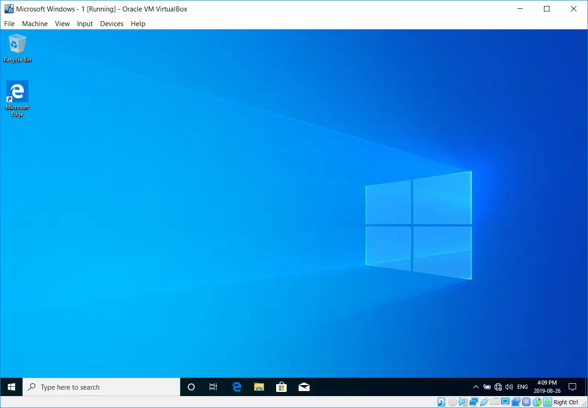

- Click on the “Add New Shared Folder” icon.

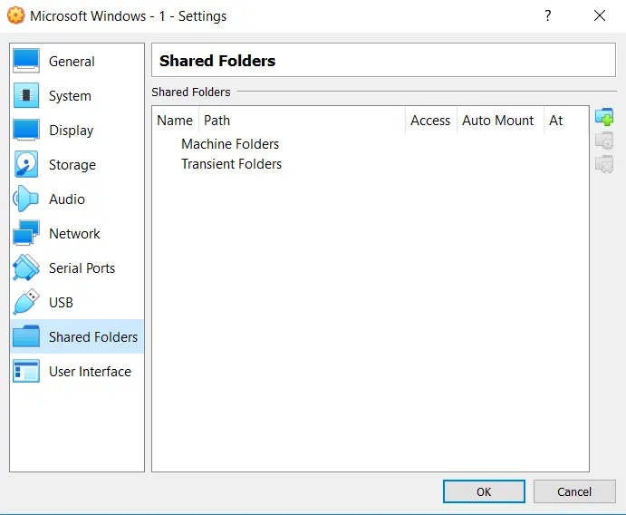

- Click on the (Folder Path) arrow, and select which folder on your Host OS will be "shared" to this Guest OS.
- Oracle VirtualBox shared folders are only available to the Guest OS for which you are configuring them.
- If you have multiple Guest OSes running, you would need to perform a similar process for each of them (if required).

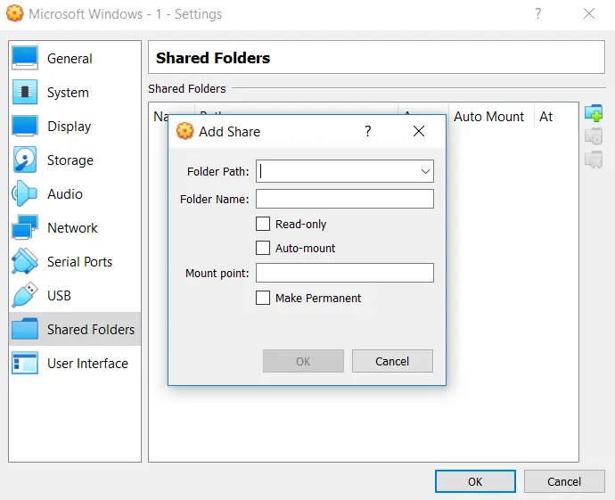

- Here, I wish to share the "Windows" folder currently located on my portable USB-powered storage device which is attached to my Host OS.
- Once completely configured, I will be able to access folders and files below this "Windows" folder from within this Guest OS.
- Using the Oracle VirtualBox Shared Folders feature is a great way of transferring files between a Guest OS and the Host OS.

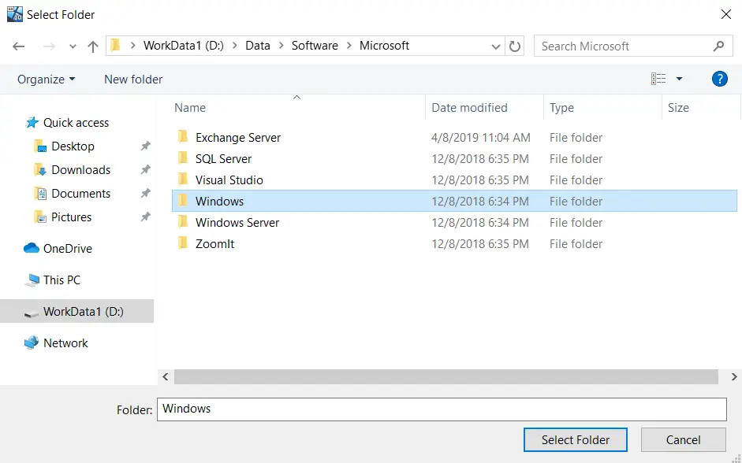

- By default, the share name (a.k.a. Folder Name) will inherit the (Folder Path)’s folder name.
- Most of the time, this is not ideal.

- Type in a share name value that is relatively short, and contains no `<space>` characters, symbol characters, etc.
- The value should be unique to this Guest OS, and something that you can easily remember.

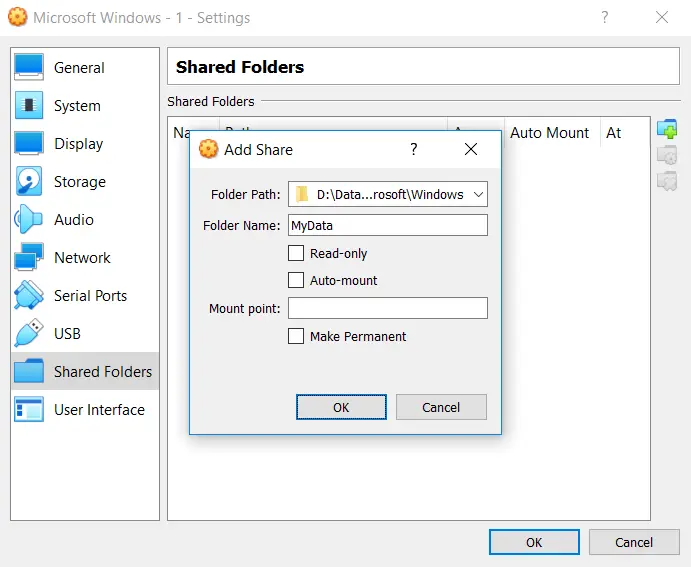

- Once the shared folder has been created for the Guest OS, click on the (OK) button to complete the process.

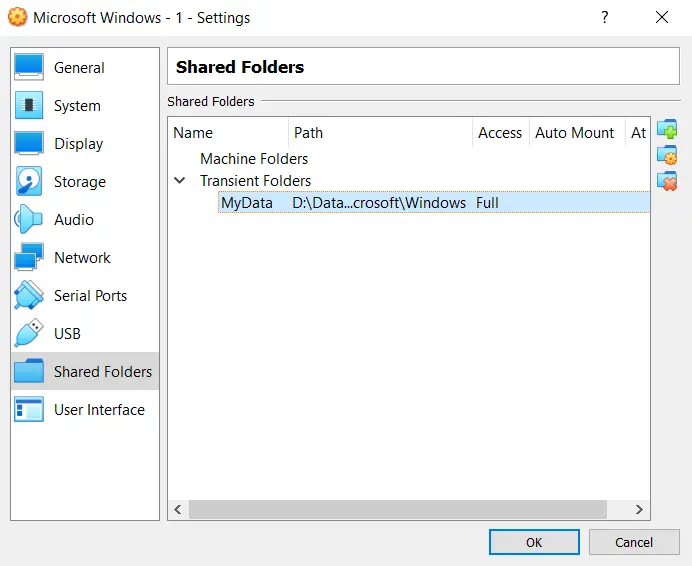

## Mapping to a Shared Folder

- From within the Guest OS you created an Oracle VirtualBox shared folder for, map a network drive to it.

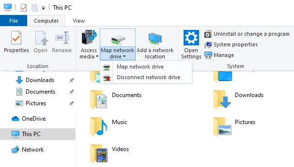

- The UNC value includes a hard-coded (`nodename`).
- The (`sharename`) portion of the UNC value is whatever value you chose earlier.
- Enter a UNC format of either:
  - `\\vboxsrv\sharename` -or-
  - `\\vboxsvr\sharename`

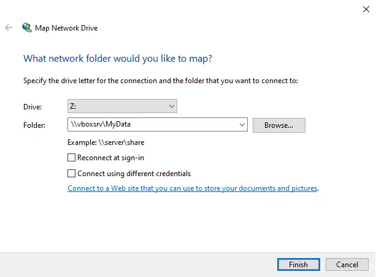

- You now have a network drive mapping out to a folder located on the Host OS.
- Folders and files can now be copied from the Guest OS out to the Host OS, or into the Guest OS.
- The copy process (either way) is performed solely from within the Guest OS.

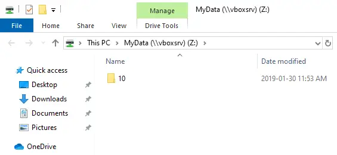

## Removing a Mapped Network Drive

- If access to the Oracle VirtualBox shared folder is no longer required, disconnect the drive mapping.

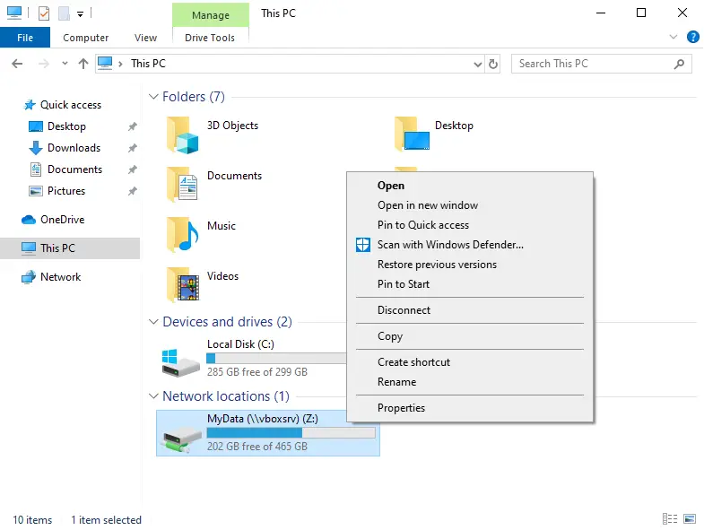

## Removing a Shared Folder

- Once the shared folder is no longer being used by the Guest OS, it can safely be removed.
- Return to the Oracle VirtualBox Shared Folder icon.
- Select the shared folder you wish to remove, and click on the remove icon.

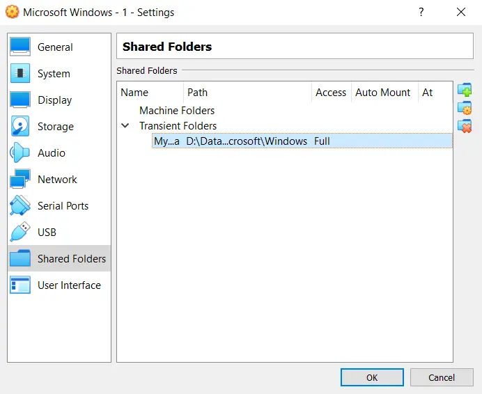

- The Oracle VirtualBox shared folder has been successfully removed.

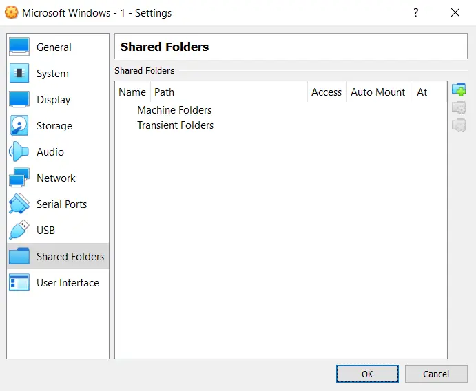

- All problems occurring with the Oracle VirtualBox Shared Folders feature are caused by users not paying attention to the share name they create.
- Leaving `<space>` characters or symbol characters in the share name will cause problems.
- Likewise, not remembering the share name value for the shared folder will also cause problems when you go to map a network drive to it.

