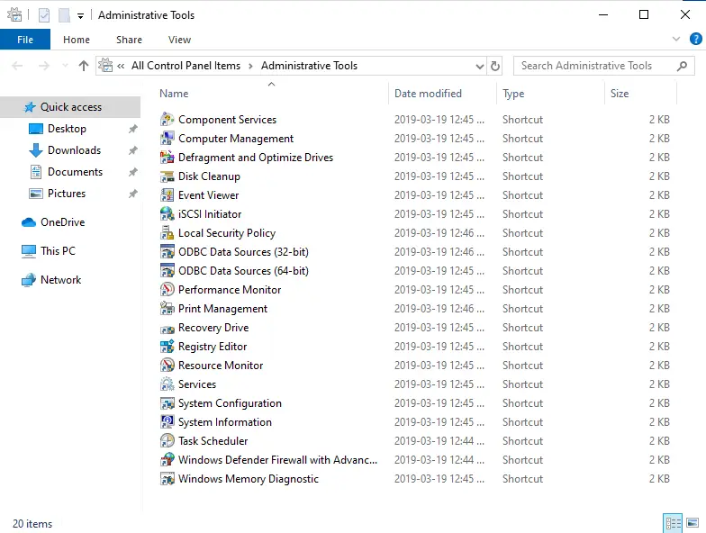

# SAM User Accounts

## Working with SAM User Accounts

- The SAM (Security Account Manager) is a database which is local to each Microsoft Windows node and to each Microsoft Windows Server node (those that have not been promoted to a Microsoft Active Directory Domain Controller role).
- A SAM database includes all local user accounts and local security groups for a given node.
- Administrators use the (Local Users and Groups) node within the (Computer Management) applet to manage SAM user accounts and security groups.
- The identical process is used when working with SAM user accounts on either Microsoft Windows nodes or Microsoft Windows Server nodes.
- Microsoft Windows Server nodes which have been promoted to a Microsoft Active Directory Domain Controller role will not have the (Local Users and Groups) node within the (Computer Management) applet.
- For domain controllers, the local SAM database is deleted.

## User Account Properties

- Username
  - Typically in the format of (firstname.lastname), as the username value is passed into an e-mail environment to create their e-mail address (e.g. `john.smith@acme.com`).
  - Usernames cannot include any whitespace (`<space>` characters, `<TAB>` characters, etc.).
  - Use of periods is permitted and encouraged.
  - Stick to letters, numbers, and periods when determining each user account's username value.
- With Microsoft Windows, usernames are not case-sensitive.
- Full Name
  - Can be pretty much any value you wish.
  - Should really be representative of the user account.
  - Example:
    - Username: `john.smith`
    - Full Name: `John Smith`
- Password
  - Is a case-sensitive value.
  - Should be at least (8) keystrokes in length.
  - Should include both letters and numbers.
  - Should include symbols.
  - Should include at least (1) uppercase letter, (1) number, and (1) symbol.
  - Should not be a recognizable word.
  - Are not to be known by anyone but the user.
  - Are not to be known by an administrator.
  - Are not to be documented in an unsecured manner (e.g
- Post-It Notes).
  - Strong and suitable password example: `52&pb%4qz!kM6`
  - Weak and/or unsuitable password examples: `qwerty`, `abc123`, `password`, `marysmith`, `12345678`, `j&m3sb0nd`
- Recommended for test environment passwords: `P&ssw0rd`, `Adm1np&ss`
  - Meets all technical requirements for all operating systems.
  - Easy to remember.
  - Not for production use.
  - Not for personal account use.
- User must change password at next logon.
  - Forces the user to change their password before they gain access to their desktop.
  - Typically, administrators will let a user know what their initial password value is and tell them they will have to change it when they next sign on.
  - Ensures the user is completely responsible for their password.
  - Ensures that administrators do not know any account passwords of which they are not responsible. User cannot change password.
  - For certain types of user accounts, it will be desirable for their passwords to remain unchanged.
  - A node which is shared by many users, all of which sign on using a common generic account (e.g. Username = DemoUser).
  - A node like this is commonly called a "Kiosk" type of node. If one user were to change the common user account's password (and not inform the other users), then the other users would not be able to sign on.
- Password never expires.
  - For non-regular user accounts (e.g. user accounts which are used to run software services on the node; a.k.a. system accounts), administrators usually configure those accounts such that they are not forced to change their password.
  - For regular user accounts and administrative accounts, this setting is almost always never enabled.
- Account is disabled.
  - As a rule of thumb, user accounts should never be deleted.
  - For auditing purposes and technical reasons, user accounts should always be disabled. Only after a (long) period of time has passed (e.g. 10 years) would an administrator possibly delete a user account.

## Creating SAM User Accounts

- SAM-based user accounts are maintained with the (Computer Management) applet, located under (Control Panel) and below (Administrative Tools).

- Below the (Local Users and Groups - Users) node, right-click and select (New User ) to create a new SAM-based user account on the Guest OS.

- Fill in the user account's details and click on the (Create) button.
- Once the user account is created, click on the (Close) button to close the (New User) window.

- A newly created SAM-based user account with a username value of (`john.smith`).

- To change the signed-on user of a node, gracefully sign out first.
- Right-click on the Windows menu icon and select the option to "Sign out."

- Locate and click on the new user account to sign on.

- Enter the new user account's password.

- The currently signed-on user account appears in the "Start Menu" on the node.
- Useful if you are signing in and out using multiple user accounts and forget who you are currently signed on as.
- Hover your mouse pointer over the profile icon to expose the currently signed-on user account.

## Managing SAM User Accounts

- Existing SAM-based user accounts can be deleted or have their properties changed using the (Computer Management) applet.

- If you delete a user account, it can never be recreated to technically be the exact same.
- A unique identifier is associated with each newly created user account.
- The unique identifier is what Microsoft Windows nodes use to identify the user for security purposes (as opposed to the username value).
- It is always wise to never delete a user account until you are absolutely certain you will never need it again.
- Instead, disable user accounts which are not permitted to authenticate or use network resources (employees who have quit or were let go from a company).

- By default, Microsoft Windows and Microsoft Windows Server nodes will periodically prompt every user to change their password.
- The interval, password length, password complexity, etc., are governed by the node's Password Policy settings.
- You can configure user accounts such that they will never be prompted to ever change their password, unless they do so explicitly.

- For certain user accounts, it may be desirable to never let the user change their password.
- A kiosk type of user account would be a good example.

- If an employee of a company quits (or gets let go), it is always recommended to disable their account indefinitely, and not delete their account.

- User accounts that are disabled will not be listed on the "Sign-on Screen”.

