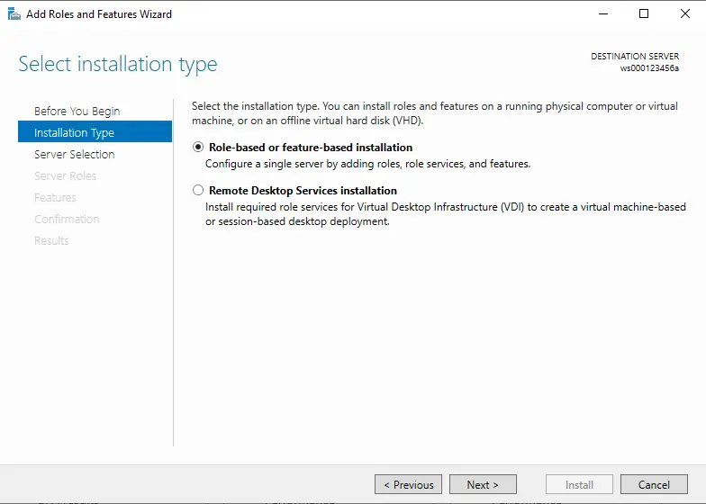

# Installing Active Directory

## Installing Microsoft Active Directory Domain Services (AD DS)

- Installing Active Directory involves (2) main steps:
  - Adding the Microsoft Active Directory Domain Services (AD DS) Server Role to the "server" node.
  - Promoting the "server" node from a standalone server or member server to an Active Directory Domain Controller.

- Launch the "Server Manager" application.

- From the "Server Manager" application, run the "Add Roles and Features" wizard.

- Click on the "Next" button.

- Click on the "Next" button.

- In a larger network environment, there would be many more "server" nodes listed here.
- In this extremely small network environment, there is only the (1) "server" node listed.
- The "Server Manager" application can be used to activate software components on remote nodes.
- Click on the "Next" button.

- Enable the "DNS Server" server role. An additional window will appear, asking if you wish to add the dependent features for the "DNS Server" server role.
- As it is with most software applications, there is a reliance on several software dependencies before the application can run successfully.

- Confirm the software dependencies for the "DNS Server" server role you are adding to the node.

- Add the "Active Directory Domain Services" server role to the node.

- Confirm the software dependencies for the "Active Directory Domain Services" server role you are adding to the node.

- With both server roles now selected, click on the "Next" button.

- Click on the "Next" button.

- Click on the "Next" button.

- Click on the "Next" button.

- At the summary screen, click on the "Install" button.

- The installation process begins.
- Wait until it completes.

- Once the installation has completed, both the "DNS Server" and "Active Directory Domain Services" server roles have been installed on the node.
- At this point, this "server" node has not been promoted to an Active Directory Domain Controller.
- Therefore, the SAM database for this node still exists.

## Domain Controller Promotion

- Click on the notification icon within the "Server Manager" application.
- There are a few messages waiting for you.
- Click on the (1) message which does NOT require you to perform any additional actions, and delete the message.

- Within the remaining message, there is an action hyperlink.
- Clicking on it will launch the (AD DS) Configuration wizard.
- This wizard will guide you through the process of promoting this "server" node to an Active Directory Domain Controller.
- Click on this hyperlink

- Type in the name of your new Active Directory Forest and root domain.
- They are one and the same.
- The name you used should include your personal 9-digit number in place of the sample one here (e.g. ad000123456a.com).

- If your network environment has been kept up to date, then the highest possible forest and domain functional level should be used.
- If you are still supporting older "workstation" nodes on your network (e.g. Windows NT 4.0, Windows 95, Windows XP, etc.), then you will need to identify what functional levels are allowed.
- In the event that Active Directory needs to be restored from a backup, you will need to provide the special Directory Services Restore Mode (DSRM) administrative password.
- Set the password to (Adm1np&ss), and click on the "Next" button.

- Click on the "Next" button.

- Automatically, a NetBIOS name will be generated for your Active Directory domain, based on the value you typed earlier (e.g. ad000123456a.com).
- This NetBIOS name is used by older software and older operating systems within your network environment.
- Click on the "Next" button.

- Click on the "Next" button.

- Click on the "Next" button.

- Click on the "Install" button to promote this "server" node to an Active Directory Domain Controller.

- To complete the promotion process, the node needs to be restarted.

- Once restarted, the Active Directory service will be available in your network environment.
- On this "server" node, the SAM database has now been deleted.
- A new (Administrator) user account has been created in your Active Directory Domain.
- The password for this account will be the same as it was beforehand (based on the old SAM user account).
- Note the use of the older NetBIOS reference for the (Administrator) account in the Active Directory domain.
- You should be using newer UPN references where possible.
- Click on the (Other User) option and type in the UPN value for the domain (Administrator) user account.

- Type in the newer UPN reference for the domain (Administrator) user account (e.g. administrator@ad000123456a.com), and sign on to this node as the new Active Directory Domain Administrator user.

## Active Directory User Accounts

- Active Directory user accounts are managed using an interface called "Active Directory Users and Computers" (ADUC).
- Locate the icon for the app in the "Start Menu", and click on it.

- This is the root of your new Active Directory domain.
- It is expandable to reveal containers (folders and organizational units), user accounts, security groups, etc.

- New user accounts should be organized appropriately, so that you are able to find and manage them properly
- New organizational units are containers which provide structure and organization to Active Directory
- Right-clicking on the domain name will allow you to create a new organizational unit container object immediately below the root of this Active Directory domain

- Organizational units typically have names which reflect the type of objects (e.g. user accounts, security groups, etc.) that are located below them

- Right-clicking on an organizational unit object will allow you to create other objects immediately below the organizational unit

- Creating a new Active Directory user account
- The combination of (A) and (B) comprise the user account's UPN reference
- Both (C) and (D) are only used for older operating systems, or software which has not been updated

- Add a password for the new user account

- Complete the Active Directory new user account creation process

- Here, the new Active Directory user account (`john.smith`) was created below the (Sales Department) organizational unit
- This user account is located somewhere below the (`ad000123456a.com`) Active Directory domain
- Therefore, the UPN reference this user will use when authenticating to the network is (`john.smith@ad000123456a.com`)

## Active Directory Integration with DNS

- Active Directory relies on DNS services to exist on the network
- In this mini network environment, both Active Directory and DNS services are hosted on this single "server" node
- To get a quick look at the DNS interface, locate and click on the "DNS Manager" app

- Expand the structure to reveal the forward lookup zone for your new DNS domain namespace (e.g. ad000123456a.com)
- The DNS domain namespace has the identical value as your Active Directory domain name
- The items identified by (A) are Active Directory related entries which assist in the advertising of services (including Active Directory) on the network
- Other nodes on the network which access Active Directory look to these DNS entries so they can locate them successfully
- The item identified by (B) is a DNS entry which is used to resolve this hostname and its FQDN to an IP address, like when you use the (ping) utility

