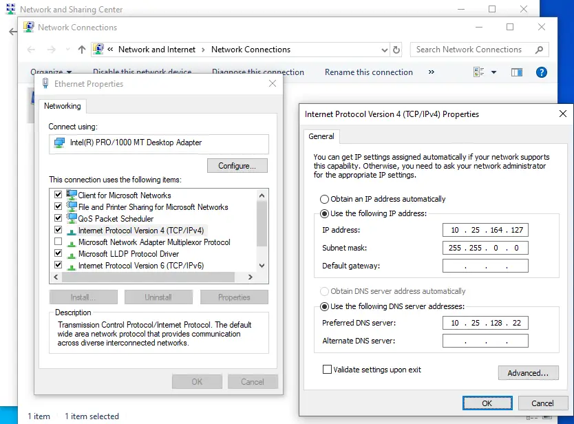
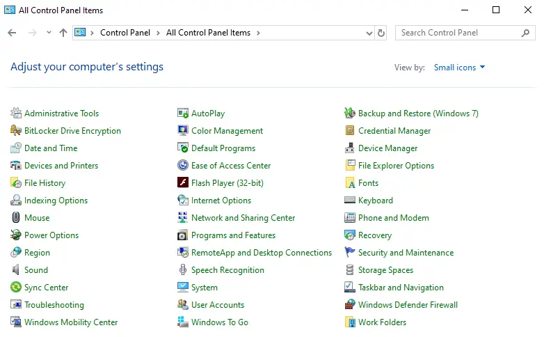
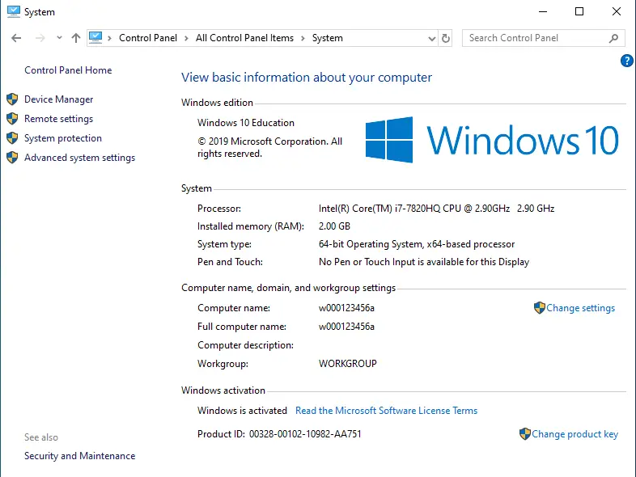
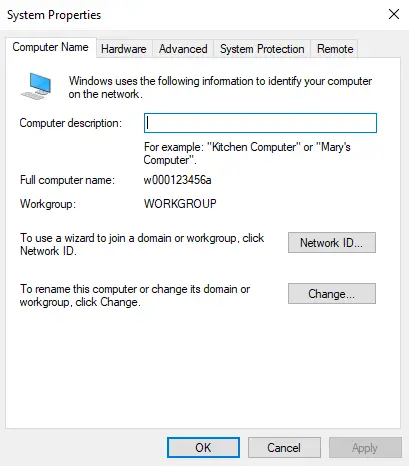
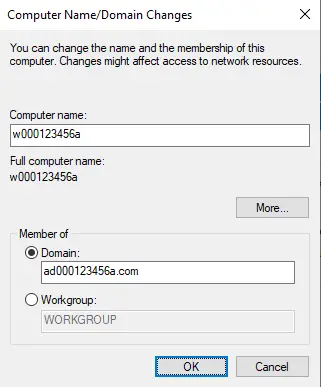
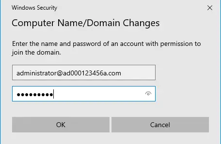
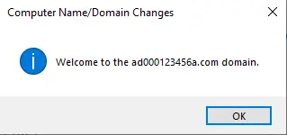
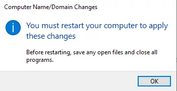
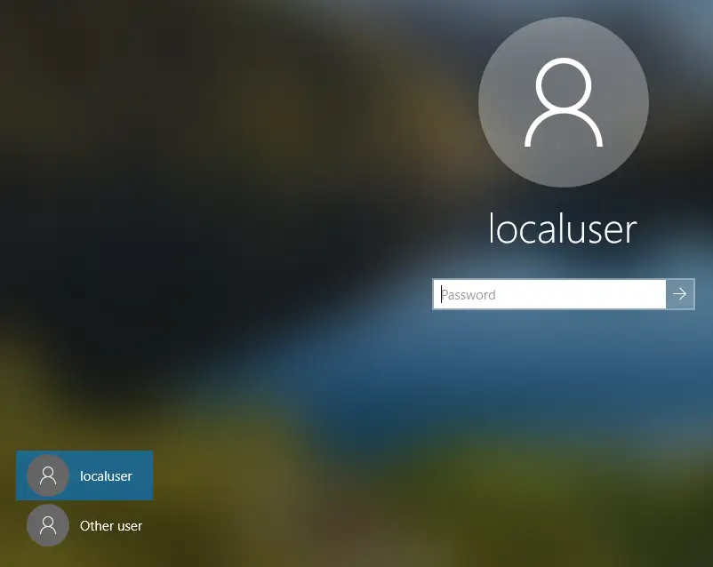
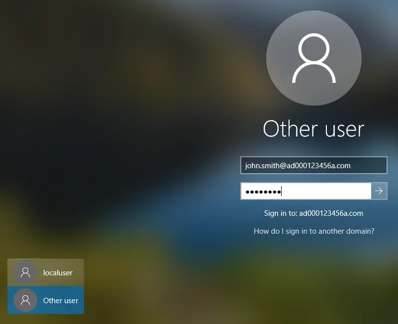

# Authenticating with Active Directory

- Before a user can authenticate on the network (using Active Directory), their workstation (node) must be made a member of Active Directory.
- In general, almost all Microsoft Windows and Microsoft Windows Server nodes on a network are configured as members of the Active Directory environment.
- Before becoming a member, each node must be able to "see" the Active Directory service being advertised on the network.
- This is a function of DNS.
- As such, each node must be configured to use the DNS service on the network beforehand.
- Active Directory utilizes DNS to advertise itself on the network.
- Both Active Directory and DNS work together.
- Active Directory cannot exist without the presence of DNS.

- Configure the node to make use of the DNS service on the network.
- If this is not properly configured, then you will not be able to add this node as a member of the Active Directory environment.

- To make this node a member of Active Directory, go to the (Control Panel - System) applet.

- Click on the "Change Settings" hyperlink.

- Click on the "Change" button.

- Type in the name of the Active Directory domain you would like this node to be a member of (e.g. `ad000123456a.com`).
- Nodes can only exist once within the Active Directory environment and are associated with only (1) Active Directory domain.
- Click on the "OK" button when finished.

- Type in the existing Active Directory user account security credentials to complete the process.
- This existing account must have the privileges to add a computer as a member of the Active Directory domain.

- If you don't receive a message similar to this, then there is a problem.
  - Was the DNS server IP address typed in correctly on this node?
  - Did you verify network connectivity with other nodes on your network beforehand?
  - Did you misspell the Administrator's UPN value and/or password?

- Adding a node as a member to the Active Directory environment, or removing them as a member, both require a restart of the node before the setting change becomes effective.

- Once the node is a member of the Active Directory environment, authentication can occur for the user accounts within Active Directory.
- Click on the "Other User" option.

- Type in the UPN value for an Active Directory user account, along with the associated password to sign on.
- Active Directory authentication complete.

