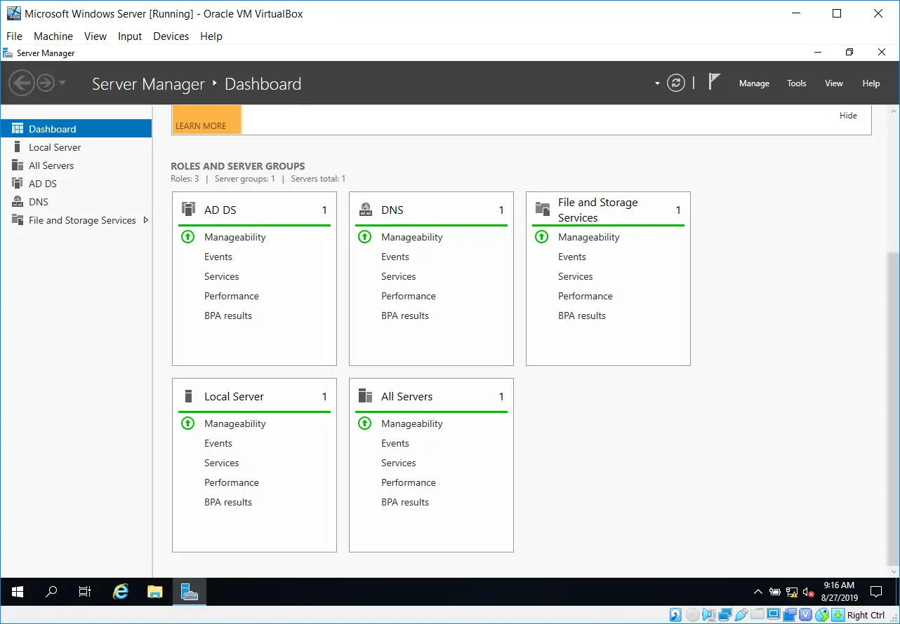
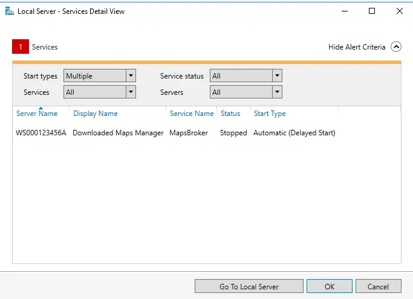
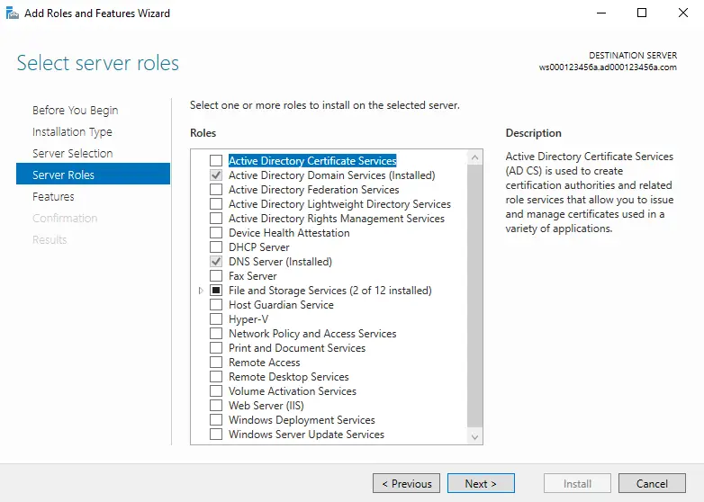
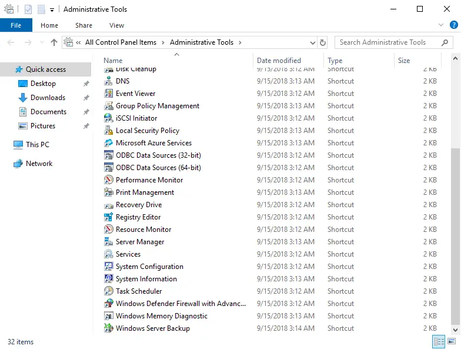
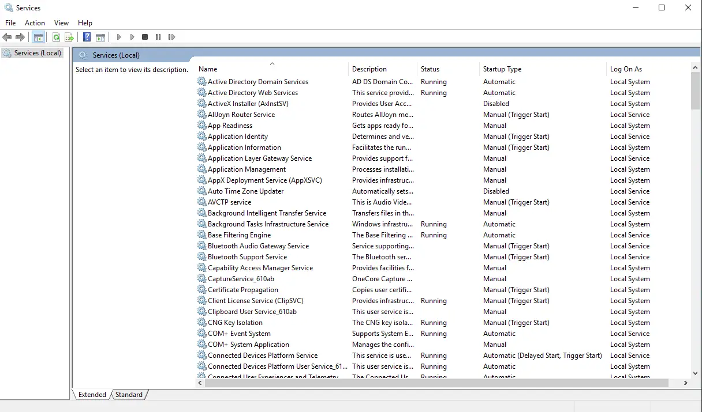
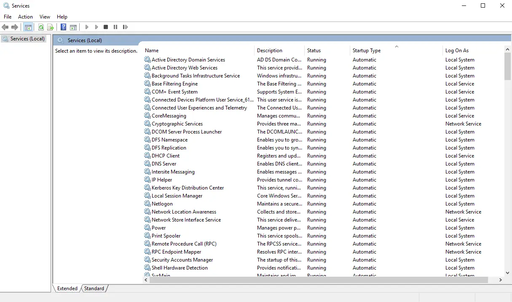
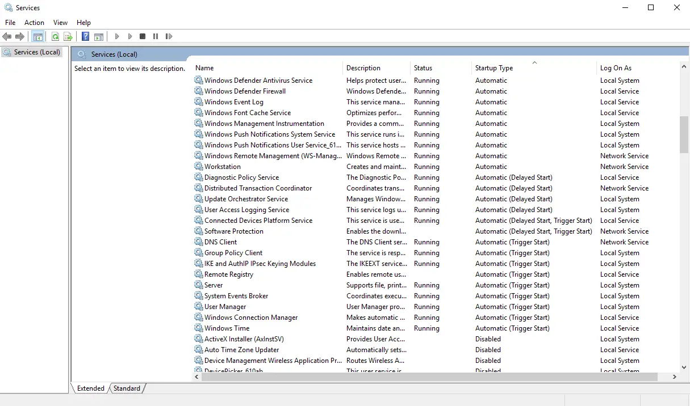
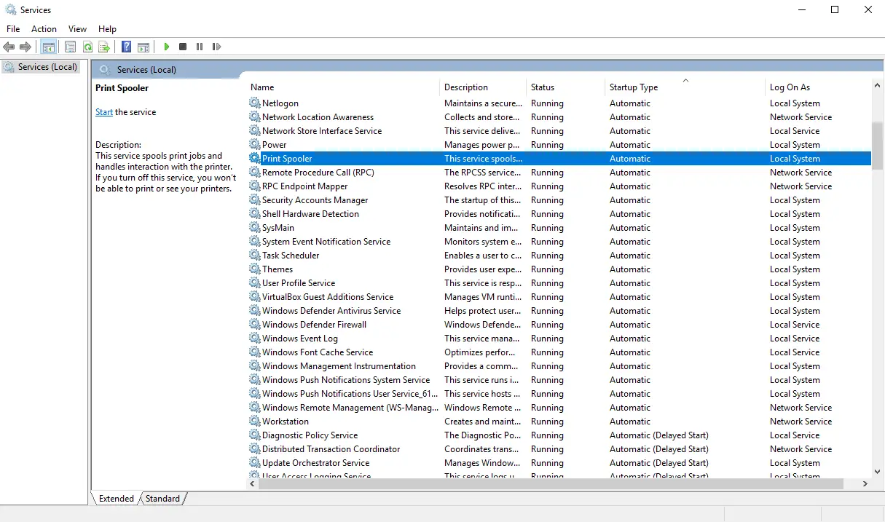
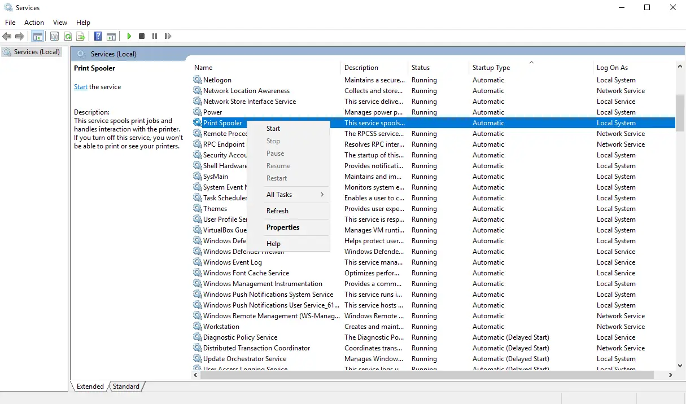

# Server Role Status and Services

- From within the "Server Manager" application, you can quickly check the status of the installed server roles on the node.
- Generally, the color "green" means good, while the color "red" means bad (something is wrong).
- You may need to manually refresh this dashboard if you have just restarted the node, or else you might see the color "red” and panic prematurely.

- Some events which can produce the color "red" in the "Server Manager" application can safely be ignored.
- In this case, there is a service which is attempting to start which needs access to the Internet.
- Seeing as this node does not currently have access to the Internet, the service is failing to start properly.
- As a result, it will produce the color "red" in this application.
- Normally, administrators would configure a service like this to not start up automatically, thereby reducing the amount of "red" that appears in this application.

- The "Add Roles and Features" wizard can be used to check which server roles have been installed on the node.
- Clicking on the "Cancel" button will close the wizard without modifying the node.

- You will install and work with the DNS, DHCP, and Web Server (IIS) server roles.

- To check the status of the services on the node, go to the (Control Panel - Administrative Tools - Services) applet.

- Services states are displayed in the "Status" column.
- A status of "Running" indicates that the underlying software for a service has started on the node.

## Service Status Values

- `<Empty/Blank>` - The underlying software components associated with the service have not started.
- Running - The underlying software components associated with the service have started.

## Service Startup Type Values

- Automatic
  - The service is configured to start up automatically when the node is started or restarted.
  - The administrator does not have to explicitly sign on and signal for the service to start up.
- Manual
  - The service is configured to only start up when the administrator explicitly signals it to.
- Disabled
  - The service is configured to never start up.
  - Not automatically, nor manually.
- Delayed Start
  - The service will start up after the node has started, and only after a period of time has lapsed.
  - Allows for other services to "settle" into their running states before the "delayed" services are started.
  - Typically indicates a form of dependency (one service depending on another service to be available before it can start).
- Trigger Start
  - The service will only start up if another service, or other software running on the node, signals it to start up.
Change the display to group all common "Startup Type" values together.
This way, you can quickly see if all services which are configured to "Automatically" start up, are in a "Running" state.

- Once a node has been started, all services configured for an "Automatic" startup type should be in a "Running" state.
- If one or more of these services are not, it indicates there is a problem with these services.

- Here, the (Print Spooler) service has not started properly.

- Right-click on the non-started service, and manually attempt to start it.
- If it starts, then there was probably just a timing issue.
- If it doesn't start, then you would have to inspect the node's log files to get an indication as to why it did not start, and then go about fixing the problem.

## Virtualization and Services

- Running virtual machines on inadequate hardware (e.g. portable USB-powered traditional hard disks, low amount of physical memory, etc.) causes problems.
- Starting up multiple virtual machines concurrently also causes problems.
- Services running within Guest OSes compete for access (reading + writing) to the hard disk.
- If there are too many services trying to start up concurrently, then access to the hard disk will be slow.
- Software (e.g. services) are written by programmers to "timeout" (quit) if they have not started within a specific amount of time (e.g. 120 seconds).
- After starting each virtual machine, it is recommended that you check the state of all services configured for an "automatic" startup type.
- If they are not all in a "running" state, then you will need to manually start them up.
- If certain services are not "running", then they cannot provide the necessary services on the network (e.g., if Active Directory is not "running", then no user will be able to authenticate on the network).
