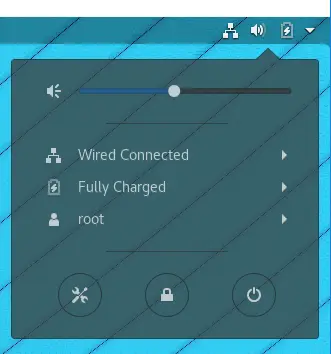
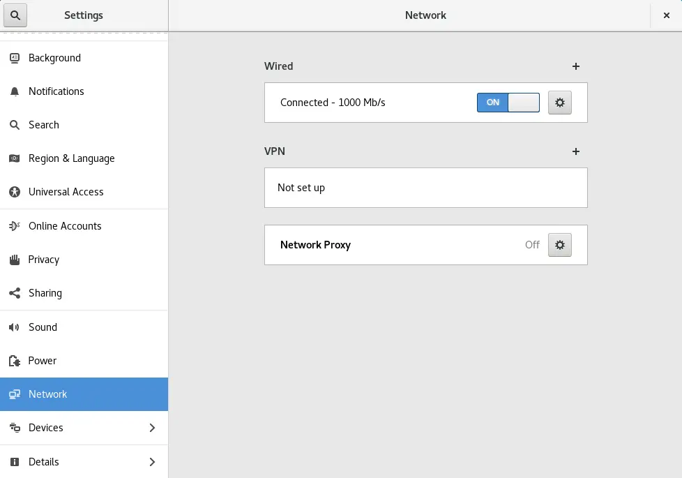
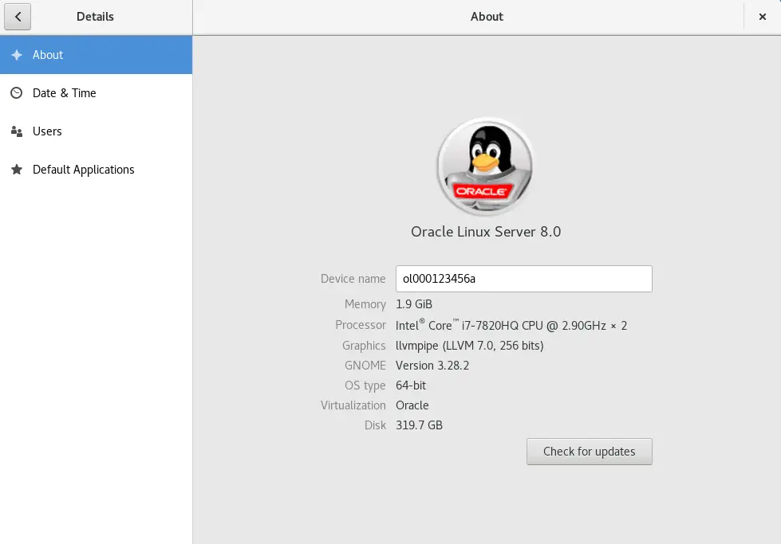
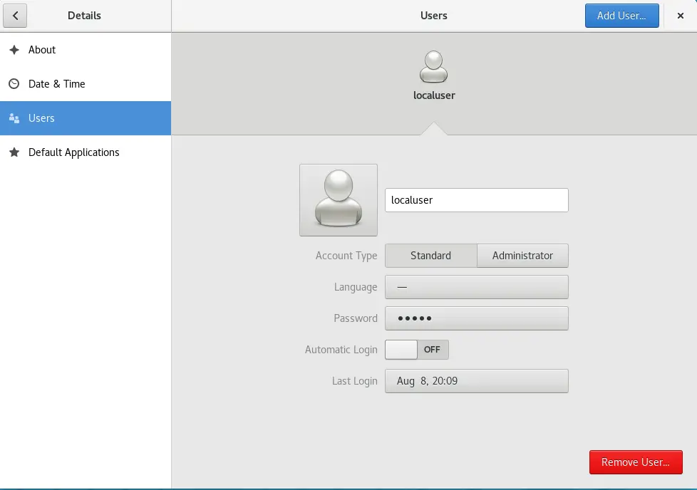
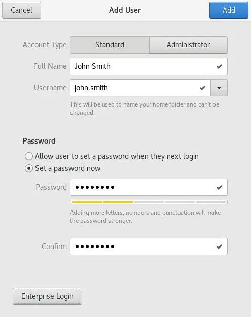
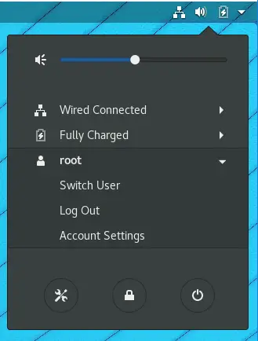
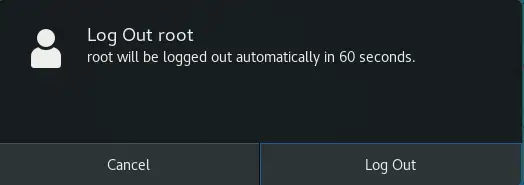
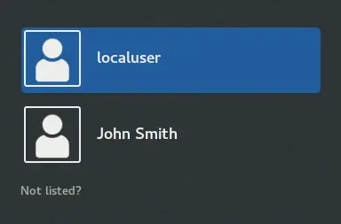
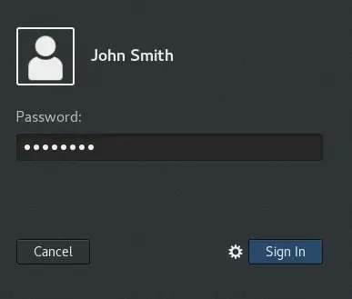

# Creating User Accounts

- By default, only the (`root`) administrative user account has the permissions to manage user accounts.
- Similar to Microsoft SAM databases and Microsoft Active Directory, username values should be unique.
- For a UNIX or UNIX "like" environment, user account (username values) may not include characters which are not alphanumerical, with the exception of the period (`.`) character.
- Invalid username values on a UNIX or UNIX "like" node would include (`john#smith`), (`john  smith`), and (`john+smith`), as they contain invalid characters in their value.
- Historically, UNIX and UNIX "like" username values were based on the person's surname and the first character of their given name.
- For example, the user (`John Smith`) would typically have had a username value of (`smithj`).
- If there was another user called (`Joan Smith`), who needed to sign on to the same UNIX or UNIX "like" node, then typically they would have had a username value of (`smithj2`) assuming their user account was created after (`John Smith's`).
- Today, UNIX and UNIX "like" username values can now contain the period (`.`) character; we can now create usernames like (`john.smith`) or (`anna.taylor`).

1. Launch the (Settings) applet to add new local user accounts to this node.

2. Click on the (Details) settings applet option.

3. Click on the (Users) settings applet option.

4. Click on the (Add User...) button to add a new user account.

5. Complete the details for a new "Standard" (regular) user account, and click on the "Add" button.

- Additional administrative user accounts can also be created by selecting the respective "Account Type”.

6. Log out of the node as the current user, in order to test the new user account.

7. Click "Logout”.

8. If the new user account appears on the sign-on screen, select it.

- If it does not appear, then click on the "Not listed?" option to sign on to the node.

9. Type in the password for the new user account, and click on the "Sign In" button.

