# Oracle Linux Network Settings

- Similar to a Microsoft Windows node, an Oracle Linux node will need to have its hostname and IP address settings configured.
- This ensures the node will be uniquely identified on the network.
- By default, only the (`root`) administrative user account has the permissions to change system-wide configuration details like the hostname and IP addressing settings.

1. Sign on to the node using the (`root`) administrative user account security credentials.

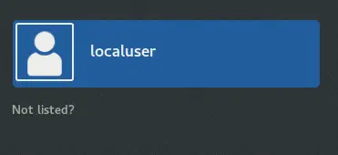

2. Username is (`root`), and typed in lowercase.

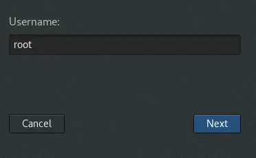

3. Password is (`Adm1np&ss`), and is case-sensitive.

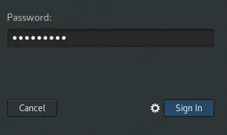

4. Verify the existing hostname and IP address settings.

- Launch the (Terminal) application to get to a shell prompt.


5. The (`hostname`) command will reveal the current hostname value for this node.

- The (`ifconfig`) command will reveal the current IP address settings for this node.
- Note that there are no IPv4 address details for this node's network adapter.

```console
[root@ol000123456a ~]# hostname
01000123456a
[root@ol000123456a ~]# ifconfig
enp0s3: flags=4163<UP, BROADCAST, RUNNING, MULTICAST> mtu 1500
        ether 08:00:27:85:4d:d8 txqueuelen 1000 (Ethernet)
        RX packets 0 bytes 0 (0.0 B)
        RX errors 0 dropped 0 overruns 0 frame 0
        TX packets 83 bytes 15523 (15.1 KiB)
        TX errors 0 dropped 0 overruns © carrier 0 collisions 0
lo0: flags=73<UP, LOOPBACK, RUNNING> mtu 65536
        inet 127.0.0.1 netmask 255.0.0.0
        inet6 ::1 prefixlen 128 scopeid 0×10<host> loop txqueuelen 1000 (Local Loopback)
        RX packets 0 bytes 0 (0.0 B)
        RX errors 0 dropped 0 overruns 0 frame 0
        TX packets 0 bytes 0 (0.0 B)
        TX errors 0 dropped 0 overruns © carrier 0 collisions 0
virbr0: flags=4099<UP, BROADCAST, MULTICAST> mtu 1500
        inet 192.168.122.1 netmask 255.255.255.0 broadcast 192.168.122.255
        ether 52:54:00:9:22:25 txqueuelen 1000 (Ethernet)
        RX packets 0 bytes 0 (0.0 B)
        RX errors 0 dropped 0 overruns 0 frame 0
        TX packets 0 bytes 0 (0.0 B)
        TX errors 0 dropped 0 overruns o carrier o collisions 0
[root@ol000123456a ~]#
```

6. Launch the (Settings) applet to change both the hostname and IP address settings for this node.

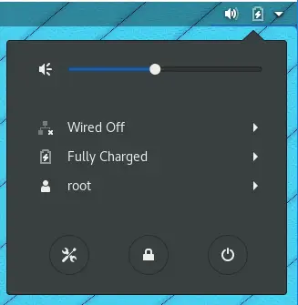

7. The hostname value is changed using the (Details) settings applet option.

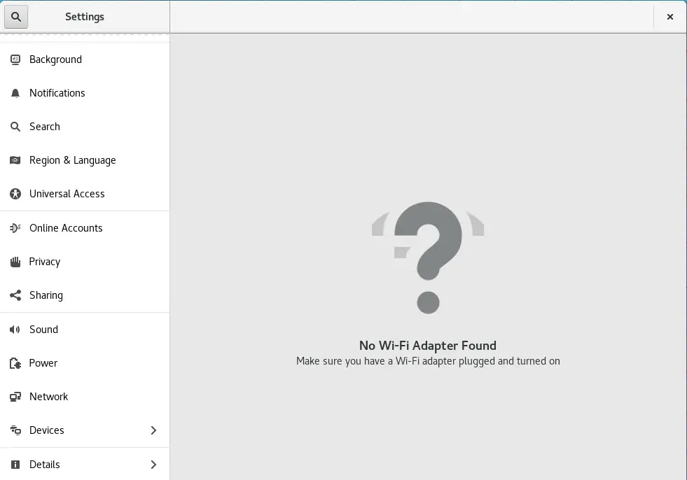

8. The current hostname value is displayed.

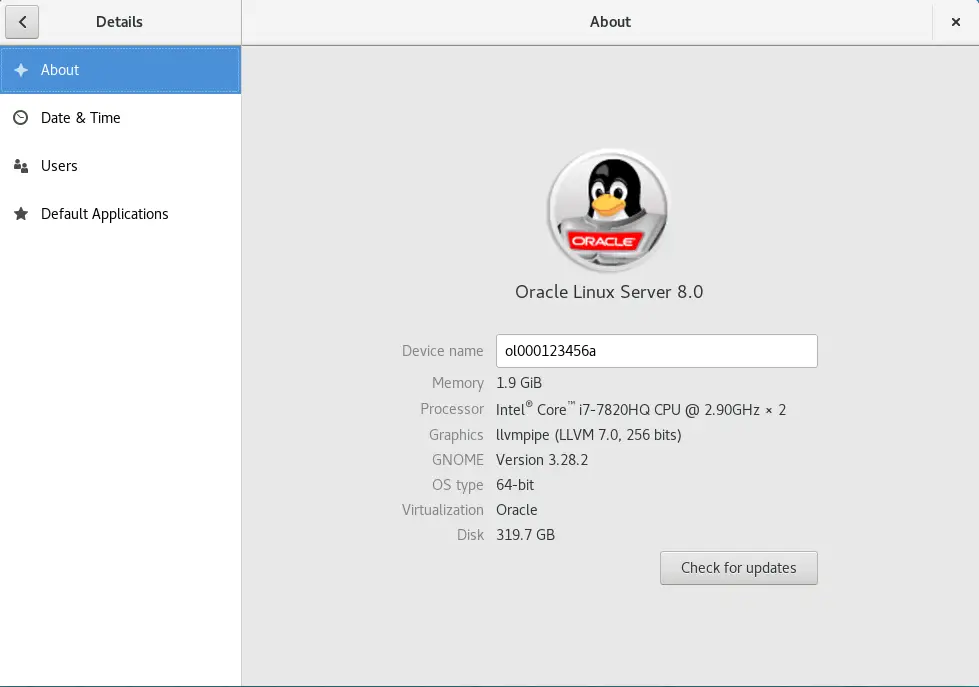

9. Change the hostname value to a unique value on your network and close the applet.

- Changes will be immediate.

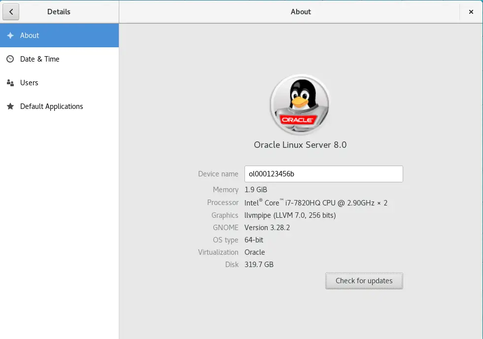

10. Verify the hostname value has changed for the node.

```console
[root@ol000123456b ~]# hostname
01000123456b
[root@ol000123456b ~]#
```

11. IP address settings are changed using the (Network) settings applet option.

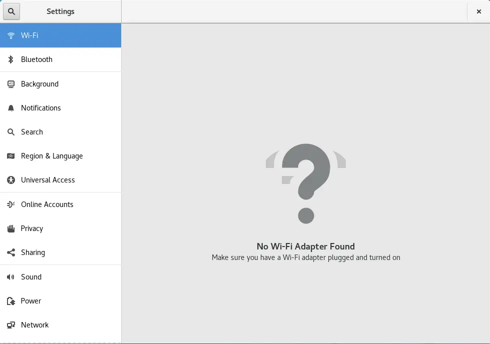

12. Click on the gear icon associated with the wired network adapter to change the network adapter settings.

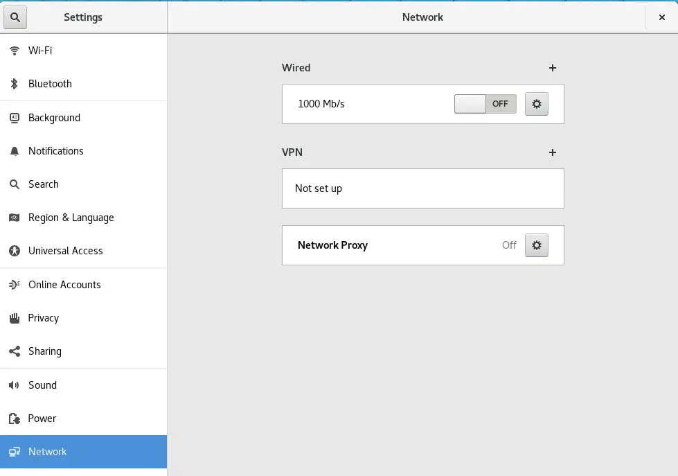

13. From the IPv4 settings category, use the radio button selection icon to change from a dynamic (automatic) IP configuration to a static (manual) IP configuration.

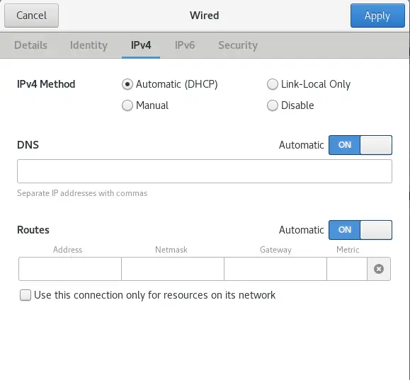

14. A (manual) IP configuration will then allow you to enter in static IP address and corresponding subnet mask values.

- On some Linux distributions, a gateway address is mandatory, even though there might not be a router located on the network.

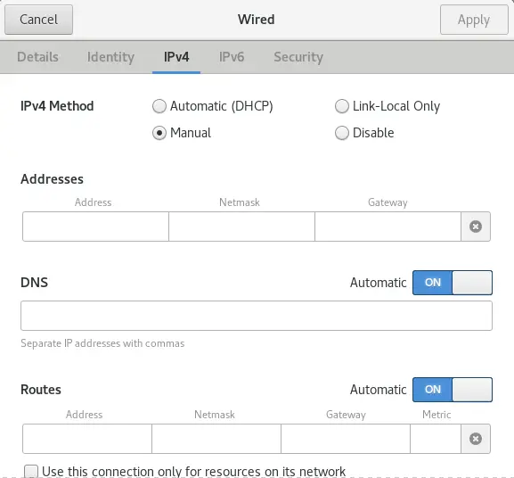

15. Type in the IP address setting values and click on the (Apply) button to save the configuration changes.

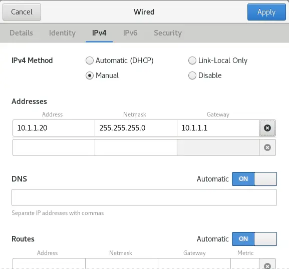

16. Verify the IP address settings have been updated for the network adapter.

- Here we see there is now IPv4 address information, where before, this network adapter did not have any.

```console
[root@ol000123456b ~]# ifconfig
enp0s3: flags=4163<UP, BROADCAST, RUNNING, MULTICAST> mtu 1500
        inet 10.1.1.20 netmask 255.255.255.0 broadcast 10.1.1.255
        inet6 fe80::ec1f:8bcc:42ab:fdf prefixlen 64 scopeid 0x20<link>
        ether 08:00:27:85:4d: d8 txqueuelen 1000 (Ethernet)
        RX packets 0 bytes 0 (0.0 B)
        RX errors 0 dropped 0 overruns 0 frame o
        TX packets 386 bytes 69789 (68.1 KiB)
        TX errors O dropped 0 overruns 0 carrier 0 collisions 0
lo0: flags=73<UP, LOOPBACK, RUNNING> mtu 65536
        inet 127.0.0.1 netmask 255.0.0.0
        inet6 ::1 prefixlen 128 scopeid 0x10<host> loop txqueuelen 1000 (Local Loopback)
        RX packets 8 bytes 724 (724.0 B)
        RX errors 0 dropped or overruns 0 frames
        TX packets 8 bytes 724 (724.0 B)
        TX errors 0 dropped or overruns 0 carrier or collisions
virbr0: flags=4099<UP, BROADCAST, MULTICAST> mtu 1500
        inet 192.168.122.1 netmask 255.255.255.0 broadcast 192.168.122.255
        ether 52:54:00:9:22:25 txqueuelen 1000 (Ethernet)
        RX packets 0 bytes 0 (0.0 B)
        RX errors 0 dropped or overruns 0 frames
        TX packets 0 bytes 0 (0.0 B)
        TX errors 0 dropped or overruns 0 carrier or collisions
[root@ol000123456b ~]#
```

17. Verify network connectivity to a remote node on the network.

- On a Linux host, the (`ping`) utility will test forever.
- To get back to the shell prompt, press the (CTRL+C) key combination.
- This key combination will stop the (`ping`) testing and return you to the shell prompt.

```console
[root@ol000123456b ~]# ping 10.1.1.10
PING 10.1.1.10 (10.1.1.10) 56(84) bytes of data.
64 bytes from 10.1.1.10: imp seq=1 ttl=64 time=0.625 ms
64 bytes from 10.1.1.10: imp seq=2 ttl=64 time=0.883 ms
64 bytes from 10.1.1.10: imp seq=3 ttl=64 time=0.948 ms
64 bytes from 10.1.1.10: imp seq=4 ttl=64 time=0.915 ms
64 bytes from 10.1.1.10: imp seq=5 ttl=64 time=0.276 ms
~C
10.1.1.10 ping statistics
5 packets transmitted, 5 received, 0% packet loss, time 14ms
rtt min/avg/max/mdev = 0.276/0.729/0.948/0.255 ms
[root@ol000123456b ~]#
```
