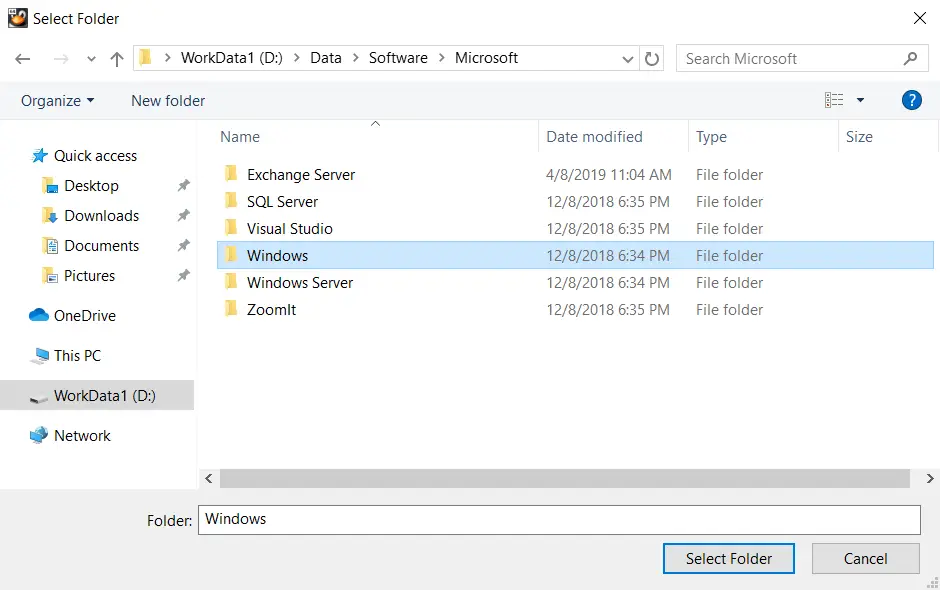

# Oracle VM VirtualBox Shared Folders

- The Oracle VM VirtualBox product has a built-in feature for easily moving data in and out to the Host OS from within a Guest OS.
- It is called the Oracle VirtualBox Shared Folders feature.
- Working with Oracle VirtualBox shared folders is near identical to working with Microsoft Windows shared folders.
Basic steps:
  - Advertise a folder located on the Host OS to a single Guest OS.
  - Within the Guest OS, mount the Host OS' shared folder to an empty folder.
  - Perform all access to the folders and files located on the Host OS from within the Guest OS.
For additional Guest OSes, repeat the steps above (shared folders are not shared between Guest OSes; it is a one-to-one relationship).

## Creating a Shared Folder

1. On a running Guest OS, right-click on the folder icon located at the bottom of its console window.

- Then, click on "Shared Folders Settings..."

```console
[john. smith@ol000123456a ~ J$ who
john. smith tty2          2019-08-27 11:46 (tty2)
```

2. Click on the add new shared folder icon.


3. Click on the (Folder Path) arrow, and select which folder on your Host OS will be "shared" to this Guest OS.

- Oracle VirtualBox shared folders are only available to the Guest OS for which you are configuring them.
- If you have multiple Guest OSes running, you would need to perform a similar process for each of them (if required).


4. Here, I wish to share the "Windows" folder currently located on my portable USB-powered storage device, which is attached to my Host OS.

- Once completely configured, I will be able to access folders and files below this "Windows" folder from within this Guest OS.
- Using the Oracle VirtualBox Shared Folders feature is a great way of transferring files between a Guest OS and the Host OS.



5. By default, the share name (a.k.a. Folder Name) will inherit the (Folder Path's) folder name.

- Most of the time, this is not ideal.


6. Type in a share name value that is relatively short and contains no `<space>` characters, symbol characters, etc.

- The value should be unique to this Guest OS and something that you can easily remember.


7. Once the shared folder has been created for the Guest OS, click on the (OK) button to complete the process.


## Mounting a Shared Folder

8. From within the Guest OS you created an Oracle VirtualBox shared folder for, identify your current filesystem context.

```console
[root@ol000123456a ~]# pwd
/root
[root@ol000123456a ~]#
```

9. Create a new empty directory.

- On UNIX and UNIX "like" nodes, physical disks, and shared folders, get "mounted" into separate directories.

```console
[root@ol000123456a ~]# mkdir MyHostShare
```

10. Execute the "mount" command to mount the Host OS' shared folder into the newly created and empty directory on the Guest OS.

- The command identifies the filesystem type of the Host OS' shared folder (`vboxsf`), the name of the Host OS' shared folder (`MyData`), and the directory on the Guest OS to make the remote filesystem available in (`MyHostShare`), using a series of command parameters.
- The directory (`MyHostShare`) is referred to as the mountpoint, as this is where the Host OS' shared folder has been mounted to (made available to this node).

```console
[root@ol000123456a ~]# mount -t vboxsf MyData MyHostShare
[root@ol000123456a ~]#
```

11. Verify you are able to access the remote filesystem (the Host OS' shared folder contents), by performing a simple directory listing.

- Folders and files can now be copied from the Guest OS out to the Host OS, or into the Guest OS, by using the mountpoint (e.g. `MyHostShare`) on the Guest OS.
- The copy process (either way) is performed solely from within the Guest OS.

```console
[root@ol000123456a ~]# ls - la . /MyHostShare
total 4
drwxrwxrwx.     1 root root    O Dec  8 20:18 .
dr-xr-x---.    16 root root 4096 Aug 27 13:00 ..
drwxrwxrwx.     1 root root    0 Jan 30 20:19 10
[root@ol000123456a ~]#
```

## Dismounting a Shared Folder

12. If access to the Oracle VirtualBox shared folder is no longer required, dismount it.

- Make sure that the shared folder is not being used in any way on the Guest OS.
- Make sure that your directory context is not somewhere below the mountpoint.

```console
[root@ol000123456a ~]# umount MyData
[root@ol000123456a ~]#
```

13. Verify you are no longer able to access the remote filesystem (the Host OS' shared folder contents), by performing a simple directory listing.

```console
[root@ol000123456a ~]# ls - la . /MyHostShare
total 4
drwxrwxrwx.     1 root root    O Dec  8 20:18 .
dr-xr-x---.    16 root root 4096 Aug 27 13:00 ..
[root@ol000123456a ~]#
```

## Removing a Shared Folder

14. Once the shared folder is no longer being used by the Guest OS, it can safely be removed.

- Return to the Oracle VirtualBox Shared Folder icon.
- Select the shared folder you wish to remove, and click on the remove icon.


15. The Oracle VirtualBox shared folder has been successfully removed.


## Typical Problems

16. Most problems occurring with the Oracle VirtualBox Shared Folders feature are caused by users not paying attention to the share name they create.

- Leaving `<space>` characters or symbol characters in the share name will cause problems.
- Likewise, not remembering the share name value for the shared folder will also cause problems when you go to map a network drive to it.


