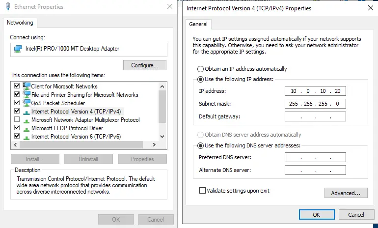
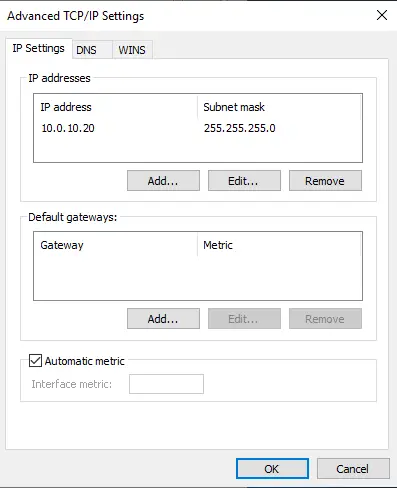
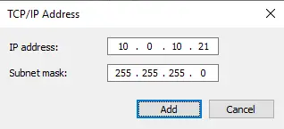
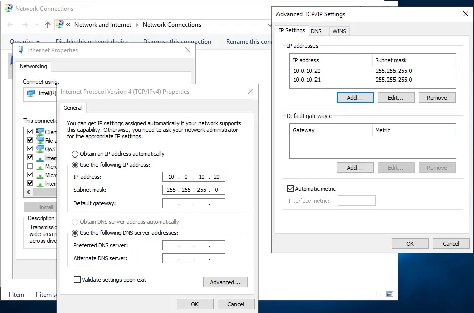

# Binding Multiple IP Addresses To A Single Network Adapter

- Each network adapter for a node may have more than (1) IP address bound to it.
- The additional IP addresses bound to each network adapter must be static.
- You cannot configure the node's network adapter to receive multiple IP addresses via a dynamic configuration (e.g. received from a DHCP server).
- Having multiple static IP addresses for a node is useful for bridging nodes between networks.
- For example, a node could have an Internet routable IP address bound to it, which makes the node accessible from the Internet.
- The same node could have a private IP address bound to it (e.g. 192.168.x.x, 10.x.x.x, etc.), which makes it accessible by nodes located on a company's internal network.
- This type of configuration separates internal and external network traffic, making it a more secured configuration.

1. The primary IP address of the node's network adapter is visible on the (General) tab.

- Click on the "Advanced" button to add additional IP addresses for the node's network adapter.



2. Click on the "Add..." button.



3. Type in the additional IP address settings, then click on the "Add" button.



4. All IP address (and associated subnet mask) values will be listed here.

- This list displays all of the IP addresses that are bound to this node's network adapter.
- Save the setting changes to complete the binding process.



5. The (ping) utility is used to verify that the node is responsive to all of the IP addresses that are bound to its network adapters.

```console
PS C:\Users\Administrator> ping 10.0.10.20

Pinging 10.0.10.20 with 32 bytes of data:
Reply from 10.0.10.20: bytes=32 time<1ms TTL=128
Reply from 10.0.10.20: bytes=32 time<1ms TTL=128
Reply from 10.0.10.20: bytes=32 time<1ms TTL=128
Reply from 10.0.10.20: bytes=32 time<1ms TTL=128

Ping statistics for 10.0.10.20:
    Packets: Sent = 4, Received = 4, Lost = 0 (0% 1o55),

Approximate round trip times in milli-seconds:
    Minimum = 0ms, Maximum = 0ms, Average = 0ms

PS C:\Users\Administrator> ping 10.0.10.21

Pinging 10.0.10.21 with 32 bytes of data:
Reply from 10.0.10.21: bytes=32 time<1ms TTL=128
Reply from 10.0.10.21: bytes=32 time<1ms TTL=128
Reply from 10.0.10.21: bytes=32 time<1ms TTL=128
Reply from 10.0.10.21: bytes=32 time<1ms TTL=128

Ping statistics for 10.0.10.21:
    Packets: Sent = 4, Received = 4, Lost = 0 (0% 1055),
Approximate round trip times in milli-seconds:
    Minimum = 0ms, Maximum = 0ms, Average 0ms
PS C:\Users\Administrator>
```
