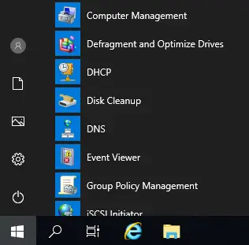
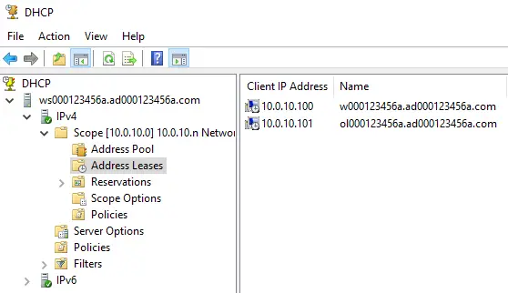

# Managing a DHCP Server

- DHCP services are a necessity for all networks.
- Without it, administrators (or users) would have to manually enter the static IP address settings for each of the nodes they work with.
- Imagine if you had to re-type the IP address settings on your smartphone each time it were connected to a different network.
- Managing a DHCP server involves:
  - Creating one or more DHCP scopes.
  - Verifying IP address settings are being issued out to DHCP clients successfully.
  - Monitoring the DHCP scope and ensuring the scope does not run out of IP addresses.

## DHCP Scopes

- A DHCP scope defines:
  - A pool (group) of IP addresses which are issued out to DHCP clients.
  - A lease time which identifies how long a DHCP client may use an issued IP address for.
  - A subnet mask that is associated with each issued IP address.
  - A default gateway address, so that DHCP clients can access other networks.
  - A DNS server address, so that DHCP clients can resolve hostnames and FQDNs to IP addresses.
  - A DNS namespace suffix, used to create FQDN values when only a hostname is queried.

## Installing the (DHCP Server) Server Role

1. Similar to (AD DS) and (DNS), select the (DHCP Server) server role and complete the installation process.


2. Complete the post-installation configuration requirement for the (DHCP Server) role.

- Nothing to change along the way in most cases.
- Just use the default settings.


3. Click "Next”.


4. Click “Commit."


5. Click “Close."


6. Once the (DHCP Server) post-installation configuration requirement has completed, don't forget to clear out the "Server Manager's" notification area.

- The notification area contains reminders for you to do something, so keeping this area clear, visually informs you that there is nothing else for you to do.


## Creating a DHCP Scope

7. The "DHCP" interface is used to manage all aspects of your DHCP environment.



8. Right-click on the (IPv4) node, and select the "New Scope..." option.

- A wizard will guide you through the process for creating a new DHCP for your network.


9. Click “Next."


10. Enter a descriptive name for your new DHCP scope.

- The value can be anything you like.


11. Enter the range of IP addresses for your pool.

- These are the IP addresses which will be issued out to your DHCP clients on the network.
- A valid subnet mask needs to be identified, so that all DHCP clients will participate in the same IP network.


12. On rare occasions, it may be necessary to remove a few IP addresses from the previously defined pool of addresses (e.g. statically configured nodes which use IP addresses which are part of the pool).

- If you define your IP networks properly from the start, then there should be no need to exclude any IP addresses from the pool.


13. Define the DHCP scope's lease time.


14. The extra options include the (default gateway, DNS server, DNS namespace suffix, etc.) setting values.


15. Add the default gateway for the IP network.


16. Add a DNS server for the IP network.

- The DNS namespace suffix can be left alone or modified if you wish.


17. Another example of "old technology" which should be deprecated.

- Only older nodes (e.g. Windows 95, Windows NT 4.0, etc.), and older software rely on WINS (Windows Internet Name Services) to resolve hostnames to IP addresses.
- Modern networks all use DNS services for name resolution purposes.


18. Activate the new DHCP scope so that DHCP clients can begin to acquire their IP settings dynamically from the DHCP service on your network.


19. Click "Finish”.


## Microsoft Windows DHCP Clients

20. Once DHCP services are available on your network, other nodes can be configured to acquire their IP settings dynamically.


21. Manually verify all IP setting values (IP address, subnet mask, default gateway address, DNS server address, DNS namespace suffix, etc.) were acquired from the DHCP service.

```console
PS C:\Users\localuser> ipconfig /all

Windows IP Configuration
    Host Name:                          w000123456a
    Primary DNS Suffix:
    Node Type:                          Hybrid
    IP Routing Enabled:                 No
    WINS Proxy Enabled:                 No
    DNS Suffix Search List:             ad000123456a.com

Ethernet adapter Ethernet:
    Connection-specific DNS Suffix:     ad000123456a.com
    Description:                        Intel (R) PRO/1000 MT Desktop Adapter
    Physical Address:                   08-00-27-83-21-31
    DHCP Enabled:                       Yes
    Autoconfiguration Enabled:          Yes
    Link-local IPv6 Address:            fe80::a062:d282:bc4a:bdb%4 (Preferred)
    IPv4 Address:                       10.0.10.100 (Preferred)
    Subnet Mask:                        255.255.255.0
    Lease Obtained:                     October 3, 2019 3:29:44 p.m.
    Lease Expires:                      October 11, 2019 3:29:46 p.m.
    Default Gateway:                    10.0.10.20
    DHCP Server:                        10.0.10.20
    DHCPv6 IAID:                        67633191
    DHCPv6 Client DUID:                 00-01-00-01-24-CD-1D-85-08-00-27-83-21-31
    DNS Servers:                        10.0.10.20
    NetBIOS over Tcpip:                 Enabled

PS C:\Users\localuser>
```

22. Test connectivity on the network and name resolution from your DNS service to ensure all is working properly.

```console
PS C:\Users\localuser> ping pet-rescue.org
```

Pinging pet-rescue.org [10.0.20.20] with 32 bytes of data:
Reply from 10.0.20.20: bytes=32 time<1ms TTL=128
Reply from 10.0.20.20: bytes=32 time<1ms TTL=128
Reply from 10.0.20.20: bytes=32 time<1ms TTL=128
Reply from 10.0.20.20: bytes=32 time<1ms TTL=128

Ping statistics for 10.0.20.20:
    Packets: Sent = 4, Received = 4, Lost = 0 (0% 1055),
Approximate round trip times in milli-seconds:
    Minimum = Oms, Maximum = Oms, Average = Oms

PS C:\Users\localuser> ping equipment.xyzsports.co.uk

Pinging www.xyzsports.co.uk [10.0.40.20] with 32 bytes of data:
Reply from 10.0.40.20: bytes=32 time<1ms TTL=128
Reply from 10.0.40.20: bytes=32 time<1ms TTL=128
Reply from 10.0.40.20: bytes=32 time=1ms TTL=128
Reply from 10.0.40.20: bytes=32 time<1ms TTL=128

Ping statistics for 10.0.40.20:
    Packets: Sent = 4, Received = 4, Lost = 0 (0% 1055),
Approximate round trip times in milli-seconds:
    Minimum = Oms, Maximum = 1ms, Average = Oms

PS C:\Users\localuser>
```

## Oracle Linux DHCP Clients

23. Use the (`ifconfig`) command to verify the node has received a valid IP address and associated subnet mask from your DHCP service.

```console
[root@ol000123456a ~]# ifconfig
enp0s3: flags=4163<UP, BROADCAST, RUNNING, MULTICAST> mtu 1500
        inet 10.0.10.101
        netmask 255.255.255.0 broadcast 10.0.10.255
        inet6 fe80:: eclf:8bcc:42ab:fdf prefixlen 64 scopeid 0x20<link>
        ether 08:00:27:1:ca:06 txqueuelen 1000 (Ethernet)
        RX packets 33 bytes 4261 (4.1 KiB)
        PX errors: 0 dropped, 0 overruns, 0 frame 0
        TX packets: 70 bytes, 7758 (7.5 KiB)
        TX errors: 0 dropped, 0 overruns, 0 carrier, 0 collisions 0
lo0: flags=73<UP, LOOPBACK, RUNNING> mtu 65536
        inet: 127.0.0.1 netmask 255.0.0.0
        inet6 : ::1 prefixlen 128 scopeid 0x10<host> loop txqueuelen 1000 (Local Loopback)
        RX packets: 0 bytes, 0 (0.0 B)
        RX errors: 0 dropped, 0 overruns, 0 frame 0
        TX packets: 0 bytes, 0 (0.0 B)
        TX errors: © dropped 0 overruns, 0 carrier, 0 collisions 0
virbr0: flags=4099<UP, BROADCAST, MULTICAST> mtu 1500
        inet: 192.168.122.1 netmask 255.255.255.0 broadcast 192.168.122.255
        ether: 52:54:00:9a:22:25 txqueuelen 1000 (Ethernet)
        RX packets: 0 bytes, 0 (0.0 B)
        RX errors: 0 dropped, 0 overruns, 0 frame 0
        TX packets: 0 bytes, 0 (0.0 B)
        TX errors: © dropped 0 overruns, 0 carrier, 0 collisions 0
[root@ol000123456a ~]#
```

24. Use the (`cat /etc/resolv.conf`) command to view the contents of the node's name resolution configuration file.

- This file is automatically updated when the node is configured as a DHCP client.
- Here, we see both the DNS server address and DNS namespace suffix are correct, with values we expect for them.

```console
[root@ol000123456a ~]# cat /etc/resolv.conf
# Generated by NetworkManager
search ad000123456a.com
nameserver 10.0.10.20
[root@ol000123456a ~]#
```

25. Test connectivity on the network and name resolution from your DNS service to ensure all is working properly.

```console
[root@ol000123456a ~]# ping -c 2 creativedesigns.net
PING creativedesigns.net (10.0.30.20) 56(84) bytes of data.
64 bytes from ws000123456a
- ad000123456a.com (10.0.30.20): icmp seq=1 ttl=128 time=0.525 m
64 bytes from ws000123456a.ad000123456a.com (10.0.30.20): imp seq=2 ttl=128 time=0.324 m

--- creativedesigns.net ping statistics ---
2 packets transmitted, 2 received, 0% packet loss, time 36ms
rtt min/avg/max/mdev = 0.324/0.424/0.525/0.102 ms
[root@ol000123456a ~]#
[root@ol000123456a ~]# ping - c 2 purchase.xyzsports.co.uk
PING www.xyzsports.co.uk (10.0.40.20) 56(84) bytes of data.
64 bytes from www.xyzsports.co.uk (10.0.40.20): imp seq=1 ttl=128 time=0.413 m
64 bytes from www.xyzsports.co.uk (10. 0.40.20): imp seq=2 ttl=128 time=0.315 ms

--- www.xyzsports.co.uk ping statistics ---
2 packets transmitted, 2 received, 0% packet loss, time 2ms
rtt min/avg/max/mdev = 0.315/0.364/0.413/0.049 ms
[root@ol000123456a ~]#
```

26. Use the (`route -n`) command to identify the default gateway for the node.

- The value should match what you defined earlier when you created the DHCP scope.

```console
[root@ol000123456a ~]# route -n
Kernel IP routing table
Destination     Gateway     Genmask         flags   Metric     Ref     Use Iface
0.0.0.0         10.0.10.20  0.0.0.0         UG      100        0       0 enp0s3
10.0.10.0       0.0.0.0     255.255.255.0   U       100        0       0 enp0s3
192.168.122.0   0.0.0.0     255.255.255.0   U       0          0       0 virbr0
[root@ol000123456a ~]#
```

## Identifying DHCP Clients

27. Now that we have a couple of nodes on our network utilizing the DHCP scope we created, let's see who they are.

- As it is with most Microsoft graphical interfaces, you will need to manually refresh the applicable node (folder) before it is populated with current information.


28. And, as expected, we see that there are (2) nodes on our network that have acquired their IP settings from our DHCP service.


## Managing a DHCP Scope

29. Once a DHCP scope has been created, it can be modified and monitored.

- Here you can view the IP address pool range, or modify it (make it bigger or smaller) if needed.


30. Here, you can see which nodes have acquired their IP address settings from this DHCP scope.

- Currently, (2) nodes on the network are configured dynamically for their IP address settings.



31. If you need to add or change the options for the DHCP scope, here is where you can do so.


