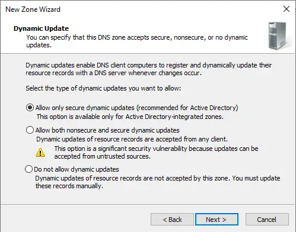
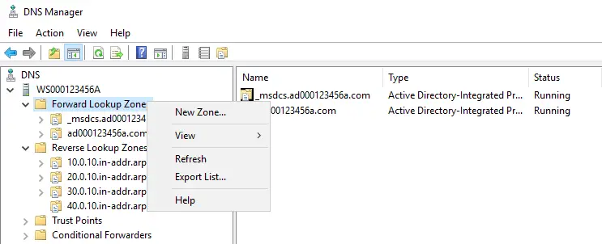
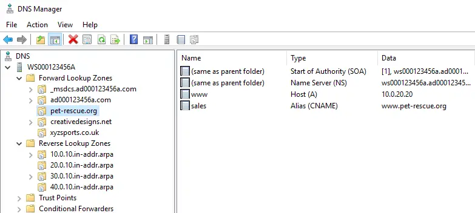

# Managing a DNS Server

- DNS services are a necessity for all networks.
- Without it, users would have to remember IP addresses in order to access all services (e.g. E-mail, e-mail, web, database, etc.) on the network.
- Managing a DNS server involves:
  - Creating and maintaining forward lookup zones.
  - Converting hostname and FQDN values to IP addresses.
  - IP addresses are then sent back to client applications, which use them to connect to the node on the network.
  - Creating and maintaining reverse lookup zones.
  - Converting IP addresses to hostname and FQDN values.
  - Used mostly for logging purposes (recording the names of the associated IP addresses).
  - Creating and maintaining resource records.
- These are the actual entries in DNS which convert hostnames and FQDNs to IP addresses, and vice versa.

## Reverse Lookup Zones

1. The "DNS Manager" interface is used to manage all aspects of a DNS server.


2. Reverse lookup zones are responsible for converting IP addresses to their associated hostname and FQDN values.

- By default, no reverse lookup zones are created.
- Many administrators do not understand the importance of reverse lookup zones and forget to create them.
- Reverse lookup zones should be created for each IP network in your environment, and BEFORE any additional forward lookup zones or resource records are created.


3. Right-click on the reverse lookup zone folder and select the "New Zone..." option.

- This will launch the "New Zone" wizard, which will step you through the process of creating a new reverse lookup zone.


4. Most of the settings throughout the "New Zone" wizard, you can keep the default settings.


5. Click "Next”.


6. Click "Next”.


7. Click "Next”.


8. This is the most important setting.

- Here is where you identify your IP network.
- The IP network is used to create a special reverse lookup zone name.


9. Here, for example, a reverse lookup zone is being created for the IP network (10.0.10.h).

- We don't use the host portion for the reverse lookup zone name.


10. Click "Next”.



11. Click "Finish”.


12. Here, a total of (4) reverse lookup zones have been created.

- One for each IP network in our network environment that we, as an administrator, are responsible for.


13. Each newly created reverse lookup zone comes with a couple of default resource records.

- As time goes by, each reverse lookup zone will be populated with more resource records.
- The new resource records equate a hostname on the network to its associated IP address.
- Reverse lookup zone resource records are mostly used for logging purposes.
- E-mail servers, web servers, etc
- will query the reverse lookup zone to acquire the hostname of an IP address it knows of, and then log that hostname in its log files.
- When an administrator inspects the log files, the hostnames are present so they don't have to manually look them up, making it easier to identify which host on the network accessed a server.


## Forward Lookup Zones

14. Forward lookup zones are responsible for converting hostname and FQDN values to their associated IP address.

- The IP address is then sent back to the client application so they can connect to the proper node on the network.
- With Active Directory installed on the network, a few default forward lookup zones will already exist.
- If you are responsible for managing multiple DNS namespaces, then you will need to create a forward lookup zone for each of those DNS namespaces.


15. Right-click on the forward lookup zone folder and select the "New Zone..." option.

- This will launch the "New Zone" wizard, which will step you through the process of creating a new forward lookup zone.



16. Most of the settings throughout the "New Zone" wizard, you can keep the default settings.


17. Click "Next”.


18. Click "Next”.


19. This is the most important setting.

- Here is where you identify your DNS namespace.
- The DNS namespace is used to create a special forward lookup zone name.


20. Here, for example, a forward lookup zone is being created for the DNS namespace (`pet-rescue.org`).


21. Click "Next”.


22. Click "Finish”.


23. Here, a total of (3) new forward lookup zones have been created.

- One for each DNS namespace that we, as an administrator, are responsible for maintaining.


24. Each newly created forward lookup zone comes with a couple of default resource records.

- As time goes by, each forward lookup zone will be populated with more resource records.
- The new resource records equate a hostname on the network to its associated IP address.


## Forward Lookup Zone Resource Records

- Once forward and reverse lookup zones have been created, they are pretty much empty and useless, so it is up to resource records to do the "real work."
- Host address (Host (A)) resource records are responsible for returning the IP address of a hostname in a DNS namespace, back to client applications.
- Host (A) resource records are a one-to-one relationship, equating (1) IP address to a unique hostname.
- When you use the (ping) utility to ping a hostname or FQDN value, the Host (A) resource record is queried in order to obtain the associated IP address for the hostname/FQDN. Canonical Name (CNAME) resource records are used to equate other hostname values to an existing Host (A) resource record.
- Often called aliases, CNAME resource records are a many-to-one relationship, equating many additional unique hostnames to an existing single Host (A) resource record.

## Host Address (A)

25. For a forward lookup zone, create a new Host (A) resource record.


26. The hostname portion of an FQDN value is what needs to be provided.

- The domain name (DNS namespace) portion does not need to be provided, as the new resource record is being created below its associated DNS namespace.
- Through this parent-child relationship, the FQDN value is automatically created.
- Identify the IP address which is to be associated with the hostname.
- Ensure a reverse lookup zone resource record (PTR: Pointer) is created also for this hostname.


27. Click "OK”.


28. Enter additional Host (A) resource records if needed.

- Click on the "Done" button when finished.


29. Here, a single new Host (A) resource record has been created.

- Now, when client applications are looking for the (`www.pet-rescue.org`) node on the network, our DNS service will return the IP address (`10.0.20.20`) back to them.
- Once the client application has the IP address, it can then communicate on the network with the node.


30. Here, the associated (PTR) reverse lookup zone resource record has been created.

- Now, when other software is looking to find out who (`10.0.20.20`) is, our DNS service will return the hostname and FQDN values (www; `www.pet-rescue.org`) back to them.
- That information, along with the original IP address, is what gets recorded in a log file.


31. Before testing to see if the new Host (A) resource record in DNS is resolving properly, ensure the node is configured to use the DNS server for name resolution purposes.

- Here, our "server" node is using the local loopback adapter IP address (`127.0.0.1`).
- As such, it will query itself whenever hostname and FQDN values need to be resolved to IP addresses.


32. Use the (ping) utility to perform a DNS forward lookup for the FQDN value.

- You should receive the associated IP address for the Host (A) resource record you created.

```console
PS C: \Users\Administrator> ping www.pet-rescue.org

Pinging www.pet-rescue.org [10.0.20.20] with 32 bytes of data:
Reply from 10.0.20.20: bytes=32 time<1ms TTL=128
Reply from 10.0.20.20: bytes=32 time<1ms TTL=128
Reply from 10.0.20.20: bytes=32 time<1ms TTL=128
Reply from 10.0.20.20: bytes=32 time<1ms TTL=128

Ping statistics for 10.0.20.20:
    Packets: Sent = 4, Received = 4, Lost = 0 (0% 1o55),
Approximate round trip times in milli-seconds:
    Minimum = Oms, Maximum = Oms, Average = Oms

PS C: \Users\Administrator>
```

## Canonical Names (CNAME)

33. Whenever you have a node that needs to respond to multiple hostnames or FQDNs, use multiple CNAME resource records.

- Here, we already have (1) Host (A) resource record.
- Next, we would like to equate additional hostnames/FQDNs to this exact same IP address.
- As such, we need to create one or more aliases which point to this existing Host (A) resource record.


34. Provide the new hostname value and point to the existing Host (A) reference.

- Once completed, both the hostname (www) and the hostname (sales) will resolve to the IP address (`10.0.20.20`).
- The resource record for (sales) has been equated to the resource record for (www), using a CNAME resource record type.
- If the IP address ever changes for the (www) hostname, automatically the IP address for the (sales) hostname will also change to match.


35. Here is the new CNAME resource record, which is equated to (`www.pet-rescue.org`).

- The FQDN value (`www.pet-rescue.org`) is associated with the IP address (`10.0.20.20`).
- Therefore, both (`www.pet-rescue.org`) AND (`sales.pet-rescue.org`) will resolve to (`10.0.20.20`) when a forward lookup query is performed.



36. Test both FQDN values to ensure that the exact same IP address is resolved for each.

```console
PS C: \Users\ Administrator> ping www.pet-rescue.org

Pinging www.pet-rescue.org [10.0.20.20] with 32 bytes of data:

Reply from 10.0.20.20: bytes=32 time<1ms TTL=128
Reply from 10.0.20.20: bytes=32 time<1ms TTL=128
Reply from 10.0.20.20: bytes=32 time<1ms TTL=128
Reply from 10.0.20.20: bytes=32 time<1ms TTL=128

Ping statistics for 10.0.20.20:
    Packets: Sent = 4, Received = 4, Lost = 0 (0% loss),
Approximate round trip times in milli-seconds:
    Minimum = Oms, Maximum = Oms, Average = Ums

PS C: \Users \Administrator› ping sales.pet-rescue.org

Pinging www.pet-rescue.org [10.0.20.20] with 32 bytes of data:
Reply from 10.0.20.20: bytes=32 time<1ms TTL=128
Reply from 10.0.20.20: bytes=32 time<1ms TTL=128
Reply from 10.0.20.20: bytes=32 time<1ms TTL=128
Reply from 10.0.20.20: bytes=32 time<1ms TTL=128

Ping statistics for `10.0.20.20`:
    Packets: Sent = 4, Received = 4, Lost = 0 (0% 1055),
Approximate round trip times in milli-seconds:
    Minimum = Oms, Maximum = Oms, Average = Oms

PS C: \Users\ Administrator>
```

## Purging Client-side DNS Cache

- One example of "older technology" which should be eliminated altogether is cache.
- Still, to this day, cache is found everywhere and will most likely haunt you for the rest of your life.
- Cache had its place back in the old days of extremely slow dial-up (modem) connections to the Internet, and where there were relatively slow speeds on business networks.
- Cache is a technology which keeps newly acquired information at the client application level.
- The client application does not check to see if the information has been updated until some time later on.
- Over time, cached information "dies” and is no longer deemed valid.
- Once the cached information has "died", the client application will go to the source and retrieve a new copy of that information.

## DNS has cache

- When you perform a DNS forward lookup (e.g. ping www.acme.com), the information that is retrieved is cached on the client.
- If you are making changes to DNS and need to test the results immediately, you may not get the results you are looking for.
- Why? Because of cache.
- Purging the client-side DNS cache is a way of life for someone working in the Information Technology field.
- Here are (2) commands for purging client-side DNS cache on a Microsoft Windows node:
  - `Clear-DnsClientCache` (A PowerShell cmdlet; modern method)
  - `ipconfig.exe /flushdns` (older method; PowerShell or Command Interpreter)

## Host-less FQDNs

- People are lazy all of the time, especially when it comes to navigating the Internet.
- If you want to navigate to Facebook's web site, you should be typing the complete host-full FQDN value in the web browser:
  - `www.facebook.com`
- The above host-full FQDN includes both the hostname (www) of the node you wish to connect to, and the DNS namespace (facebook.com) of where the (www) node is located.
- Instead, people get lazy and just type:
  - `facebook.com`
- Which node did you want to connect to?
- All of them simultaneously in the (`facebook.com`) network.
- DNS had to be changed because of lazy people.
- It had to be updated to support host-less FQDNs, like:
  - `facebook.com`
- DNS needed to have a way of providing an IP address back to the client application, for an FQDN with an unspecified hostname.
- Only (1) host-less Host (A) resource record may exist for each DNS namespace.
- A host-less Host (A) resource record is one that does not include a hostname value.

37. Here, we use the (`ping`) utility to perform a forward lookup for a host-less FQDN value.

- As expected, no resource record exists, and therefore we do not receive any IP address for the host-less FQDN queried.

```console
PS C:\Users\Administrator> ping pet-rescue.org
Ping request could not find host pet-rescue.org
- Please check the name and try again.
PS C:\Users\Administrator>
```

38. Host-less FQDNs cannot be created using a CNAME resource record, because it cannot have the new hostname field left `<empty>`.


39. Host (A) resource records can be used to create a host-less FQDN.

- Just leave the new hostname field `<empty>`.


40. Now, (2) Host (A) resource records exist for the exact same IP address.

- The (www) entry is for the host-full FQDN (`www.pet-rescue.org`).
- The other is for the host-less FQDN (`pet-rescue.org`).


41. Using the (ping) utility, test both the host-full and host-less FQDNs.

- Both should return the exact same IP address.
- Because the change was made quickly after first attempting to resolve the host-less FQDN value, the client-side cache needed to be purged before the node would go out and check DNS (again) to see if it could provide an IP address.

```console
PS C:\Users\Administrator> ping pet-rescue.org
Ping request could not find host pet-rescue.org
- Please check the name and try again.

PS C:\Users\Administrator> Clear-DnsClientCache

PS C:\Users\Administrator> ping pet-rescue.org

Pinging pet-rescue.org [10.0.20.20] with 32 bytes of data:
Reply from 10.0.20.20: bytes=32 time<1ms TTL=128
Reply from 10.0.20.20: bytes=32 time<1ms TTL=128
Reply from 10.0.20.20: bytes=32 time<1ms TTL=128
Reply from 10.0.20.20: bytes=32 time<1ms TTL=128

Ping statistics for 10.0.20.20:
    Packets: Sent = 4, Received = 4, Lost = 0 (0% 1055),
Approximate round trip times in milli-seconds:
    Minimum = Oms, Maximum = Oms, Average Oms

PS C:\Users\Administrator>
```

## Local Resolution (Non-DNS)

- In extremely small network environments, you may not have the presence of a DNS service.
- So how do you resolve hostnames and FQDNs to IP addresses?
- By manually entering the information into each node's local resolution file.
- The local resolution file for a UNIX or UNIX "like" node is:
  - `/etc/hosts`
- The local resolution file for a Microsoft Windows node is:
  - `C:\Windows\System32\drivers\etc\hosts`
- These are text-editable files, which only an administrative user account can modify.

42. Locate the local resolution file.


43. Open the local resolution file in a text editor application.


44. Place as many resolution entries as needed, and save the changes to the file.

```console
# Copyright (c) 1993-2009 Microsoft Corp.
# This is a sample HOSTS file used by Microsoft TCP/IP for Windows.
#
# This file contains the mappings of IP addresses to host names.
- Each
# entry should be kept on an individual line.
- The IP address should
# be placed in the first column followed by the corresponding host name.
# The IP address and the host name should be separated by at least one
# space.
# Additionally, comments (such as these) may be inserted on individual
# lines or following the machine name denoted by a '#' symbol.
#
# For example:
#
#   102.54.94.97    rhino.acme.com          # source server
#   38.25.63.10     x.acme.com             # x client host

# localhost name resolution is handled within DNS itself.
#   127.0.0.1       localhost
#   ::1             localhost

    10.0.40.20      www.xyzsports.co.uk
```

45. Note that the entry made to the local resolution file (previous slide) is not located in our DNS environment.

- Therefore, the only way to resolve the FQDN at this point is locally, using the local resolution file.


46. Using the (`ping`) utility, check to see if you are able to resolve the FQDN.

- WARNING: Local resolution entries supersede anything located in the DNS environment.

```console
PS C:\Users\Administrator> ping www.xyzsports.co.uk

Pinging www.xyzsports.co.uk [`10.0.40.20`] with 32 bytes of data:
Reply from `10.0.40.20`: bytes=32 time<1ms TTL=128
Reply from `10.0.40.20`: bytes=32 time<1ms TTL=128
Reply from `10.0.40.20`: bytes=32 time<1ms TTL=128
Reply from `10.0.40.20`: bytes=32 time<1ms TTL=128

Ping statistics for `10.0.40.20`:
    Packets: Sent = 4, Received = 4, Lost = 0 (0% 1055),
Approximate round trip times in milli-seconds:
    Minimum = Oms, Maximum = Oms, Average = Oms

PS C:\Users\Administrator>
```
