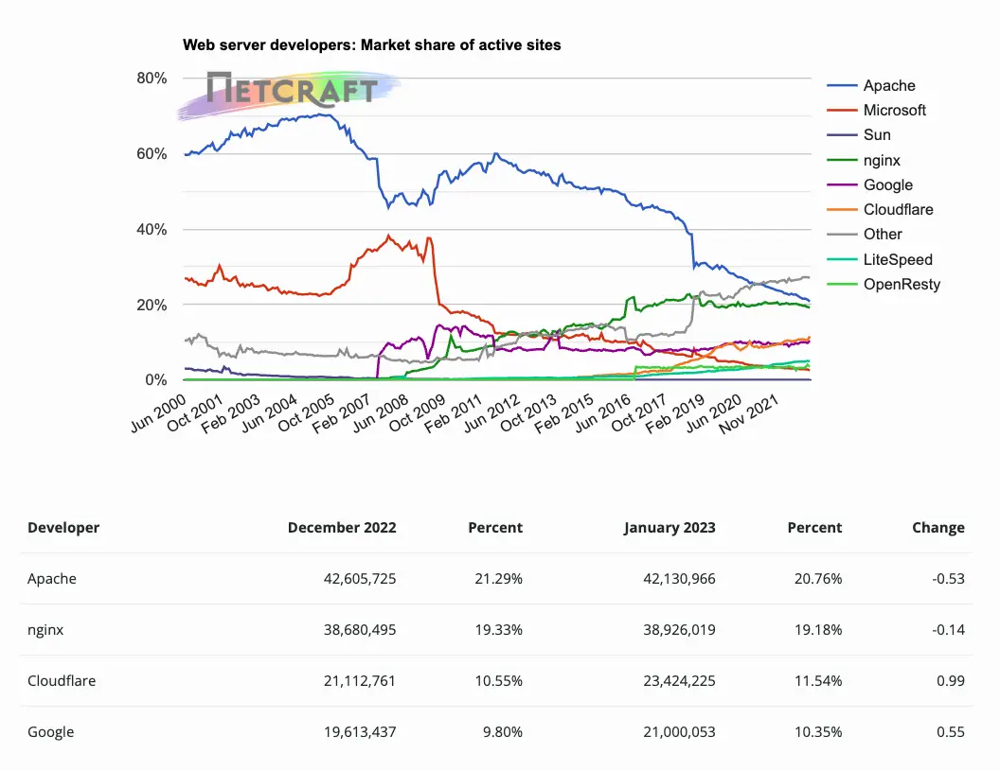

# Web Server Platforms

- A web server platform allows for the hosting of web sites.
- The hosted web sites may exist on a company's internal network, accessible by employee nodes only, or be Internet accessible (by any node in the world).
- The top (4) web server platforms (ordered by global active site market share) are:
  - Apache HTTP Server
  - nginx HTTP Server
  - Google Web Server
  - Microsoft Internet Information Services
- Apache HTTP Server has held the top position, in global active market share, for the past (20+) years.
- See latest market share details [here](http://news.netcraft.com/archives/category/web-server-survey)

## Microsoft Internet Information Services (IIS)

- Microsoft's native web server platform is called Microsoft Internet
- Information Services, or simply, “IIS."
- IIS is installed as part of the (Web Server (IIS)) server role on a Microsoft Windows Server node.
- IIS is also available as an installable Windows Feature on workstation class versions of Microsoft Windows nodes.
- Installed via the (Programs and Features) Control Panel applet.
- The native administrative GUI is called the Internet Information Services (IIS) Manager, or simply, "IIS Manager."
- IIS is capable of hosting many web sites on a single node simultaneously.
- They are referred to as virtual web sites, since they do not need to be hosted on separate nodes (physical or virtual).
- IIS comes with a single web site called the Default Web Site.

## The Default Web Site

- The Default Web Site responds to all inbound requests, for all IP addresses bound to the node, which are not explicitly bound to any other web site.
- The Default Web Site also responds to inbound requests on the local loopback adapter (`localhost`, `127.0.0.1`).
- Web sites are typically configured to respond to default web browsing-related protocols and port numbers.
  - "Unsecured" web sites respond by default to the (**http**) protocol and on port number (`80`) of the web site hosting node.
  - "Secured" web sites respond by default to the (**https**) protocol and on port number (`443`) of the web site hosting node.
- Technically, a web site can be configured to respond on any one of the available (65,536) port numbers for each IP address bound to the web site hosting node.

## Web Site Bindings

- Each web site is unique to the hosting node by way of its bindings.
- Unique binding attributes include:
  - IP address (**IPv4** or **IPv6**)
  - Port Number (**65,536** possibilities)
  - Protocol (**http** or **https**)
  - Host Header Name (**hostname** or **FQDN** value)
- When all of the bindings are evaluated together, each web site must somehow be uniquely distinguishable.
- If not, then there would be no way for the web server to provide client web browser applications with the correct web site content.

## Web Server (IIS) Role Services

- IIS, by default, is capable of hosting static web sites only.
- A static web site is one where the content is manually updated by an individual (e.g. manually editing an HTML document, manually replacing an image file, etc.).
- Static web sites are typically boring, as their content does not change quickly enough to keep most visitors interested for long.
- The Web Server (IIS) server role can be extended in order to support additional capabilities, by way of related Web Server (IIS) role services.
- By adding the Basic Authentication role service, web sites can be configured to prompt users to enter their username and password before they are able to access web site content.
- By adding additional role services, IIS can be configured to host dynamic web sites.
- A dynamic web site is one where the content is dynamically changed based on time, programmatic code, changes in data, etc.
- Dynamic web sites are what most businesses use today for their corporate web presence, in order to keep users coming back (typically not boring).

## Unique Web Site Configurations

1. IP-Based web sites are web sites configured with their own IP address as the unique binding attribute.

- The IP address is not used by any other web site (or any other software product on the hosting node).

2. Port-based web sites are web sites configured with their own Port Number as the unique binding attribute.

- The IP address is usually common to other web sites.
- Multiple web sites configured to use the same IP address must each be configured with a unique Port Number.

3. Named-Based web sites are web sites configured with their own hostname or FQDN value as the unique binding attribute.

- Both the IP address and the
- Port Number can be common to other web sites.

## IP-Based Web Sites

- IP-Based web sites are the least common of the web sites created on the Internet today.
- Each IP-Based web site consumes a single IP address.
- In a world where the Internet has run out of IPv4 addresses, it becomes "too expensive" to use a precious Internet routable IPv4 address for just one web site.
- What would happen if a company needed to host (`500`) web sites which were required to be Internet accessible?
- IP-Based web sites are great for a company's internal network environment, where they most likely make use of reserved IP addressing (e.g. `10.x.x.x`, `192.168.x.x`, etc.).
- These companies would literally have millions of IP addresses to use for web sites.
- The downside is that those web sites are only accessible by nodes attached to the company's network, and not by any Internet nodes.
- IP-Based web sites are the easiest type of web site to create, regardless of the web server platform (IIS, Apache HTTP Server, nginx HTTP Server, etc.).

## Port-Based Web Sites

- Port-Based web sites are the least common of the web sites created on the
- Internet today, as they require the end-user to explicitly type in a port number value within the URL.
- Port overriding is used to connect to web sites which are not configured with a default port number (`80` or `443`).
  - `http://www.acme.com/` - Connects to port (`80`) Implicit
  - `http://sales/` Connects to port (`80`) Implicit
  - `https://hrdept/` - Connects to port (`443`) Implicit
  - `http://hrdept.acme.com:55555/` - Connects to port (`55555`) Explicit
  - `https://sales:36487/` - Connects to port (`36487`) Explicit

## Name-Based Web Sites

- Name-Based web sites are the most common of the web sites created on the Internet today, and for internal company networks.
- Name-Based web sites can share a common IP address and port number, making them ideal and efficient.
- The Host Header Name is used as the unique binding attribute.
- The Host Header Name value is derived from the URL used to connect to the web site.
- It is either a hostname or FQDN value.
  - http://**www.acme.com**/
  - http://**sales**/
  - http://**hrdept.acme.com**:55555/
  - https://**sales**:36487/
