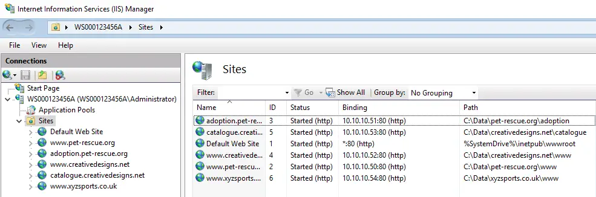
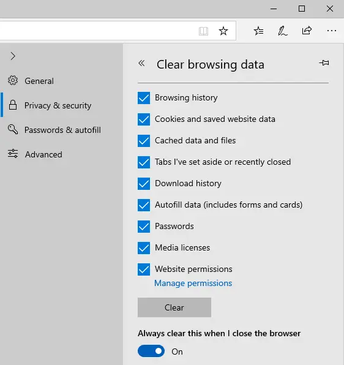

# Installing the (Web Server - IIS) Server Role

- The (Web Server (IIS)) server role is installed in a similar manner to the (AD DS, DNS, and DHCP) server roles.
- The (Web Server (IIS)) server role is installed with a set of default role services.

- Default role services (Image # 1)
- All items located below the (Web Server (IIS)) branch are related role services for the server role.
- Note, many of them are not selected by default.
- Additional role services are only enabled if they are needed.

- Default role services (Image # 2)

- Default role services (Image # 3)

## The Default Web Site

- The Default Web Site is the only web site created once the Web Server (IIS) server role has been installed.
- Any additional web sites must be manually created by the administrator.
- Once the Web Server (IIS) server role has been installed, it is wise to see if the Default Web Site is accessible on the network.
- This will confirm the installation was successful (or not).
- If there are problems accessing the Default Web Site, they will need to be dealt with before creating any new web sites.
- All aspects of IIS are managed using the IIS Manager GUI administrative interface.

- Locate and launch the "IIS Manager”.

- Expand the hierarchy to expose the Default Web Site.
- Visually this confirms that the (1) web site exists in your environment.

- On a remote network node, launch the Microsoft Edge web browser application.
- This will be used to test connectivity and responsiveness of the Default Web Site.

- Forget about DNS for now, just try to access the Default Web Site using the primary IP address of the web server node.
- No point in dealing with any potential name resolution issues, as you only want to verify if the Default Web Site is accessible on the network.

- If all goes well, the Default Web Site's main web page will be rendered in the client web browser application.
- Next, you can begin creating additional web sites, and testing out their accessibility on the network.

## Creating IP-Based Web Sites

- From the (Sites) shortcut menu, select the "Add Website..." option to create a new web site.

- Fill in the new web site's attribute values (explained over the next 2 slides).

## Web Site Attributes

1. Site Name: Can be any unique name you like, but should really be reflective of the associated web site content.

- Using the FQDN value for the site name makes identification much easier, especially when there are many web sites in the list.
- Using names like (Site 1, Site 2, Site 3, etc.) is a bad idea, as you will not easily know what each web site is used for (e.g. the sales department, the human resources department, etc.).

2. Physical Path: Commonly referred to as the root content folder.

- Identifies the top-most level of the filesystem folder hierarchy, where the location of the website’s content (HTML documents, images, etc.) begins.

3. (Binding) Type: Identifies which protocol the website will respond to.

- Choice is between either (http) or (https).
- If (https) is selected, then a digital certificate will also need to be bound to the website in order to make it a secured website.

3. (Binding) IP Address: Identifies which IP address the website will be bound to.

- Only existing IP addresses bound to the node's network adapters may be selected.
- From the drop-down selection list, pick the IP address.
- Do not manually type in an IP address (good chance you will type the value incorrectly; does not "add" any new IP addresses to the node).

4. (Binding) Port: Identifies the Port Number the website will respond to.

- Typically either port (80) or port (443).
- If needed, the port number can be
- virtually any value you like from the (65,536) available port numbers, as long as it does not conflict with any other software services running on the node.

5. (Binding) Host Name: Commonly called the Host Header Name.

- Used ONLY for Name-Based websites.
- NEVER used for IP-Based websites.
- Never used for Port-Based websites.
- The value is typically the FQDN value used to access the website.
- In small network environments (e.g. without DNS services), where only hostnames are used to access resources, then the value would be the hostname.

- Add website details and click "OK”.

- Using a web browser application, test connectivity to the new website, using the host-full FQDN value.

- If DNS is configured with a matching host-less FQDN value, test that as well.

- Here, a total of (5) new IP-based websites have been created.

## Purging the Web Browser's Cache

- As stated last day, cache is everywhere, including at the web browser application level.
- Think of a node which has Microsoft Edge, Microsoft Internet Explorer, Mozilla Firefox, and Google Chrome installed on it.
- Users will need to purge cache periodically for each of these (4) web browser applications.
- When a website is visited, the information that is downloaded and rendered (HTML, images, etc.) is stored locally on the node.
- If a change has been recently made to the website content, or its configuration, you may not see the changes until some time has passed (minutes, hours, or even days).
- In a testing environment, where you are setting up websites, changing settings, or modifying data, cache will prevent you from seeing your changes immediately.
- No matter which web browser application you use, you will need to purge the application's cached information before you are able to see any recent changes to a website.
- In Microsoft Edge, go to the browser's settings.

- Locate the area for clearing the browsing data, and click on the button.

- Select all of the cached components, and enable Microsoft Edge to automatically clear the selected cache components when the web browser is gracefully closed.
- Then, click on the "Clear" button to manually clear the selected cache components immediately.

## Creating Name-Based Web Sites

- The major difference between IP-Based web sites and Name-Based web sites is found in DNS.
- Unique name-based web sites share a common IP address.

- Name-Based web sites utilize the Host Header Name binding attribute.
- The spelling must match what DNS uses to resolve the IP address, or the Default Web Site will render in the client's web browser application.

- Here, a total of (3) new Name-Based web sites have been created.

