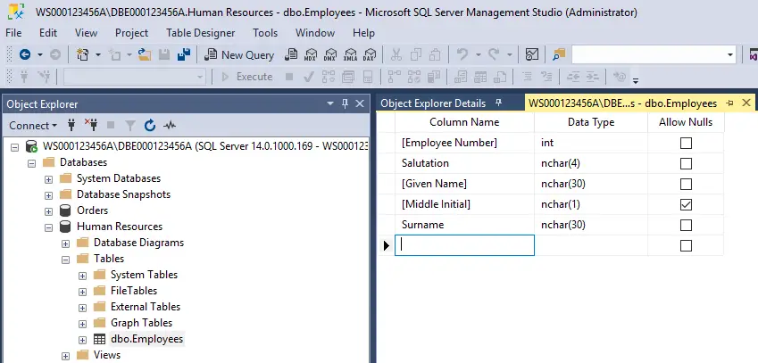

# Database Servers

- Data is what "drives" every business.
- Data is the most important asset a business can have.
- It cannot be purchased, and therefore, has to be created from scratch (which is very costly).
- Data needs to be available (24/7/365), (24) hours a day, (7) days a week, and (365) days per year, basically, all of the time.
- When data becomes unavailable in a business, the business begins to lose money.
- Depending on how reliant a business is on its data, the losses could be upwards of millions of dollars for every few minutes a business does not have access to its data (e.g. Amazon, Walmart, etc.).
- Likewise, if a business loses its data altogether (e.g. fire, theft, hardware malfunctions, etc.), the company could lose much more money.
- Database servers provide the level of access and protection businesses need for their data.
- Database servers are designed with these features in mind:
  - Centralizing data.
  - Multiple users can simultaneously access the data (not one at a time).
  - Users have fast access to the data (when reading + writing).
  - Data is resilient to typical problems (e.g. power issues, storage device issues, network issues, physical security issues, etc.).
- Database environments, if designed properly, can significantly minimize the risk of a business losing access to its data.
- Database servers make use of one or more database engines, used to host databases (controls access to the data securely, performs backups of databases, performs replication of data over the network, etc.).
- A database application (e.g. Microsoft Access), which is used to create user-level (non-centralized) databases, is:
  - Good for personal (home use) projects (e.g. a personal address book, documenting your Blu-ray/DVD movie collection, etc.).
  - Good for small personal software applications which require data to be stored (on the same node as the installed application).
  - Not designed for heavy use (e.g., used to run key business operations).
  - Not designed to be accessed reliably by multiple simultaneous users (typically all other users are locked out of the data, while one user is modifying it).
- It is extremely difficult to justify the existence of any database application type of database (e.g. Microsoft Access) in the workplace.
- They are just not capable of providing the level of performance and reliability businesses need in order to operate successfully.
- The top (3) database server platforms in the workplace (ordered by global market share) are:
  - Oracle Database (approximately: 50%)
  - Microsoft SQL Server (approximately: 25%)
  - IBM DB2 (approximately: 22%)
- The above database platforms cost anywhere from thousands of dollars to hundreds of thousands of $$$ (or more) to legally license.
- Very few "free" database platforms are used in the workplace for production purposes.
- Why? There is little to no technical support available.
- A business wants to be able to pick up a telephone and pay for a fast solution to the technical issues they are experiencing.
- When a business doesn't have access to their database(s), the business is losing a lot of money.

## Microsoft SQL Server

- Most of these database-related items are found in many of the popular database platforms.
- Microsoft allows for the installation of its database server platform to be installed on a single node, more than once (simultaneously).
- Each separate installation is called an instance.
- Each database engine instance is capable of hosting many user databases.

1. This is the database engine instance.

- Every node (container) and item below this level is a part of and managed by this database engine instance.

2. Below the "Databases" node lie the hosted databases for this database engine instance.

- There are system databases (master, model, msdb, and tempdb), and then user databases (Orders, Human Resources, Shipping Information).
- In a new installation, only the system databases will initially be present.

3. Below the (Logins) node, lie the Login Objects for the database engine instance.

- A Login Object is required in order to authenticate each user to the database engine.
- Without authenticating successfully, a user will not be able to access any of the information (including the user databases) which are managed by the database engine.

4. Below each database, there are Tables.

- Tables contain the data businesses rely on daily.

5. Tables are custom-designed to hold the underlying data.

- Tables are designed at the column level, with an appropriate Data Type.
- The data type is used when storing the pieces of column data, with a specific level of precision (e.g. how many decimal places for a number).
- Data types also determine how much space is consumed to store each piece of data on the hard disk (storage device).

6. Data is then entered into each table where it is stored.

- New table data is entered in at a row level.
- Here, there are (4) rows of table data, where each row of data consists of (5) columns of data.
- Existing data is modified at a column level.

7. Users are authorized to access data by way of their Database User object.

- Database user objects are associated with a database engine instance's Login object.
- Once the user has authenticated to the database engine instance, it is up to each database's user object to determine if the user can view, create, modify, and remove rows of table data.

