# Installing Microsoft SQL Server

- The major steps to installing Microsoft SQL Server (a.k.a. MSSQL) on a "server" node include:
  - Select the minimum software components to create a database environment that can host centralized databases.
  - Create a named MSSQL database engine instance.
  - Ensure the collation setting is appropriate for the hosted data.
  - Configure network settings specific to the MSSQL database engine (how it will respond to inbound connections).
  - Configure network settings specific to the MSSQL client (how it will connect to the database engine).
  - Install (or update) native GUI and CLI applications used to interface with the MSSQL database engine (for both administrators and regular users).
  - Test connectivity to the MSSQL database environment.
  - Create User Databases, Tables, Login Objects, Database User Objects.
  - Add data to tables.
  - Secure and maintain the MSSQL hosted data.

## Local Name Resolution

1. Since you won't have DNS services available in your network environment, place (2) entries in the local resolution file on the Microsoft Windows Server Guest OS.

- The Guest OS should be capable of resolving both the "server" and the "client" nodes in your network environment using hostname values.

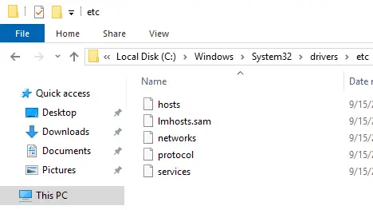

2. You should have (2) similar entries in the local resolution file on the Microsoft Windows Server Guest OS.

- Use your personal 9-digit number in place of the sample ones in this image.

```console
# Copyright (c) 1993-2009 Microsoft Corp.
# This is a sample HOSTS file used by Microsoft TCP/IP for Windows.

# This file contains the mappings of IP addresses to host names.
# Each entry should be kept on an individual line.
# The IP address should be placed in the first column followed by the corresponding host name.
# The IP address and the host name should be separated by at least one space.
# Additionally, comments (such as these) may be inserted on individual
# lines or following the machine name denoted by a '#' symbol.

# For example:
#
#   102.54.94.97    rhino.acme.com          # source server
#   38.25.63.10     x.acme.com             # x client host

# localhost name resolution is handled within DNS itself.
#   127.0.0.1       localhost
#   ::1             localhost

    192.168.100.20  w000123456a
    192.168.100.25  w000123456a
```

## Installing Microsoft SQL Server

- From the menu bar, located at the top of the Guest OS console window, select the following menu options:
  - Devices -> Optical Drive -> Choose Disk Image - Select the Microsoft SQL Server 2017 (64 bit; English; Developer Edition) DVD ISO image file you downloaded from the Microsoft Azure Dev Tools.

3. Using File Explorer, double-click on the optical drive which has the Microsoft SQL Server 2017 DVD ISO image "inserted" into it.

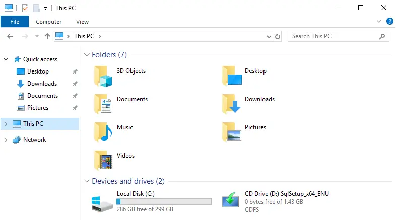

4. Click on the "Installation" category.

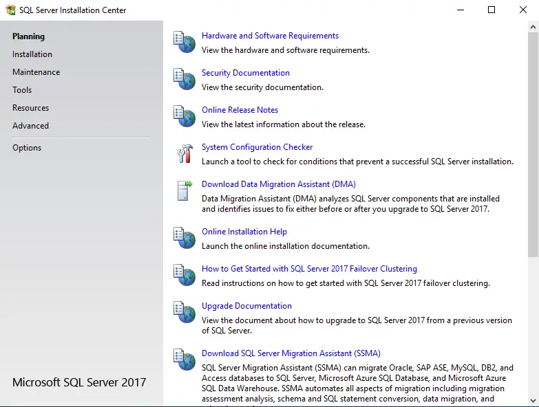

5. Click on the hyperlink to perform a new installation of the MSSQL software product.

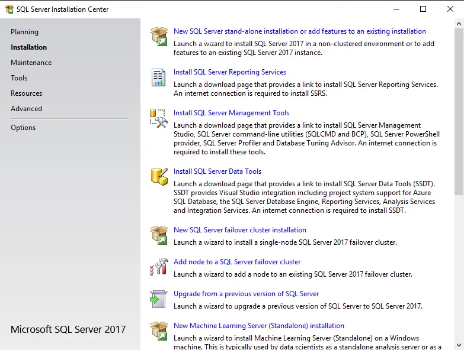

6. Select the edition of the product you wish to install.

- The "Developer" edition has identical features to the "Enterprise" edition.
- The "Enterprise" edition is used in production environments.
- The "Developer" edition is used for testing and development purposes.

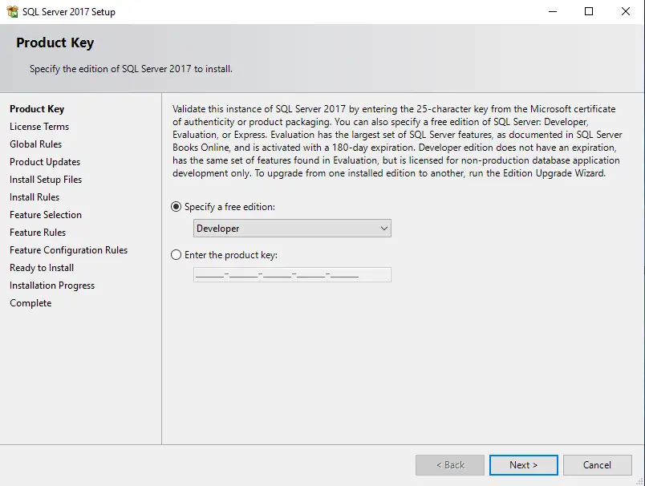

7. Accept the license agreement.

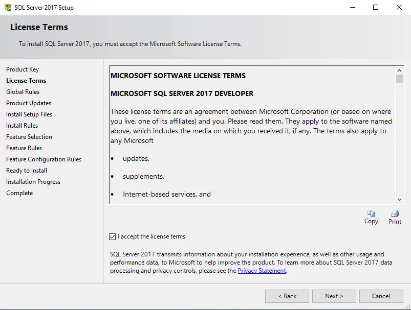

8. This is not an error message.

- It is a warning message because the node does not have connectivity to the Internet.
- Not all nodes have to be connected to the Internet, nor should they be (for security reasons).

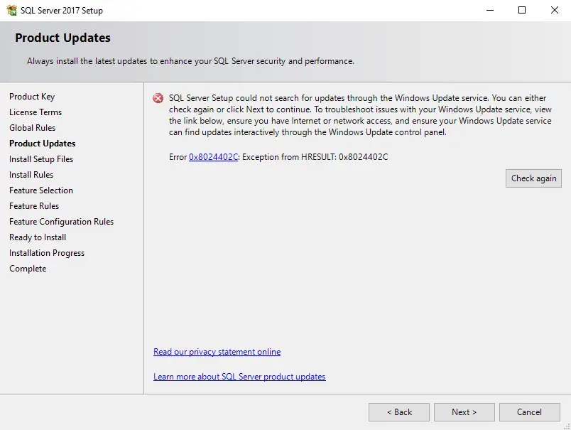

9. For your database environment, you need only to install the "Database Engine" component.

- This minimal installation will let you host MSSQL databases and allow applications (including web applications) to connect to the MSSQL database engine.

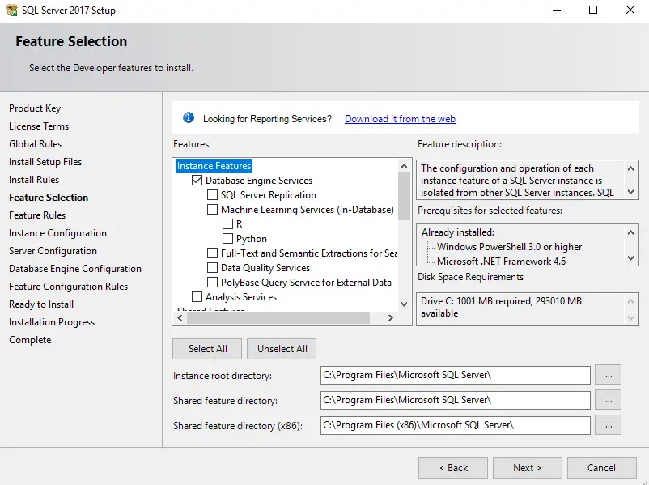

10. Here is the trickiest part of the installation, and where the installation can go terribly wrong, so pay close attention before clicking on the "Next" button.

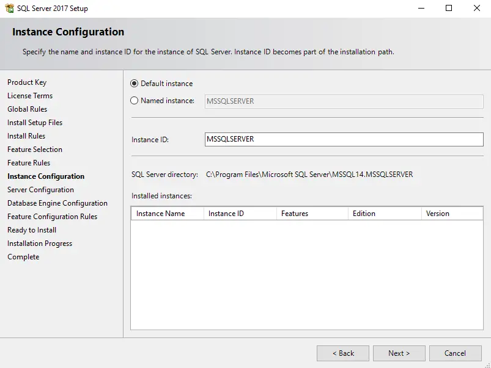

11. For almost all installations of the MSSQL database engine, a "named instance" is used.

- A "default instance" is typically only used by older software that has not been maintained nor modernized.
- "Default instances" are a thing of the past.
- Create a new "named instance" for the MSSQL database engine, using the format (dbe000123456a).
- Modify this sample value with your personal 9-digit number during your installation.
- Proceeding with the installation, using the above, will install your MSSQL database engine as a "default instance”.
- Note that the "Instance ID" value is still set to the older "default instance" value (MSSQLSERVER).

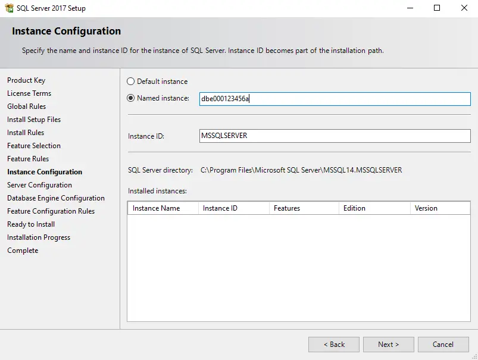

12. You must explicitly click in the "Instance ID" value's field, in order for the value to be updated to the "named instance" value you typed above it.

- Forgetting to do this will result in an undesirable configuration.
- Once the (2) values match, click on the "Next" button to continue.

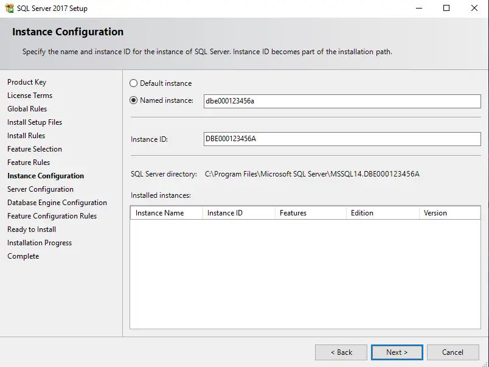

13. Ensure both the database engine and the browser are configured to start automatically each time the node is booted/re-booted, so users can connect immediately.

- The browser is used by other nodes on the network to more easily find your new MSSQL database engine.
- Next, click on the "Collation" tab.

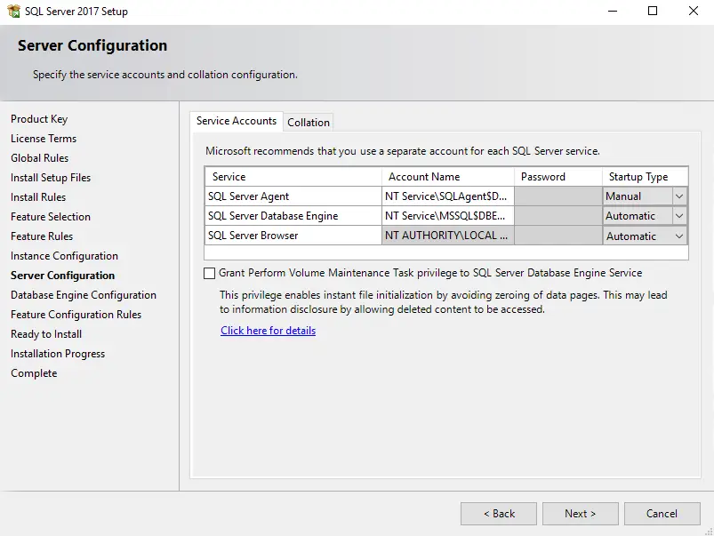

## Collation Settings

- Collation settings are configured at the database engine instance level.
- Collation settings are inherited by each database that is hosted by the instance of the database engine.
- Collation settings determine:
  - If the data will be treated as case sensitive or case insensitive.
  - For example, will the letter ‘a' be treated the same as the letter ‘A'?
  - Or will they be treated differently?
  - If you perform a search for the string 'Dog', then you will not match on values like ‘DOG', ‘dog', etc (if case sensitive).
- Most modern databases are configured to treat their data in a case insensitive manner.
- Most modern databases keep the data using the case they were entered in, making them also case respective.
- How characters are compared to other characters.
- It is used for sorting data, display purposes, and when comparing multiple pieces of data to each other.

14. In most cases, the default collation settings will suffice.

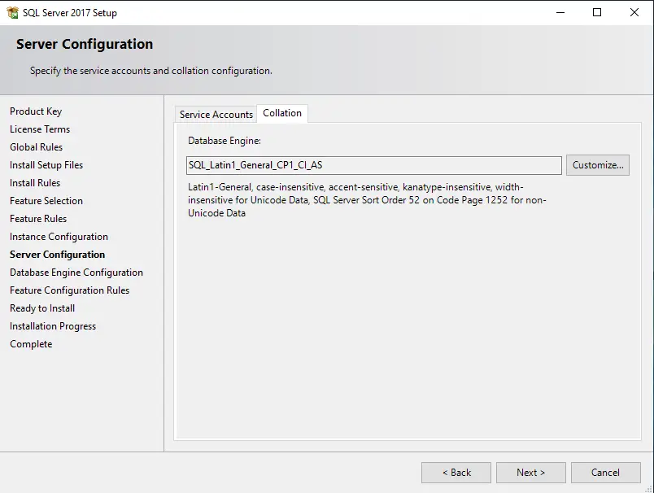

## MSSQL Authentication

- How will users and applications authenticate to the MSSQL database engine?
- They must prove who they are before they can access any data.
- Hopefully, by leveraging existing Active Directory user accounts.
- Active Directory will typically already exist for most network environments, so why bother creating multiple user accounts for the same user on the network (one user account in Active Directory, and another user account separately for each MSSQL database engine)?
- This would not be an efficient use of your existing network infrastructure.
- Ideally (and if possible), users should only have (1) user account within the network environment.
- There are occasions where local SAM database user accounts might need to authenticate to the MSSQL database engine (e.g by web servers, by other software products, etc.).
- Internal MSSQL user accounts are needed when neither an Active Directory nor a SAM database user account exists.
- For example, a contract employee who has been hired to only work on your MSSQL database environment would not need to have an Active Directory or SAM database user account in your network environment.
- They wouldn't need to sign on to a network-attached node, print to a printer, access other non-database-related files (e.g `*.xlsx`, `*.docx`, `*.pptx`, etc.).
- Given all the above, most MSSQL database engines are configured for Mixed Mode Authentication, allowing for Internal MSSQL user accounts, SAM database user accounts, and Active Directory user accounts to authenticate with the MSSQL database engine.
- When Mixed Mode authentication is selected, an internal system administrative user account is created (with the username: sa).
- This administrative user account must have a password assigned to it.
- The (sa) user account has full administrative privileges inside the MSSQL database engine environment.
- The (sa) user account has no privileges outside of the MSSQL database engine environment (e.g. creating folders or files, creating user accounts in Active Directory, creating user accounts in the SAM database, printing to a printer, etc.).
- It is also ideal to give SAM database administrative user accounts and/or Active Directory administrative user accounts full administrative permissions inside the MSSQL database engine environment.

15. Configure for "Mixed Mode" authentication.

- Set the internal MSSQL system administrator account (sa) password to (Adm1np&ss).
- Add the currently signed-on SAM database (administrator) user account as an MSSQL database engine administrator.

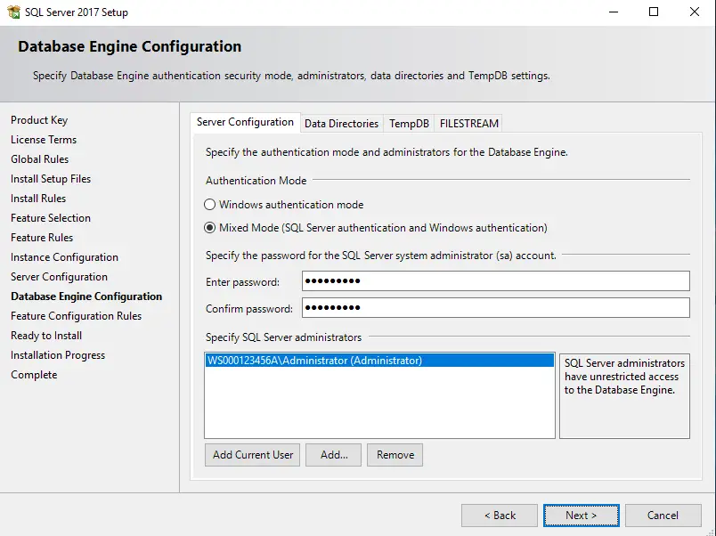

16. A summary screen identifying the configuration settings you have chosen for the installation of the MSSQL software product.

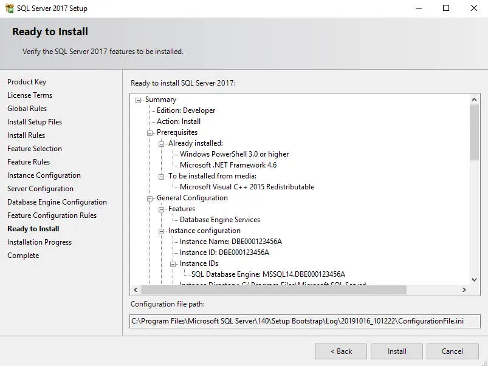

17. Let the installation process complete.

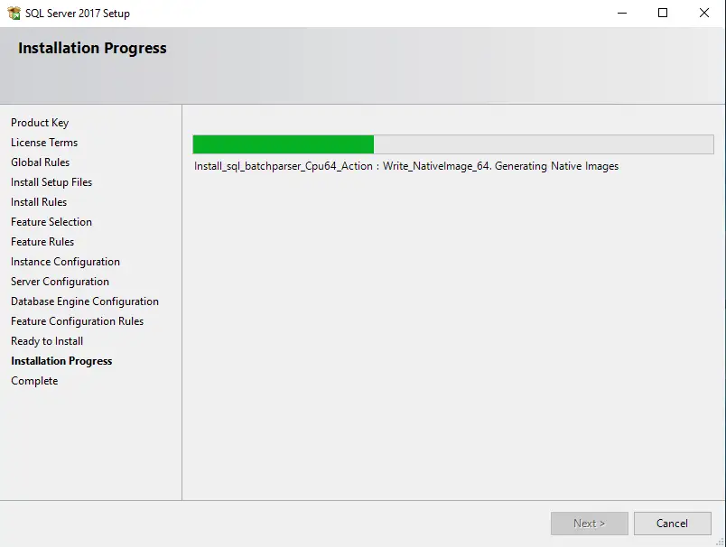

18. Ensure all of the components were installed successfully.

- Issues must be resolved first before you will be able to reliably use the database environment.

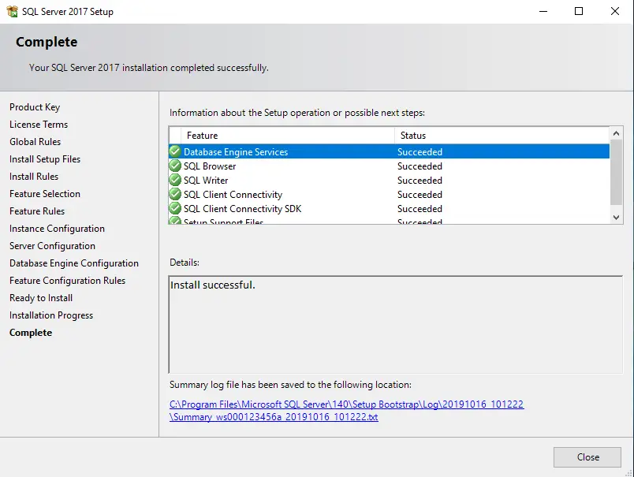

## Completing the MSSQL Installation

- A rather large piece of software has just been installed on the node.
- As such, it is wise for you to restart the node before continuing any further.
- This allows you to verify that the MSSQL-related services all start successfully.
- Once the node has restarted, use the (Services) applet and verify that all services configured for an "automatic" startup type are in a "running" state.
- Remove the Microsoft SQL Server DVD ISO from the optical drive.
- You have finished installing MSSQL components from it.
- From the menu bar, located at the top of the Guest OS console window, select the following menu options:
  - Devices -> Optical Drive -> Remove disk from virtual drive

19. Here, all of the MSSQL-related services, which are configured for an "automatic" startup state, have all started successfully.

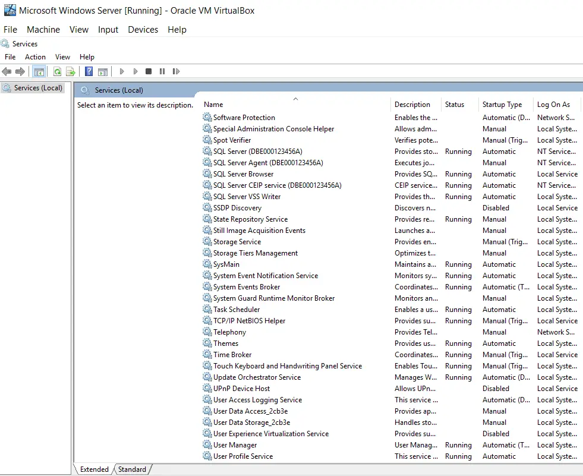

## MSSQL Specific Network Settings

- Once MSSQL has been installed, network-specific settings for the software product need to be configured.
- By default, no remote node on the network can connect to the MSSQL database engine.
- Only local connections can be made to the MSSQL database engine on the node that has the MSSQL database engine installed.
- The (IP) protocol is used by remote nodes and applications to connect to the MSSQL database engine across the network.
- The (Shared Memory) protocol is a special protocol, which only allows for local connections to the MSSQL database engine, on the node that has the MSSQL database engine installed.
- The (Named Pipes) protocol is another special protocol.
- It allows for a software process to communicate directly with the MSSQL database engine.
- The (Shared Memory) protocol cannot communicate across a network (a.k.a. traverse the network).
- As such, it cannot be used by a remote node to connect an MSSQL database engine running on a different node.
- The (Named Pipes) protocol is typically only a concern for experienced software developers.
- You will modify the MSSQL-specific (IP) protocol settings for:
  - How the database "server" engine is configured to "listen" for inbound connections.
  - How the MSSQL "client" will connect to the database "server" engine (32-bit) configurations exist for both the "server" and "client" network components.
- Since you are trying to be more modern and up-to-date, you will only work with the (64-bit) network configuration settings.
- Once a change is made to the MSSQL-specific network configuration settings, the MSSQL database engine service needs to be restarted, before the new settings become effective.

20. Locate and launch the "SQL Server 2017 Configuration Manager."

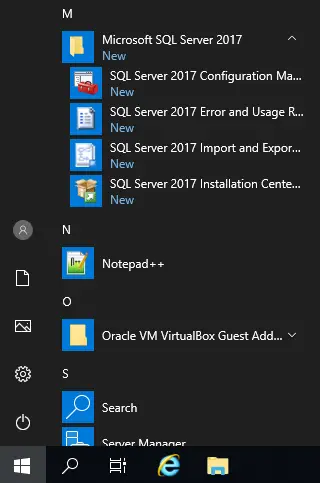

21. Begin by enabling the (64-bit) version of the "server" (database engine) IP protocol settings.

- This change will allow remote nodes on the network to connect to the MSSQL database engine.

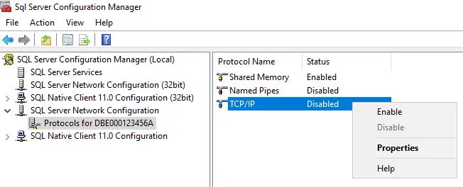

22. Acknowledge the 'service requires a restart' message.

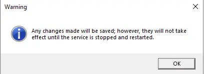

23. Modify the properties of the IP protocol for the MSSQL installation.


24. This server node has multiple IP interfaces associated with it.

- An IPv4 address, an IPv6 address, a few internal loopback addresses, etc.
- With the IP protocol enabled, the MSSQL server will accept inbound connections on all of these different IP interfaces.
- No changes are required on this tab.
- Click on the "IP Addresses" tab.

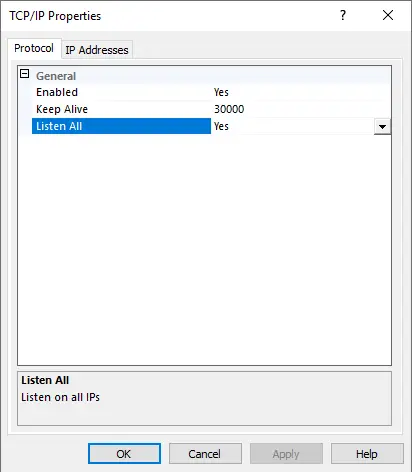

25. By default, the MSSQL server will use "dynamic" port numbers for inbound connections from clients and applications.

- This is not an ideal configuration.
- Configure the MSSQL server to respond to an explicit port number (1433) only.
- This is the reserved port number for an MSSQL server.

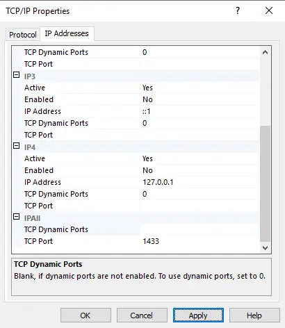

26. Apply the changes.

- Acknowledge the 'service requires a restart' message.

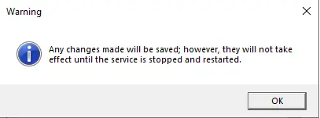

27. Locate the (64-bit) version of the "client" IP protocol settings.

- The "client" settings affect how this node will communicate with other MSSQL database engines ("servers") on the network.
- No change is required here, as there are no other MSSQL database engines ("servers") in the network environment to communicate with, plus, the (IP) protocol is already enabled.

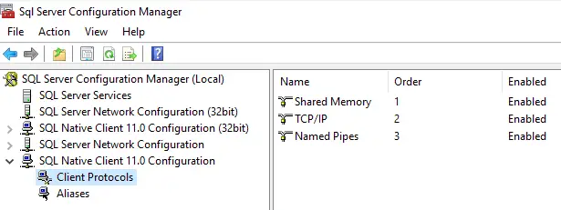

28. Locate the MSSQL database engine service.

- Right-click on it.
- From the shortcut menu, select the option to "Stop" the database engine service currently running on this node.

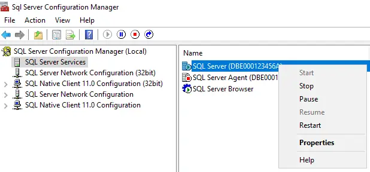

29. From a stopped state, select the option to "Start" the MSSQL database engine service.

- Once started, changes to the MSSQL-specific network settings will become effective.

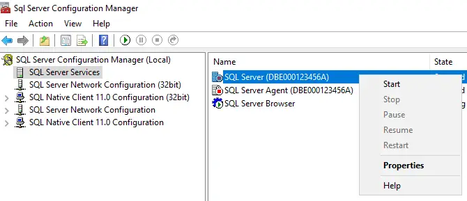

30. Here, the MSSQL database engine is back in a running state, and is now capable of accepting inbound connections from remote nodes on the network.

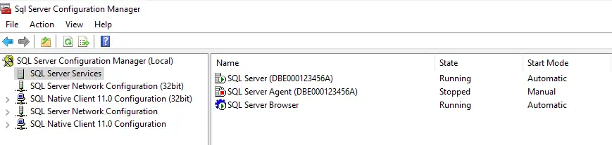

## Installing the Native MSSQL Native User Interfaces

- Now that an MSSQL database engine is up and running in the network environment, you need a way to interface with it.
- Interfacing with the database engine allows you to create databases, tables, login objects, database user objects, enter data into tables, etc.
- The (2) MSSQL native user interfaces are:
  - (GUI): The Microsoft SQL Server Management Studio (SSMS)
    - A graphical point-and-click interface most users will feel comfortable with.
  - (CLI): The (sqlcmd) executable utility
    - A command line utility used by advanced users, and for scripting (programmatic) purposes.
- Updated versions of both the (SSMS) and (sqlcmd) native interfaces are bundled separately, via the installation packages.
- By default, only the (sqlcmd) native interface comes packaged with the Microsoft SQL Server installation media, but it will be an outdated (older) version.
- Once a MSSQL Database Engine has been installed on a "server" node, the (sqlcmd) native CLI interface will have been installed by default.
- If a command line interface is only required on this node, then you would not need to install the Microsoft SQL Server Management Studio (SSMS) software product.
- However, it is best practice to update the default (sqlcmd) native CLI interface on the "server" node, as it is guaranteed to be an older version that was installed.
- For all other "client" type of nodes on the network:
  - If a GUI interface to the MSSQL environment is required, then you would need to install the Microsoft SQL Server Management Studio (SSMS) software product.
  - If a CLI interface to the MSSQL environment is required, then you would need to install the Microsoft SQL Server (sqlcmd) software product.

31. Copy the downloaded Microsoft SQL Server Management Studio (SSMS) installation package from your Host OS into the Microsoft Windows Server Guest OS.

- Double-click on it to begin the installation of the MSSQL native GUI user interface.

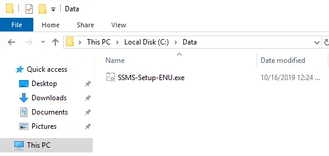

32. Click on the "Install" button and let the software product install.

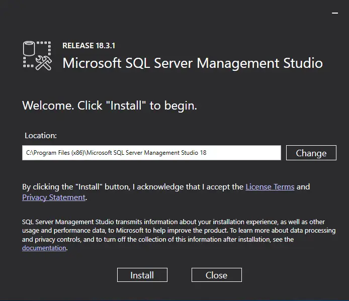

33. Let the installation complete.

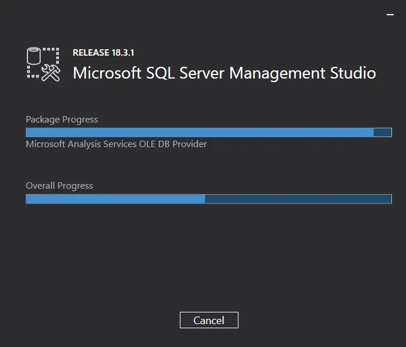

34. Once the installation has successfully completed, click on the "Restart" button.

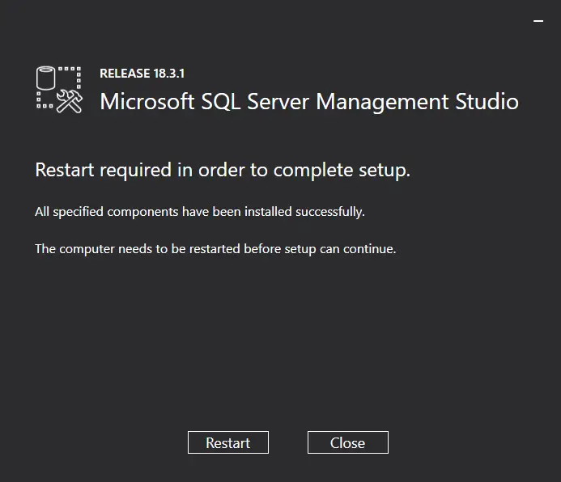

## Updating the MSSQL Native CLI User Interface (sqlcmd)

- The version of the (sqlcmd) CLI interface utility can be viewed by executing the (sqlcmd.exe -?) command.
- Above is an example of an older version of the (sqlcmd) CLI interface utility, installed by default, when the MSSQL database engine was installed on this node.
- This utility needs to be updated manually.
- Close the Windows PowerShell session.

36. Copy the downloaded Microsoft SQL Server (sqlcmd) installation package from your Host OS into the Microsoft Windows Server Guest OS.

- Double-click on it to begin the installation of the MSSQL native CLI user interface.

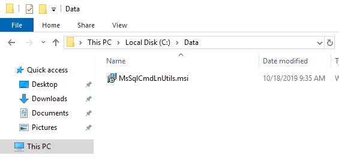

37. Click on the "Next" button.

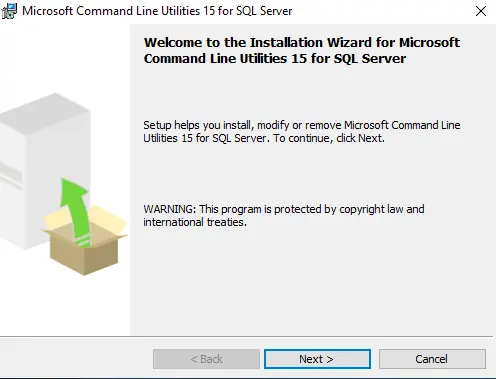

38. Accept the license agreement.

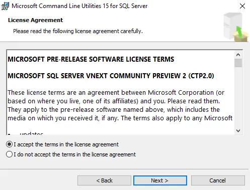

39. Click on the "Install" button to begin the software product installation process.

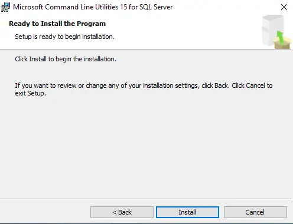

40. Once the installation has successfully completed, click on the "Finish" button.

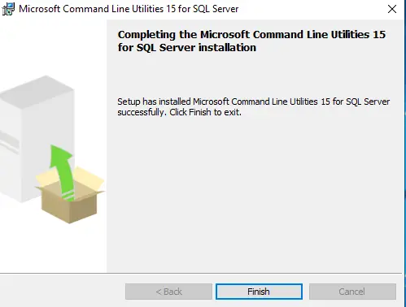

41. There are (2) versions of the (sqlcmd) CLI utility now installed on this node.

- Once the updated version of the (sqlcmd) CLI utility has been installed, the older version will still be accessed by default.
- A quick setting adjustment needs to be made, such that the newer version of the (sqlcmd) CLI utility is accessed by default, as opposed to the older one.
- Close the Windows PowerShell session.

42. Launch the Control Panel “System" applet.

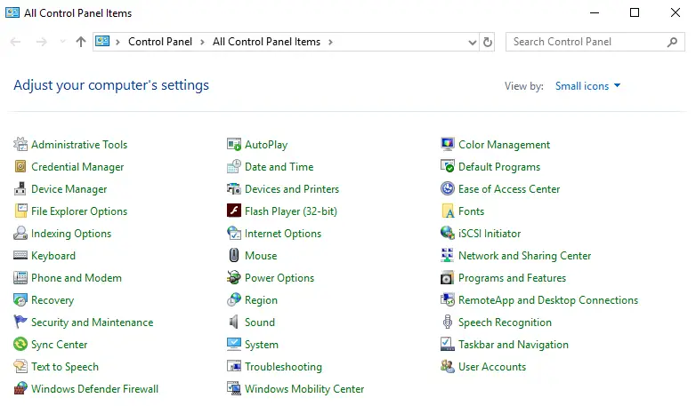

43. From the Control Panel “System" applet, click on the "Advanced system settings" link.

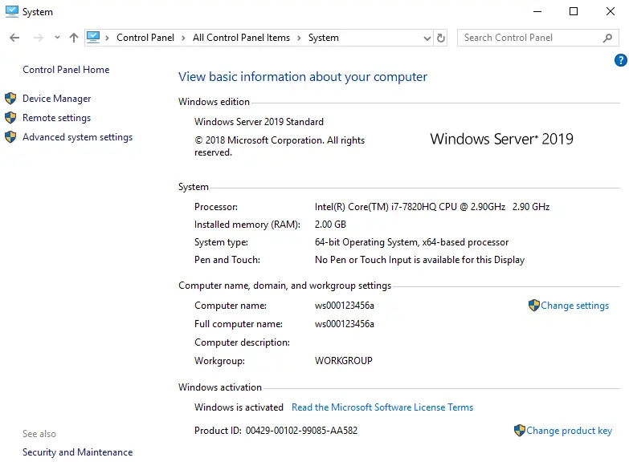

44. Click on the "Environment variables..." button.

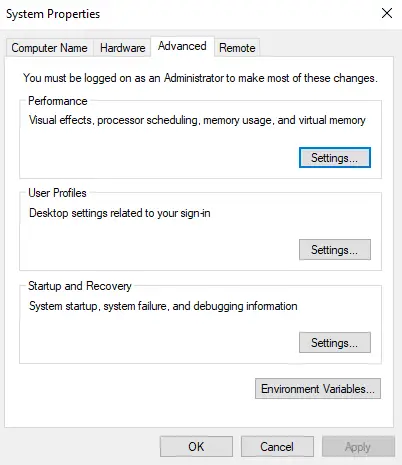

45. Select the existing (Path) system environment variable, then click on the "Edit..." button.

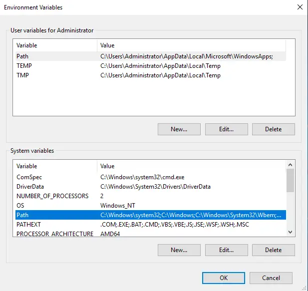

46. (A) Is the location of the newer version of the (sqlcmd) CLI utility.

- (B) is the location of the older version of the (sqlcmd) CLI utility.
- Adjust the order, such that (A) appears before (B), making it higher in the list of file system locations for the (Path) system environment variable.
- Use the "Move up..." button to relocate folder location (A) before (B).

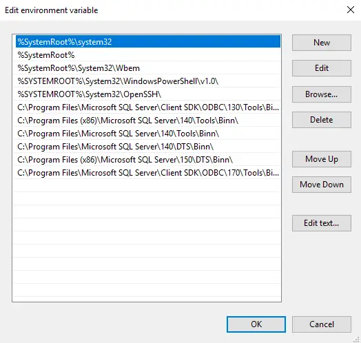

47. Once the order has been adjusted, click on the “OK" button to save the change.

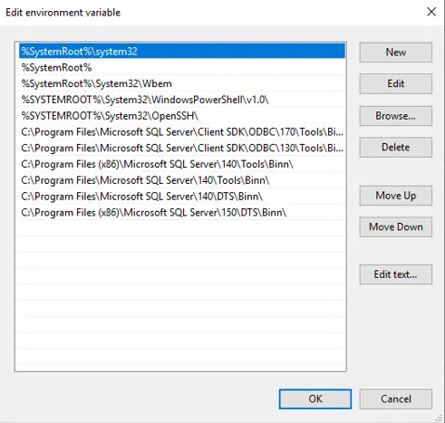

48. Click on the remaining “OK" buttons, to complete the setting change.

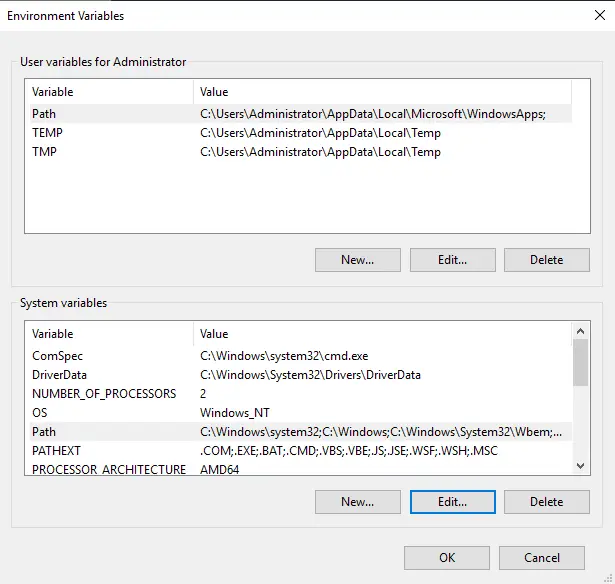

49. Re-launch a Windows PowerShell session, and check the version of the (sqlcmd) CLI utility.

- It will now show that the newer version of (sqlcmd) is being accessed by default.

## Connecting using the (SSMS) User Interface

50. Locate and launch the Microsoft SQL Server Management Studio (SSMS) application.

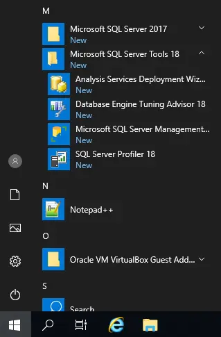

51. In order to connect to the MSSQL database engine, you must first authenticate.

- Using Windows Authentication, the same security credentials for the user account you signed on to the node with are used, and therefore cannot be altered.
- Note the format of the MSSQL database engine name (nodename\instancename).
- Do not authenticate yet.

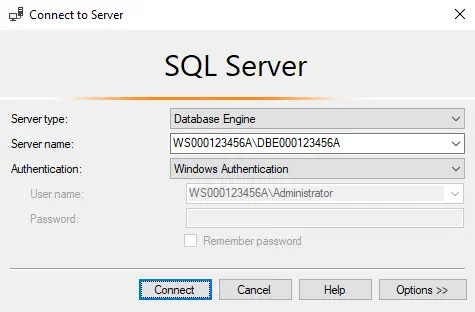

52. Using SQL Server Authentication, the security credentials (username + password) must be entered.

- The username + password values are associated with a Login Object for the MSSQL database engine instance.
- Currently, the only Login Object credentials you know of are for the (sa) system administrator (internal SQL Server user account) and its password (Adm1np&ss).
- Do not authenticate yet.

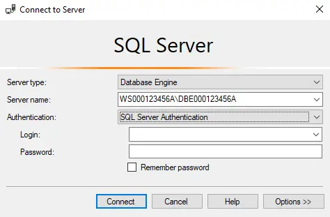

53. Now, authenticate to the MSSQL database engine, using the local SAM database (administrator) user account.

- This will give you full privileges within the MSSQL database engine environment.

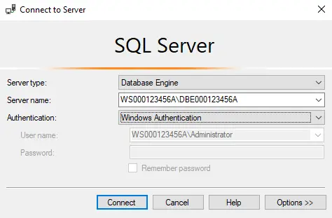

54. Graphically, here is the root of your MSSQL database engine.

- Note the name of the MSSQL database engine instance is present, along with ‘who' you are currently connected as.

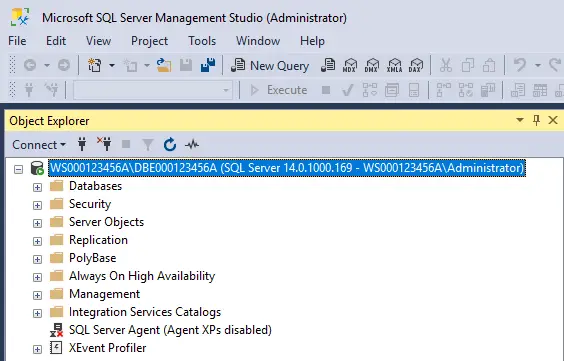

## Customizing the (SSMS) User Interface

55. Let's make the interface a bit more usable.

- Add the "Object Explorer Details" pane to the interface.


56. Next, add the "Properties Window" pane to the interface.

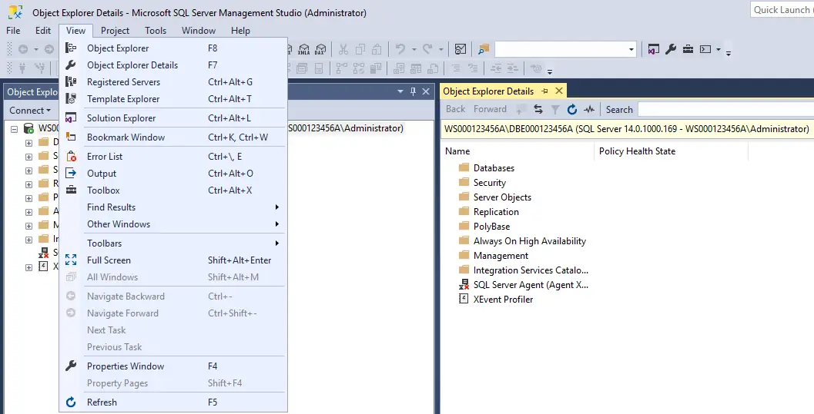

57. These are the (3) panes for the (SSMS) interface most users will require when working with an MSSQL environment.

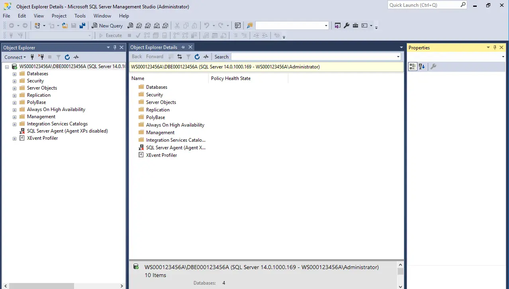

## Default Databases

58. Expand the "Databases" node to see what default databases are present.

- Only system databases (master, model, msdb, and tempdb) are installed or created by default.
- Currently, there are no user databases available.
- User databases are required to store personal data (for you) or business data (for a company).

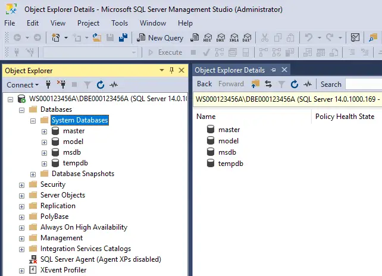

## Graceful Disconnection

59. To gracefully signal to the MSSQL database engine that you are finished with it, you "Disconnect" from it (right-click on the database engine instance and select the disconnect option).

- The MSSQL database engine will then close your connection properly.

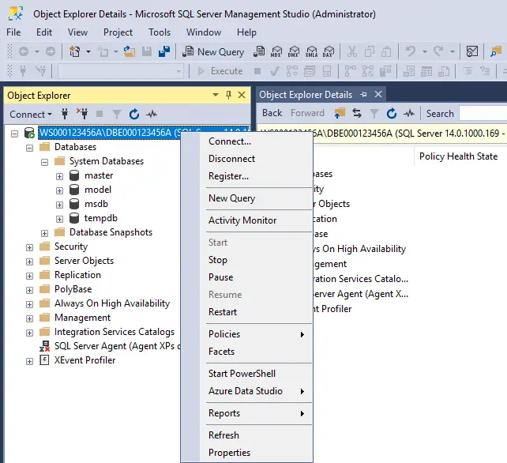

60. To connect to the same (or a different) MSSQL database engine, click on the "Connect" button.

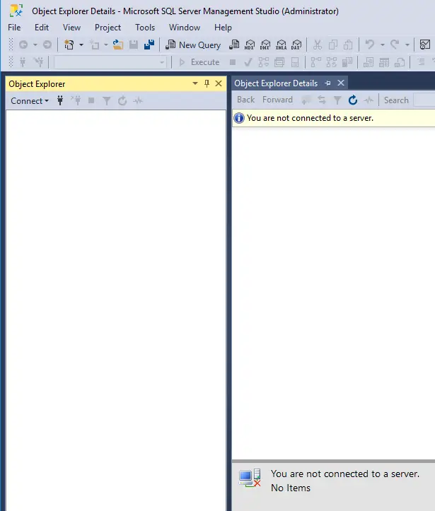

61. Select that you wish to connect to a database engine. 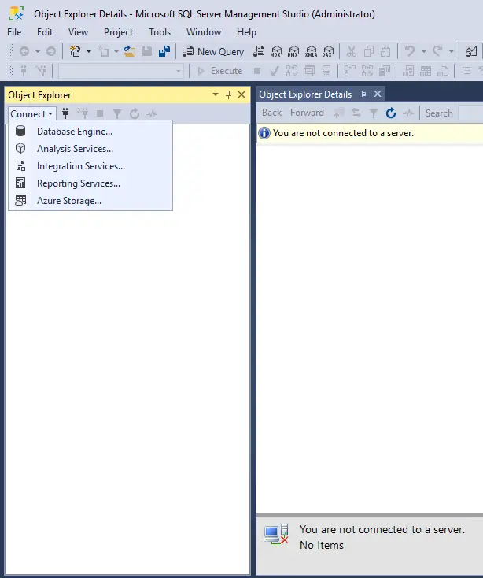

62. ...and authenticate.

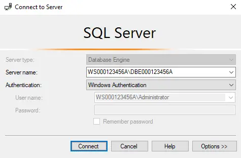

## Connecting using the (sqlcmd) User Interface

63. A connection to the database engine instance using Windows Authentication, using the (sqlcmd) CLI utility.

```console
PS C:\Users\Administrator> sqlcmd -S w000123456a\dbe000123456a -E
```

64. A connection to the database engine instance using internal SQL Authentication, using the (sqlcmd) CLI utility.

```console
PS C:\Users\Administrator> sqlcmd -S w000123456a\dbe000123456a -U sa
Password:
```
