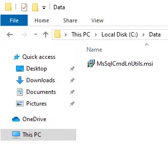
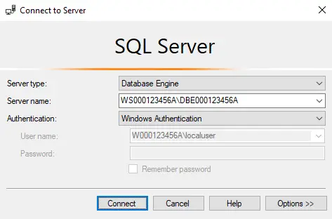

# Installing the MS SQL Client

## Installing (SSMS) and (sqlcmd) on "Client" Nodes

- If you wish to interface to the MSSQL database engine from other nodes on the network (using (SSMS) or (sqlcmd)), you will need to install these user interface applications on each of the remote nodes.
- It is quite common for both administrative users and regular users to use the (SSMS) and (sqlcmd) user interfaces in the workplace.
- They are not just interfaces for the administrators.

## Local Name Resolution

1. Since you won't have DNS services available in your network environment, place (2) entries in the local resolution file on the Microsoft Windows Guest OS.

- The Guest OS should be capable of resolving both the "server" and the "client" nodes in your network environment using hostname values.


2. You should have (2) similar entries in the local resolution file on the Microsoft Windows Guest OS.

- Use your personal 9-digit number in place of the sample ones in this image.

```console
# Copyright (c) 1993-2009 Microsoft Corp.
# This is a sample HOSTS file used by Microsoft TCP/IP for Windows.

# This file contains the mappings of IP addresses to host names.
# Each entry should be kept on an individual line.
# The IP address should be placed in the first column followed by the corresponding host name.
# The IP address and the host name should be separated by at least one space.
# Additionally, comments (such as these) may be inserted on individual lines.
# lines or following the machine name denoted by a '#' symbol.

# For example:
#
#   102.54.94.97    rhino.acme.com          # source server
#   38.25.63.10     x.acme.com             # x client host

# localhost name resolution is handled within DNS itself.
#   127.0.0.1       localhost
#   ::1             localhost

    192.168.100.20  w000123456a
    192.168.100.25  w000123456a
```

3. On a Microsoft Windows Guest OS, administrative permissions are required to modify a key system file like (`C:\...\etc\hosts`).

- When you attempt to save the modifications to this file, the Notepad++ editor will ask if you want to restart in administrator mode.
- Select "Yes”.


4. Select "Yes" to the (UAC: User Account Control) message.


5. ...then re-save the modifications to this file.

## Installing the MSSQL Native GUI User Interface (SSMS)

6. Copy the downloaded Microsoft SQL Server Management Studio (SSMS) installation package from your Host OS into the Microsoft Windows Guest OS.

- Double-click on it to begin the installation of the MSSQL native GUI user interface.


7. Select "Yes" to the (UAC: User Account Control) message.


8. Click on the "Install" button and let the software product install.


9. Let the installation complete.


10. Once the installation has successfully completed, click on the "Close" button.


## Installing the MSSQL Native CLI User Interface (sqlcmd)

11. Here, you can see that the (sqlcmd) CLI interface utility was not installed along with the (SSMS) GUI interface application.

- The (sqlcmd) utility is installed separately on "client" nodes.

12. Copy the downloaded Microsoft SQL Server (sqlcmd) installation package from your Host OS into the Microsoft Windows Guest OS.

- Double-click on it to begin the installation of the MSSQL native CLI user interface.



13. Click on the "Next" button.


14. Accept the license agreement.


15. Click on the "Install" button to begin the software product installation process.


16. Select "Yes" to the (UAC: User Account Control) message.


17. Once the installation has successfully completed, click on the "Finish" button.


18. Re-launch a Windows PowerShell session and verify that the (sqlcmd) CLI utility is accessible from the command line environment.

- Also, check the version of the (sqlcmd) CLI utility to ensure it is the version you are expecting to see.

## Connecting using the (SSMS) User Interface

19. Locate and launch the Microsoft SQL Server Management Studio (SSMS) application.


20. Note the difference from that which you encountered earlier on the Microsoft Windows Server Guest OS.

- No MSSQL database engine is selected by default.


21. From the "Server Name:" drop-down list, click on the option to browse for MSSQL database engines on the network.


22. The (Local Servers) tab will display all MSSQL database engines which are in a running state on the local node (the Microsoft Windows Guest OS).

- The only MSSQL database engine running in your network environment (currently) is located on the Microsoft Windows Server Guest OS.


23. Click on the (Network Servers) tab to search for MSSQL database engines which are running on remote network nodes.

- Expand the (Database Engines) structure to see which nodes they are running on, and what each database engine's instance name is.


24. Select the MSSQL database engine in your network environment, and click on the "OK" button.


25. A connection to the MSSQL database engine cannot be made using this SAM database user account.

- This user account is currently not permitted to connect to the MSSQL database engine, as it is not configured to do so.



26. You can, however, connect to the MSSQL database engine using the built-in (sa) user account during the authentication process.

- Its password is (Adm1np&ss).


## Customizing the (SSMS) User Interface

27. Once authenticated, verify your connection details.


28. Configure the (SSMS) user interface to make use of the (3) standard interface panes.


29. Verify that the system databases are visible to the (sa) user account.


30. As it is with most Microsoft GUI application user interfaces, periodically a manual "refresh" needs to be performed in order to view any newly created items (or see deleted items actually disappear).

- Here, a refresh of the "User Databases" node is being performed.


31. Here, a manual refresh of the database engine's (Login) objects' node is being performed.

- Each node in the (SSMS) user interface structure needs to be individually "refreshed" from time to time, if you wish to see item changes below them.
- There is no global refresh for the (SSMS) user interface.


32. This will not work as one would expect.

- Attempting to manually "refresh" at the top of the (SSMS) user interface, the MSSQL database engine level (node), will not refresh the node information below it (within all the child node containers).


## Connecting using the (sqlcmd) User Interface

33. This is an example of a connection to the database engine instance using internal SQL Authentication, using the (sqlcmd) CLI utility.

```console
PS C:\Users\Administrator> sqlcmd -S w000123456a\dbe000123456a -U sa
Password:
```
