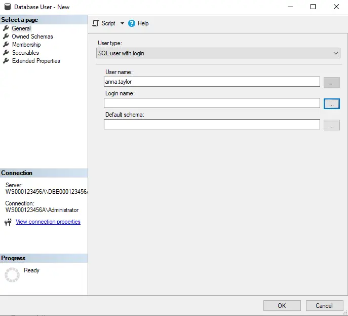
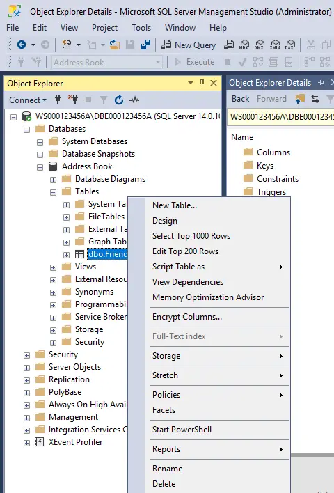

# Microsoft SQL Server - Creating a New User Database

1. Authenticate to the MSSQL database engine as the SAM database (administrator) user account.

- Right-click on the "Databases" node, and select the "New Database..." option.

2. Give the new database a meaningful name, and then click on the "OK" button.

3. The new (Address Book) user database has been created.

- It is attached to, and managed by, the MSSQL database engine.
- You may need to refresh the "Databases" node if you don't see this database listed.

4. At a file system level, every MSSQL database has at least (2) separate files associated with it, with the possibility of many more.

## Creating a New Data Table

5. Right-click on the (Tables) node for the (Address Book) user database.

- From the sub-shortcut menu (New), select "Table", to create a new data table in this user database.

6. From top-to-bottom, go row-by-row and define (design) the new data table.

7. Assign a meaningful name for this new data table.

8. Right-click on the data table's tab, and select the option to save the data table.

9. Click on the (x) icon, within the data table's tab, to close the open tab.

- You have completed with the design process of the table.

10. Right-click on the (Tables) node for the (Address Book) user database.

- From the shortcut menu, select “Refresh."
- Although the new data table has been created, you won't likely see it until you refresh the applicable node in the user interface.

11. Here is the new data table you created.

- Currently, it is empty.
- As of right now, there are no rows of table data inside this data table.

## Inputting Table Data

12. Right-click on the data table.

- From the shortcut menu, select the option to "edit" the rows of table data within the data table.

13. On a row-by-row basis, begin entering some table data into the data table.

- As you begin to enter the column data, the red circles you see are not error messages.
- This is just an indicator that these pieces of column data have not yet been stored (committed) in the data table.
- Once you move on to the next row to enter data, you will see the previous row's red circles disappear.

14. Here, (1) row of table data has been committed to the data table, and is now stored in the user database.

- The (Contact Number) column is used to ensure every row of data is uniquely identified somehow, or how else would we be able to tell the difference between (2) or more identical rows of table data? Ensure you type a unique integer value (Range: 0 - 255) in this column, as you enter in subsequent rows of table data.

15. There are now (3) rows of table data which have been entered into the data table.

- Close the edit tab once you have finished entering your table data.

## Viewing the Data

16. Right-click on the table.

- From the shortcut menu, select the option to "view" the table's data.

17. Verify all rows of table data are present and are what you were expecting to see.

- This output is called the result-set.
- Close the tab when you are finished viewing the table data.

## Authenticating to the Database Engine

18. Up to now, you have been using an administrative account to do everything.

- That is not the case in the business environment.
- Next, you will create a regular user account in the database engine environment and grant suitable permissions for this new regular user account to view, create, modify, and remove the table data.
- Right-click on the (Logins) node below the database engine.
- From the shortcut menu, select "New Login..."

19. Create a new internal SQL Login Object.

- Assign a password value of (P&ssw0rd).
- Configure the password policy settings as indicated.
- Click on the "OK" button to create the new Login Object.

10. Here, a new regular user's Login Object has been created.

- This Login Object is used to authenticate the user to this database engine, and before the user can gain access to any databases, data tables, or table data, etc.

## Authorizing Access to the Database and Table Data

21. Locate the (Users) node associated with the (Address Book) user database.

- It is located below the (Security) node.
- Right-click on it.
- From the shortcut menu, select the "New User..." option.
- Each user must have a database user object in order to authorize them to access the database, data tables, table data, basically anything associated with the user database, in which the database user object exists.

22. Type in a user name value for the new database user object.

- It does not have to be the exact same value as the Login Object you created earlier, but it would be best if it is.
- You then won't have to guess at whose database user object it belongs to.

23. Each database user object has to be associated back to an existing database engine's instance Login Object.

- Click on the ellipsis button, then the "Browse" button to search for this user's Login Object.

24. From the list of available existing Login Objects, select the one that matches the user you're setting up.

- Click on the "OK" button once you've finished selecting it.

25. With the Login Object selected, click on the "OK" button.

26. Here, the new (anna.taylor) database user object has been associated with their (anna.taylor) internal SQL Login Object.

- Click on the "Membership" category to give this user some additional permissions.

27. Being a member of the (db_datareader) database role will allow the user to view existing table data and for all data tables.

- Being a member of the (db_datawriter) database role will allow the user to create, modify, and remove existing table data.
- Make this user a member of both database roles so they will have full access to all table data and for all data tables within this user database.
- Once configured, click on the "OK" button.

28. Now, we have a regular (non-administrative) user account which is capable of authenticating to the database engine instance and has full permissions to all table data related to the (Address Book) user database.

## Verifying Access

29. Gracefully disconnect from the database engine as the SAM database (administrator) user account.

20. Re-connect back to the database engine instance, but this time, using your new regular (internal SQL) user account.

31. Authenticate using the new (internal SQL) user account you created.

- Their password is (P&ssw0rd).

32. As this regular user account, navigate to the existing data table and attempt to view the rows of table data within it.

33. Success !!! You are able to view the table data.

34. As this regular user account, navigate to the existing data table and attempt to edit the table data.

35. At first, try changing just (1) column of data to see if you have enough permissions to do so.

- Remember to click on another row in order to commit the changed data in the data table.

36. It worked !!! You have confirmed that you are able to modify the table data.

37. Next, right-click at the very beginning of a row of data.

- From the shortcut menu, select the option to remove the row of table data.

38. Click the "Yes" button to confirm that the deletion is about to take place.

- There is no going back after you click on this button, so make sure you are not deleting any important data.

39. It worked, you have confirmed that you are able to remove existing table data.

- Now, create a new row of table data to see if you have that permission to the data table.
- You have confirmed that this user account has the (4) basic permissions to work with table data (view, create, modify, and remove).
- To be technically accurate, the database terminology for these functions are: SELECT, INSERT, UPDATE, and DELETE.
- These keywords are the building blocks used for SQL statements, part of each database language you will encounter in your career.

## Deleting a User Database

30. Disconnect from the database engine as the regular (internal SQL) user account.

41. Use the (Connect) button, and authenticate to the database engine as the SAM database (administrator) user account.

42. Authenticating using the SAM database (administrator) user account.

43. Right-click on the user database you wish to delete.

- From the shortcut menu, select the option to "delete" the user database.

44. Select the options to delete everything associated with the user database, and to disconnect any attached users to this database beforehand.

- Click on the "OK" button to complete the deletion process.

45. The (Address Book) user database has now been deleted.

46. ...and so have the (2) associated underlying files for the database (at a file system level).

